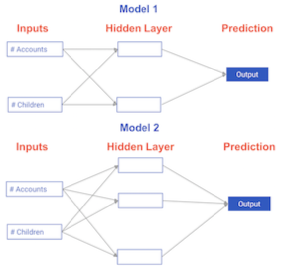

# Deep Learning {.unnumbered}

## Introduction {.unnumbered}

<h3 class="course__description-title">Dan Becker</h3>
<p class="course__instructor-description display-none-mobile-course-page-experiment">
    Dan Becker is a data scientist with years of deep learning experience. He has contributed to the Keras and TensorFlow libraries, finishing 2nd (out of 1353 teams) in the $3million Heritage Health Prize competition, and supervised consulting projects for 6 companies in the Fortunate 100. He previously worked as a data scientist at Google. Now he is the CEO and co-founder of Decision.ai, which helps companies apply their machine learning models to make better real-world decisions.
  </p>

**Course Description**


**Discover Deep Learning Applications**

Deep learning is the machine learning technique behind the most exciting capabilities in robotics, natural language processing, image recognition, and artificial intelligence. In this 4-hour course, you’ll gain hands-on practical knowledge of how to apply your Python skills to deep learning with the Keras 2.0 library.

**Explore Keras Models with a Library Contributor**

Taught by ex-Google data scientist and Keras contributor, Dan Becker, this deep learning course explores neural network models and how you can generate predictions with them. The first chapters will grow your understanding of both forward and backward propagation and how they work in practice.

Keras library is a Python library that can help you develop and review deep learning models. Like many Python libraries, it's free, open-source and very user friendly. You’ll start by creating a Keras model and will learn how to compile, fit, and classify it before making predictions. Once you’ve completed this course, you’ll have all the tools you need to build deep neural networks and start experimenting with wider and deeper networks over time.

**Delve Further into Deep Learning**

This course is part of several machine learning and deep learning tracks, offering you clear pathways to build your skills and experience in this area once you’ve completed the introductory course, whether you want to complete a personal project or move towards a career as a Machine Learning Scientist.


### Basics of deep learning and neural networks {.unnumbered}

<p class="chapter__description">
    In this chapter, you'll become familiar with the fundamental concepts and terminology used in deep learning, and understand why deep learning techniques are so powerful today. You'll build simple neural networks and generate predictions with them.
  </p>

#### Introduction to deep learning {.unnumbered}


##### Comparing neural network models to classical regression models {.unnumbered}

<p>Which of the models in the diagrams has greater ability to account for interactions?</p>



- [ ] Model 1
- [x] Model 2
- [ ] They are both the same

<p class="dc-completion-pane__message dc-u-maxw-100pc">Correct! Model 2 has more nodes in the hidden layer, and therefore, greater ability to capture interactions.</p>

#### Forward propagation {.unnumbered}


##### Coding the forward propagation algorithm {.unnumbered}


<div class>
<p>In this exercise, you'll write code to do forward propagation (prediction) for your first neural network:</p>
<p></p>
<p>Each data point is a customer. The first input is how many accounts they have, and the second input is how many children they have. The model will predict how many transactions the user makes in the next year. You will use this data throughout the first 2 chapters of this course. </p>
<p>The input data has been pre-loaded as <code>input_data</code>, and the weights are available in a dictionary called <code>weights</code>. The array of weights for the first node in the hidden layer are in <code>weights['node_0']</code>,
and the array of weights for the second node in the hidden layer are in <code>weights['node_1']</code>.</p>
<p>The weights feeding into the output node are available in <code>weights['output']</code>.</p>
<p>NumPy will be pre-imported for you as <code>np</code> in all exercises.</p>
</div>
<div class="exercise--instructions__content">


<li>Calculate the value in node 0 by multiplying <code>input_data</code> by its weights <code>weights['node_0']</code> and computing their sum. This is the 1st node in the hidden layer.</li>

<li>Calculate the value in node 1 using <code>input_data</code> and <code>weights['node_1']</code>. This is the 2nd node in the hidden layer.</li>

<li>Put the hidden layer values into an array. This has been done for you.</li>

<li>Generate the prediction by multiplying <code>hidden_layer_outputs</code> by <code>weights['output']</code> and computing their sum. </li>

<li>Hit 'Submit Answer' to print the output!</li>
```{python}
# edited/added
import numpy as np
import pandas as pd

input_data = np.array([3, 5])
weights = {'node_0': np.array([2, 4]), 
           'node_1': np.array([ 4, -5]), 
           'output': np.array([2, 7])}
           
# Calculate node 0 value: node_0_value
node_0_value = (input_data * weights['node_0']).sum()

# Calculate node 1 value: node_1_value
node_1_value = (input_data * weights['node_1']).sum()

# Put node values into array: hidden_layer_outputs
hidden_layer_outputs = np.array([node_0_value, node_1_value])

# Calculate output: output
output = (hidden_layer_outputs * weights['output']).sum()

# Print output
print(output)
```
</div>

<p class="">Wonderful work! It looks like the network generated a prediction of <code>-39</code>.</p>

#### Activation functions {.unnumbered}


##### The Rectified Linear Activation Function {.unnumbered}


<div class>
<p>As Dan explained to you in the video, an "activation function" is a function applied at each node. It converts the node's input into some output. </p>
<p>The rectified linear activation function (called <em>ReLU</em>) has been shown to lead to very high-performance networks.
This function takes a single number as an input, returning 0 if the input is negative, and the input if the input is positive.  </p>
<p>Here are some examples:<br><strong>relu(3) = 3</strong> <br><strong>relu(-3) = 0</strong> <br></p>
</div>
<div class="exercise--instructions__content">

<li>Fill in the definition of the <code>relu()</code> function:<li>Use the <code>max()</code> function to calculate the value for the output of <code>relu()</code>. </li>

</li>

<li>Apply the <code>relu()</code> function to <code>node_0_input</code> to calculate <code>node_0_output</code>.</li>

<li>Apply the <code>relu()</code> function to <code>node_1_input</code> to calculate <code>node_1_output</code>.</li>
```{python}
def relu(input):
    '''Define your relu activation function here'''
    # Calculate the value for the output of the relu function: output
    output = max(0, input)
    
    # Return the value just calculated
    return(output)
  
# Calculate node 0 value: node_0_output
node_0_input = (input_data * weights['node_0']).sum()
node_0_output = relu(node_0_input)

# Calculate node 1 value: node_1_output
node_1_input = (input_data * weights['node_1']).sum()
node_1_output = relu(node_1_input)

# Put node values into array: hidden_layer_outputs
hidden_layer_outputs = np.array([node_0_output, node_1_output])

# Calculate model output (do not apply relu)
model_output = (hidden_layer_outputs * weights['output']).sum()

# Print model output
print(model_output)
```
</div>

<p class="">Great work! You predicted 52 transactions. Without this activation function, you would have predicted a negative number! The real power of activation functions will come soon when you start tuning model weights.</p>

##### Applying the network to many observations/rows of data {.unnumbered}


<div class><p>You'll now define a function called <code>predict_with_network()</code> which will generate predictions for multiple data observations, which are pre-loaded as <code>input_data</code>. As before, <code>weights</code> are also pre-loaded. In addition, the <code>relu()</code> function you defined in the previous exercise has been pre-loaded.</p></div>
<div class="exercise--instructions__content">


<li>Define a function called <code>predict_with_network()</code> that accepts two arguments - <code>input_data_row</code> and <code>weights</code> - and returns a prediction from the network as the output.</li>

<li>Calculate the input and output values for each node, storing them as: <code>node_0_input</code>, <code>node_0_output</code>, <code>node_1_input</code>, and <code>node_1_output</code>.
<li>To calculate the input value of a node, multiply the relevant arrays together and compute their sum. </li>

<li>To calculate the output value of a node, apply the <code>relu()</code> function to the input value of the node.</li>


</li>

<li>Calculate the model output by calculating <code>input_to_final_layer</code> and <code>model_output</code> in the same way you calculated the input and output values for the nodes.</li>

<li>Use a <code>for</code> loop to iterate over <code>input_data</code>:<li>Use your <code>predict_with_network()</code> to generate predictions for each row of the <code>input_data</code> - <code>input_data_row</code>. Append each prediction to <code>results</code>.</li>

</li>
```{python}
# edited/added
input_data = [np.array([3, 5]), np.array([ 1, -1]), 
              np.array([0, 0]), np.array([8, 4])]
              
# Define predict_with_network()
def predict_with_network(input_data_row, weights):

    # Calculate node 0 value
    node_0_input = (input_data_row * weights['node_0']).sum()
    node_0_output = relu(node_0_input)

    # Calculate node 1 value
    node_1_input = (input_data_row * weights['node_1']).sum()
    node_1_output = relu(node_1_input)

    # Put node values into array: hidden_layer_outputs
    hidden_layer_outputs = np.array([node_0_output, node_1_output])
    
    # Calculate model output
    input_to_final_layer = (hidden_layer_outputs * weights['output']).sum()
    model_output = relu(input_to_final_layer)
    
    # Return model output
    return(model_output)
  
# Create empty list to store prediction results
results = []
for input_data_row in input_data:
    # Append prediction to results
    results.append(predict_with_network(input_data_row, weights))

# Print results
print(results)    
```
</div>

<p class="">Great work!</p>

#### Deeper networks {.unnumbered}


##### Forward propagation in a deeper network {.unnumbered}

<div class=""><p>You now have a model with 2 hidden layers.  The values for an input data point are shown inside the input nodes. The weights are shown on the edges/lines. What prediction would this model make on this data point?</p>
<p>Assume the activation function at each node is the <em>identity function</em>. That is, each node's output will be the same as its input. So the value of the bottom node in the first hidden layer is -1, and not 0, as it would be if the ReLU activation function was used.</p>
</div>


- [x] <code>0</code>
- [ ] <code>7</code>
- [ ] <code>9</code>

<p class="dc-completion-pane__message dc-u-maxw-100pc">Correct!</p>

##### Multi-layer neural networks {.unnumbered}


<div class>
<p>In this exercise, you'll write code to do forward propagation for a neural network with 2 hidden layers. Each hidden layer has two nodes. The input data has been preloaded as <code>input_data</code>. The nodes in the first hidden layer are called <code>node_0_0</code> and <code>node_0_1</code>. Their weights are pre-loaded as <code>weights['node_0_0']</code> and <code>weights['node_0_1']</code> respectively.</p>
<p>The nodes in the second hidden layer are called <code>node_1_0</code> and <code>node_1_1</code>. Their weights are pre-loaded as <code>weights['node_1_0']</code> and <code>weights['node_1_1']</code> respectively.</p>
<p>We then create a model output from the hidden nodes using weights pre-loaded as <code>weights['output']</code>.</p>
<p></p>
</div>
<div class="exercise--instructions__content">


<li>Calculate <code>node_0_0_input</code> using its weights <code>weights['node_0_0']</code> and the given <code>input_data</code>. Then apply the <code>relu()</code> function to get <code>node_0_0_output</code>.</li>

<li>Do the same as above for <code>node_0_1_input</code> to get <code>node_0_1_output</code>.</li>

<li>Calculate <code>node_1_0_input</code> using its weights <code>weights['node_1_0']</code> and the outputs from the first hidden layer - <code>hidden_0_outputs</code>. Then apply the <code>relu()</code> function to get <code>node_1_0_output</code>.</li>

<li>Do the same as above for <code>node_1_1_input</code> to get <code>node_1_1_output</code>.</li>

<li>Calculate <code>model_output</code> using its weights <code>weights['output']</code> and the outputs from the second hidden layer <code>hidden_1_outputs</code> array. Do not apply the <code>relu()</code> function to this output.</li>
```{python}
# edited/added
input_data = np.array([3, 5])
weights = {'node_0_0': np.array([2, 4]),
           'node_0_1': np.array([ 4, -5]),
           'node_1_0': np.array([-1,  2]),
           'node_1_1': np.array([1, 2]),
           'output': np.array([2, 7])}
           
def predict_with_network(input_data):
    # Calculate node 0 in the first hidden layer
    node_0_0_input = (input_data * weights['node_0_0']).sum()
    node_0_0_output = relu(node_0_0_input)

    # Calculate node 1 in the first hidden layer
    node_0_1_input = (input_data * weights['node_0_1']).sum()
    node_0_1_output = relu(node_0_1_input)

    # Put node values into array: hidden_0_outputs
    hidden_0_outputs = np.array([node_0_0_output, node_0_1_output])

    # Calculate node 0 in the second hidden layer
    node_1_0_input = (hidden_0_outputs * weights['node_1_0']).sum()
    node_1_0_output = relu(node_1_0_input)

    # Calculate node 1 in the second hidden layer
    node_1_1_input = (hidden_0_outputs * weights['node_1_1']).sum()
    node_1_1_output = relu(node_1_1_input)

    # Put node values into array: hidden_1_outputs
    hidden_1_outputs = np.array([node_1_0_output, node_1_1_output])
    
    # Calculate output here: model_output
    model_output = (hidden_1_outputs * weights['output']).sum()
    
    # Return model_output
    return(model_output)

output = predict_with_network(input_data)
print(output)
```
</div>

<p class="">Wonderful work! The network generated a prediction of <code>182</code>.</p>

##### Representations are learned {.unnumbered}

<div class=""><p>How are the weights that determine the features/interactions in Neural Networks created?</p></div>

- [ ] A user chooses them when creating the model.
- [x] The model training process sets them to optimize predictive accuracy.
- [ ] The weights are random numbers.

<p class="dc-completion-pane__message dc-u-maxw-100pc">Exactly! You will learn more about how Neural Networks optimize their weights in the next chapter!</p>

##### Levels of representation {.unnumbered}

<div class=""><p>Which layers of a model capture more complex or "higher level" interactions?</p></div>

- [ ] The first layers capture the most complex interactions.
- [x] The last layers capture the most complex interactions.
- [ ] All layers capture interactions of similar complexity.

<p class="dc-completion-pane__message dc-u-maxw-100pc">Exactly! The last layers capture the most complex interactions.</p>

### Optimizing a neural network with backward propagation {.unnumbered}

<p class="chapter__description">
    Learn how to optimize the predictions generated by your neural networks. You'll use a method called backward propagation, which is one of the most important techniques in deep learning. Understanding how it works will give you a strong foundation to build on in the second half of the course.
  </p>

#### The need for optimization {.unnumbered}


##### Calculating model errors {.unnumbered}

<div class=""><p>For the exercises in this chapter, you'll continue working with the network to predict transactions for a bank.</p>
<p>What is the error (predicted - actual) for the following network using the ReLU activation function when the input data is [3, 2] and the actual value of the target (what you are trying to predict) is 5? It may be helpful to get out a pen and piece of paper to calculate these values.</p>
</div>


- [ ] <code>5</code>
- [ ] <code>6</code>
- [x] <code>11</code>
- [ ] <code>16</code>

<p class="dc-completion-pane__message dc-u-maxw-100pc">Well done! The network generates a prediction of <code>16</code>, which results in an error of <code>11</code>.</p>

##### Understanding how weights change model accuracy {.unnumbered}

<div class=""><p>Imagine you have to make a prediction for a single data point. The actual value of the target is 7. The weight going from <code>node_0</code> to the output is 2, as shown below.  If you increased it slightly, changing it to 2.01, would the predictions become more accurate, less accurate, or stay the same?</p>
</div>


- [ ] More accurate.
- [x] Less accurate.
- [ ] Stay the same.

<p class="dc-completion-pane__message dc-u-maxw-100pc">Exactly! Increasing the weight to <code>2.01</code> would increase the resulting error from <code>9</code> to <code>9.08</code>, making the predictions <em>less</em> accurate.</p>

##### Coding how weight changes affect accuracy {.unnumbered}


<div class>
<p>Now you'll get to change weights in a real network and see how they affect model accuracy!</p>
<p>Have a look at the following neural network:
</p>
<p>Its weights have been pre-loaded as <code>weights_0</code>. Your task in this exercise is to update a <strong>single</strong> weight in <code>weights_0</code> to create <code>weights_1</code>, which gives a perfect prediction (in which the predicted value is equal to <code>target_actual</code>: 3). </p>
<p>Use a pen and paper if necessary to experiment with different combinations. You'll use the <code>predict_with_network()</code> function, which takes an array of data as the first argument, and weights as the second argument.</p>
</div>
<div class="exercise--instructions__content">


<li>Create a dictionary of weights called <code>weights_1</code> where you have changed <strong>1</strong> weight from <code>weights_0</code> (You only need to make 1 edit to <code>weights_0</code> to generate the perfect prediction). </li>

<li>Obtain predictions with the new weights using the <code>predict_with_network()</code> function with <code>input_data</code> and <code>weights_1</code>.</li>

<li>Calculate the error for the new weights by subtracting <code>target_actual</code> from <code>model_output_1</code>. </li>

<li>Hit 'Submit Answer' to see how the errors compare!</li>
```{python}
# edited/added
def predict_with_network(input_data_point, weights):
    node_0_input = (input_data_point * weights['node_0']).sum()
    node_0_output = relu(node_0_input)
    
    node_1_input = (input_data_point * weights['node_1']).sum()
    node_1_output = relu(node_1_input)
    
    hidden_layer_values = np.array([node_0_output, node_1_output])
    input_to_final_layer = (hidden_layer_values * weights['output']).sum()
    model_output = relu(input_to_final_layer)
    
    return(model_output)
  
# The data point you will make a prediction for
input_data = np.array([0, 3])

# Sample weights
weights_0 = {'node_0': [2, 1],
             'node_1': [1, 2],
             'output': [1, 1]
            }

# The actual target value, used to calculate the error
target_actual = 3

# Make prediction using original weights
model_output_0 = predict_with_network(input_data, weights_0)

# Calculate error: error_0
error_0 = model_output_0 - target_actual

# Create weights that cause the network to make perfect prediction (3): weights_1
weights_1 = {'node_0': [2, 1],
             'node_1': [1, 2],
             'output': [1, 0]
            }
            
# Make prediction using new weights: model_output_1
model_output_1 = predict_with_network(input_data, weights_1)

# Calculate error: error_1
error_1 = model_output_1 - target_actual

# Print error_0 and error_1
print(error_0)
print(error_1)
```
</div>

<p class="">Fantastic! The network now generates a perfect prediction with an error of <code>0</code>.</p>

##### Scaling up to multiple data points {.unnumbered}


<div class>
<p>You've seen how different weights will have different accuracies on a single prediction. But usually, you'll want to measure model accuracy on many points. You'll now write code to compare model accuracies for two different sets of weights, which have been stored as <code>weights_0</code> and <code>weights_1</code>.  </p>
<p><code>input_data</code> is a list of arrays.  Each item in that list contains the data to make a single prediction.
<code>target_actuals</code> is a list of numbers. Each item in that list is the actual value we are trying to predict.</p>
<p>In this exercise, you'll use the <code>mean_squared_error()</code> function from <code>sklearn.metrics</code>. It takes the true values and the predicted values as arguments.</p>
<p>You'll also use the preloaded <code>predict_with_network()</code> function, which takes an array of data as the first argument, and weights as the second argument.</p>
</div>
<div class="exercise--instructions__content">


<li>Import <code>mean_squared_error</code> from <code>sklearn.metrics</code>.</li>

<li>Using a <code>for</code> loop to iterate over each row of <code>input_data</code>:
<li>Make predictions for each row with <code>weights_0</code> using the <code>predict_with_network()</code> function and append it to <code>model_output_0</code>.</li>

<li>Do the same for <code>weights_1</code>, appending the predictions to <code>model_output_1</code>.</li>


</li>

<li>Calculate the mean squared error of <code>model_output_0</code> and then <code>model_output_1</code> using the <code>mean_squared_error()</code> function. The first argument should be the actual values (<code>target_actuals</code>), and the second argument should be the predicted values (<code>model_output_0</code> or <code>model_output_1</code>).</li>
```{python}
# edited/added
weights_0 = {'node_0': np.array([2, 1]), 'node_1': np.array([1, 2]), 'output': np.array([1, 1])}
weights_1 = {'node_0': np.array([2, 1]), 'node_1': np.array([1, 1.5]), 'output': np.array([1, 1.5])}
input_data = [np.array([0, 3]), np.array([1, 2]), np.array([-1, -2]), np.array([4, 0])]
target_actuals = [1, 3, 5, 7]

from sklearn.metrics import mean_squared_error

# Create model_output_0 
model_output_0 = []
# Create model_output_1
model_output_1 = []

# Loop over input_data
for row in input_data:
    # Append prediction to model_output_0
    model_output_0.append(predict_with_network(row, weights_0))
    
    # Append prediction to model_output_1
    model_output_1.append(predict_with_network(row, weights_1))
    
# Calculate the mean squared error for model_output_0: mse_0
mse_0 = mean_squared_error(target_actuals, model_output_0)

# Calculate the mean squared error for model_output_1: mse_1
mse_1 = mean_squared_error(target_actuals, model_output_1)

# Print mse_0 and mse_1
print("Mean squared error with weights_0: %f" %mse_0)
print("Mean squared error with weights_1: %f" %mse_1)
```
</div>

<p class="">Excellent work! It looks like <code>model_output_1</code> has a higher mean squared error.</p>

#### Gradient descent {.unnumbered}


##### Calculating slopes {.unnumbered}


<div class>
<p>You're now going to practice calculating slopes. When plotting the mean-squared error loss function against predictions, the slope is <code>2 * x * (xb-y)</code>, or <code>2 * input_data * error</code>. Note that <code>x</code> and <code>b</code> may have multiple numbers (<code>x</code> is a vector for each data point, and <code>b</code> is a vector).  In this case, the output will also be a vector, which is exactly what you want. </p>
<p>You're ready to write the code to calculate this slope while using a single data point. You'll use pre-defined weights called <code>weights</code> as well as data for a single point called <code>input_data</code>.  The actual value of the target you want to predict is stored in <code>target</code>.</p>
</div>
<div class="exercise--instructions__content">


<li>Calculate the predictions, <code>preds</code>, by multiplying <code>weights</code> by the <code>input_data</code> and computing their sum.</li>

<li>Calculate the error, which is <code>preds</code> minus <code>target</code>. Notice that this error corresponds to <code>xb-y</code> in the gradient expression.</li>

<li>Calculate the slope of the loss function with respect to the prediction. To do this, you need to take the product of <code>input_data</code> and <code>error</code> and multiply that by <code>2</code>.</li>
```{python}
# edited/added
weights = np.array([0, 2, 1])
input_data = np.array([1, 2, 3])
target = 0

# Calculate the predictions: preds
preds = (weights * input_data).sum()

# Calculate the error: error
error = preds - target

# Calculate the slope: slope
slope = 2 * input_data * error

# Print the slope
print(slope)
```
</div>

<p class="">Well done! You can now use this slope to improve the weights of the model!</p>

##### Improving model weights {.unnumbered}


<div class>
<p>Hurray!  You've just calculated the slopes you need.  Now it's time to use those slopes to improve your model.  If you add the slopes to your weights, you will move in the right direction.  However, it's possible to move too far in that direction. So you will want to take a small step in that direction first, using a lower learning rate, and verify that the model is improving.</p>
<p>The weights have been pre-loaded as <code>weights</code>, the actual value of the target as <code>target</code>, and the input data as <code>input_data</code>. The predictions from the initial weights are stored as <code>preds</code>.</p>
</div>
<div class="exercise--instructions__content">

<li>Set the learning rate to be <code>0.01</code> and calculate the error from the original predictions. This has been done for you.</li>
```{python}


```
<li>Calculate the updated weights by subtracting the product of <code>learning_rate</code> and <code>slope</code> from <code>weights</code>.</li>

<li>Calculate the updated predictions by multiplying <code>weights_updated</code> with <code>input_data</code> and computing their sum.</li>

<li>Calculate the error for the new predictions. Store the result as <code>error_updated</code>.</li>

<li>Hit 'Submit Answer' to compare the updated error to the original!</li>
```{python}
# Set the learning rate: learning_rate
learning_rate = 0.01

# Calculate the predictions: preds
preds = (weights * input_data).sum()

# Calculate the error: error
error = preds - target

# Calculate the slope: slope
slope = 2 * input_data * error

# Update the weights: weights_updated
weights_updated = weights - learning_rate * slope

# Get updated predictions: preds_updated
preds_updated = (weights_updated * input_data).sum()

# Calculate updated error: error_updated
error_updated = preds_updated - target

# Print the original error
print(error)

# Print the updated error
print(error_updated)
```
</div>

<p class="">Fantastic! Updating the model weights did indeed decrease the error!</p>

##### Making multiple updates to weights {.unnumbered}


<div class>
<p>You're now going to make multiple updates so you can dramatically improve your model weights, and see how the predictions improve with each update. </p>
<p>To keep your code clean, there is a pre-loaded <code>get_slope()</code> function that takes <code>input_data</code>, <code>target</code>, and <code>weights</code> as arguments. There is also a <code>get_mse()</code> function that takes the same arguments.  The <code>input_data</code>, <code>target</code>, and <code>weights</code> have been pre-loaded. </p>
<p>This network does not have any hidden layers, and it goes directly from the input (with 3 nodes) to an output node.  Note that <code>weights</code> is a single array.</p>
<p>We have also pre-loaded <code>matplotlib.pyplot</code>, and the error history will be plotted after you have done your gradient descent steps.</p>
</div>
<div class="exercise--instructions__content">


<li>Using a <code>for</code> loop to iteratively update weights:
<li>Calculate the slope using the <code>get_slope()</code> function.</li>

<li>Update the weights using a learning rate of <code>0.01</code>. </li>

<li>Calculate the mean squared error (<code>mse</code>) with the updated weights using the <code>get_mse()</code> function.</li>

<li>Append <code>mse</code> to <code>mse_hist</code>.</li>


</li>

<li>Hit 'Submit Answer' to visualize <code>mse_hist</code>. What trend do you notice?</li>
```{python}
# edited/added
import matplotlib.pyplot as plt
def get_error(input_data, target, weights):
    preds = (weights * input_data).sum()
    error = preds - target
    return error

def get_slope(input_data, target, weights):
    error = get_error(input_data, target, weights)
    slope = 2 * input_data * error
    return slope

def get_mse(input_data, target, weights):
    errors = get_error(input_data, target, weights)
    mse = np.mean(errors ** 2)
    return mse
  
n_updates = 20
mse_hist = []

# Iterate over the number of updates
for i in range(n_updates):
    # Calculate the slope: slope
    slope = get_slope(input_data, target, weights)
    
    # Update the weights: weights
    weights = weights - 0.01 * slope
    
    # Calculate mse with new weights: mse
    mse = get_mse(input_data, target, weights)
    
    # Append the mse to mse_hist
    mse_hist.append(mse)
    
# Plot the mse history
plt.plot(mse_hist)
plt.xlabel('Iterations')
plt.ylabel('Mean Squared Error')
plt.show()
```
</div>

<p class="">Great work! As you can see, the mean squared error decreases as the number of iterations go up.</p>

#### Backpropagation {.unnumbered}


##### The relationship between forward and backward propagation {.unnumbered}

<div class=""><p>If you have gone through 4 iterations of calculating slopes (using backward propagation) and then updated weights, how many times must you have done forward propagation?</p></div>

- [ ] 0
- [ ] 1
- [x] 4
- [ ] 8

<p class="dc-completion-pane__message dc-u-maxw-100pc">Exactly! Each time you generate predictions using forward propagation, you update the weights using backward propagation.</p>

##### Thinking about backward propagation {.unnumbered}

<div class=""><p>If your predictions were all exactly right, and your errors were all exactly 0, the slope of the loss function with respect to your predictions would also be 0. In that circumstance, which of the following statements would be correct?</p></div>

- [x] The updates to all weights in the network would also be 0.
- [ ] The updates to all weights in the network would be dependent on the activation functions.
- [ ] The updates to all weights in the network would be proportional to values from the input data.

<p class="dc-completion-pane__message dc-u-maxw-100pc">Correct! In this situation, the updates to all weights in the network would indeed also be <code>0</code>.</p>

#### Backpropagation in practice {.unnumbered}

##### A round of backpropagation {.unnumbered}

<div class=""><p>In the network shown below, we have done forward propagation, and node values calculated as part of forward propagation are shown in white. The weights are shown in black.  Layers after the question mark show the slopes calculated as part of back-prop, rather than the forward-prop values. Those slope values are shown in purple.  </p>
<p>This network again uses the ReLU activation function, so the slope of the activation function is 1 for any node receiving a positive value as input. Assume the node being examined had a positive value (so the activation function's slope is 1).</p>
<p></p>
<p>What is the slope needed to update the weight with the question mark?</p>
<p></p></div>

- [ ] 0.
- [ ] 2.
- [x] 6.
- [ ] Not enough information.

<p class="dc-completion-pane__message dc-u-maxw-100pc">Well done! The slope needed to update this weight is indeed <code>6</code>. You're now ready to start building deep learning models with Keras!</p>

### Building deep learning models with keras {.unnumbered}

<p class="chapter__description">
    In this chapter, you'll use the Keras library to build deep learning models for both regression and classification. You'll learn about the Specify-Compile-Fit workflow that you can use to make predictions, and by the end of the chapter, you'll have all the tools necessary to build deep neural networks.
  </p>

#### Creating a Keras model {.unnumbered}


##### Understanding your data {.unnumbered}


<div class>
<p>You will soon start building models in Keras to predict wages based on various professional and demographic factors. Before you start building a model, it's good to understand your data by performing some exploratory analysis.</p>
<p>The data is pre-loaded into a pandas DataFrame called <code>df</code>.  Use the <code>.head()</code> and <code>.describe()</code> methods in the IPython Shell for a quick overview of the DataFrame.</p>
<p>The target variable you'll be predicting is <code>wage_per_hour</code>. Some of the predictor variables are binary indicators, where a value of 1 represents <code>True</code>, and 0 represents <code>False</code>.</p>
<p>Of the 9 predictor variables in the DataFrame, how many are binary indicators? The min and max values as shown by <code>.describe()</code> will be informative here.
How many binary indicator predictors are there?</p>
</div>

```{python}
# edited/added
df = pd.read_csv('archive/Introduction-to-Deep-Learning-in-Python/datasets/hourly_wages.csv')
df.head()
df.describe()
```

- [ ] <code>0</code>
- [ ] <code>5</code>
- [x] <code>6</code>

<p class="">Exactly! There are 6 binary indicators.</p>

##### Specifying a model {.unnumbered}


<div class>
<p>Now you'll get to work with your first model in Keras, and will immediately be able to run more complex neural network models on larger datasets compared to the first two chapters.</p>
<p>To start, you'll take the skeleton of a neural network and add a hidden layer and an output layer. You'll then fit that model and see Keras do the optimization so your model continually gets better.</p>
<p>As a start, you'll predict workers wages based on characteristics like their industry, education and level of experience.  You can find the dataset in a pandas DataFrame called <code>df</code>.  For convenience, everything in <code>df</code> except for the target has been converted to a NumPy array called <code>predictors</code>. The target, <code>wage_per_hour</code>, is available as a NumPy array called <code>target</code>.</p>
<p>For all exercises in this chapter, we've imported the <code>Sequential</code> model constructor, the <code>Dense</code> layer constructor, and pandas.</p>
</div>
<div class="exercise--instructions__content">


<li>Store the number of columns in the <code>predictors</code> data to <code>n_cols</code>. This has been done for you.</li>

<li>Start by creating a <code>Sequential</code> model called <code>model</code>.</li>

<li>Use the <code>.add()</code> method on <code>model</code> to add a <code>Dense</code> layer.<li>Add <code>50</code> units, specify <code>activation='relu'</code>, and the <code>input_shape</code> parameter to be the tuple <code>(n_cols,)</code> which means it has <code>n_cols</code> items in each row of data, and any number of rows of data are acceptable as inputs.</li>

</li>

<li>Add another <code>Dense</code> layer. This should have <code>32</code> units and a <code>'relu'</code> activation.</li>

<li>Finally, add an output layer, which is a <code>Dense</code> layer with a single node. Don't use any activation function here.</li>
```{python}
# edited/added
predictors = df.iloc[:, 1:].to_numpy()
target = df.iloc[:, 0].to_numpy()

# Import necessary modules
from tensorflow.keras.layers import Dense
from tensorflow.keras.models import Sequential

# Save the number of columns in predictors: n_cols
n_cols = predictors.shape[1]

# Set up the model: model
model = Sequential()

# Add the first layer
model.add(Dense(50, activation='relu', input_shape=(n_cols,)))

# Add the second layer
model.add(Dense(32, activation='relu'))

# Add the output layer
model.add(Dense(1))
```
</div>

<p class="">Well done! Now that you've specified the model, the next step is to compile it.</p>

#### Compiling and fitting a model {.unnumbered}

* Why you need to compile your model
  * Specify the optimizer
    * Many options and mathematically complex
    * "Adam" is usually a good choice
  * Loss function
    *"mean_squared_error"
* Fitting a model
  * Applying backpropagation and gradient descent with your data to update the weights
  * Scaling data before fitting can ease optimization

##### Compiling the model {.unnumbered}


<div class>
<p>You're now going to compile the model you specified earlier. To compile the model, you need to specify the optimizer and loss function to use. In the video, Dan mentioned that the Adam optimizer is an excellent choice. You can read more about it as well as other Keras optimizers <a href="https://keras.io/optimizers/#adam">here</a>, and if you are really curious to learn more, you can read the <a href="https://arxiv.org/abs/1412.6980v8">original paper</a> that introduced the Adam optimizer.</p>
<p>In this exercise, you'll use the Adam optimizer and the mean squared error loss function. Go for it!</p>
</div>
<div class="exercise--instructions__content">

<li>Compile the model using <code>model.compile()</code>.  Your <code>optimizer</code> should be <code>'adam'</code> and the <code>loss</code> should be <code>'mean_squared_error'</code>.</li>
```{python}
# Import necessary modules
from tensorflow.keras.layers import Dense
from tensorflow.keras.models import Sequential

# Specify the model
n_cols = predictors.shape[1]
model = Sequential()
model.add(Dense(50, activation='relu', input_shape = (n_cols,)))
model.add(Dense(32, activation='relu'))
model.add(Dense(1))

# Compile the model
model.compile(optimizer='adam', loss='mean_squared_error')

# Verify that model contains information from compiling
print("Loss function: " + model.loss)
```
</div>

<p class="">Fantastic work - all that's left now is to fit the model!</p>

##### Fitting the model {.unnumbered}


<div class><p>You're at the most fun part. You'll now fit the model. Recall that the data to be used as predictive features is loaded in a NumPy array called <code>predictors</code> and the data to be predicted is stored in a NumPy array called <code>target</code>. Your <code>model</code> is pre-written and it has been compiled with the code from the previous exercise.</p></div>
<div class="exercise--instructions__content">

<li>Fit the <code>model</code>.  Remember that the first argument is the predictive features (<code>predictors</code>), and the data to be predicted (<code>target</code>) is the second argument.</li>
```{python}
# Import necessary modules
from tensorflow.keras.layers import Dense
from tensorflow.keras.models import Sequential

# Specify the model
n_cols = predictors.shape[1]
model = Sequential()
model.add(Dense(50, activation='relu', input_shape = (n_cols,)))
model.add(Dense(32, activation='relu'))
model.add(Dense(1))

# Compile the model
model.compile(optimizer='adam', loss='mean_squared_error')

# Fit the model
model.fit(predictors, target)
```
</div>

<p class="">Superb! You now know how to specify, compile, and fit a deep learning model using Keras!</p>

#### Classification models {.unnumbered}

* Classification
  * <code>categorical_crossentropy</code> loss function
  * Similar to log loss: Lower is better
  * Add <code>metrics=['accuracy']</code> to compile step for easy-to-understand diagnostics
  * Output layers has separate node for each possible outcome, and uses softmax activation

##### Understanding your classification data {.unnumbered}


<div class>
<p>Now you will start modeling with a new dataset for a classification problem. This data includes information about passengers on the Titanic.  You will use predictors such as <code>age</code>, <code>fare</code> and where each passenger embarked from to predict who will survive.  This data is from <a href="https://www.kaggle.com/c/titanic">a tutorial on data science competitions</a>.  Look <a href="https://www.kaggle.com/c/titanic/data">here</a> for descriptions of the features.</p>
<p>The data is pre-loaded in a pandas DataFrame called <code>df</code>.</p>
<p>It's smart to review the maximum and minimum values of each variable to ensure the data isn't misformatted or corrupted.  What was the maximum age of passengers on the Titanic? Use the <code>.describe()</code> method in the IPython Shell to answer this question.</p>
</div>

```{python}
# edited/added
df = pd.read_csv('archive/Introduction-to-Deep-Learning-in-Python/datasets/titanic_all_numeric.csv')
df.head()
df.describe()

```

- [ ] 29.699.
- [x] 80.
- [ ] 891.
- [ ] It is not listed.

<p class="">Exactly! The maximum age in the data is <code>80</code>.</p>

##### Last steps in classification models {.unnumbered}


<div class>
<p>You'll now create a classification model using the titanic dataset, which has been pre-loaded into a DataFrame called <code>df</code>. You'll take information about the passengers and predict which ones survived. </p>
<p>The predictive variables are stored in a NumPy array <code>predictors</code>. The target to predict is in <code>df.survived</code>, though you'll have to manipulate it for Keras. The number of predictive features is stored in <code>n_cols</code>. </p>
<p>Here, you'll use the <code>'sgd'</code> optimizer, which stands for <a href="https://en.wikipedia.org/wiki/Stochastic_gradient_descent">Stochastic Gradient Descent</a>. You'll learn more about this in the next chapter!</p>
</div>
<div class="exercise--instructions__content">


<li>Convert <code>df.survived</code> to a categorical variable using the <code>to_categorical()</code> function.</li>

<li>Specify a <code>Sequential</code> model called <code>model</code>.</li>

<li>Add a <code>Dense</code> layer with <code>32</code> nodes. Use <code>'relu'</code> as the <code>activation</code> and <code>(n_cols,)</code> as the <code>input_shape</code>.</li>

<li>Add the <code>Dense</code> output layer. Because there are two outcomes, it should have 2 units, and because it is a classification model, the <code>activation</code> should be <code>'softmax'</code>. </li>

<li>Compile the model, using <code>'sgd'</code> as the <code>optimizer</code>, <code>'categorical_crossentropy'</code> as the loss function, and <code>metrics=['accuracy']</code> to see the accuracy (what fraction of predictions were correct) at the end of each epoch.</li>

<li>Fit the model using the <code>predictors</code> and the <code>target</code>.</li>
```{python}
# edited/added
predictors = df.iloc[:, 1:].astype(np.float32).to_numpy()
target = df.survived.astype(np.float32).to_numpy()
n_cols = predictors.shape[1]

# Import necessary modules
from tensorflow.keras.layers import Dense
from tensorflow.keras.models import Sequential
from tensorflow.keras.utils import to_categorical

# Convert the target to categorical: target
target = to_categorical(df.survived)

# Set up the model
model = Sequential()

# Add the first layer
model.add(Dense(32, activation='relu', input_shape=(n_cols,)))

# Add the output layer
model.add(Dense(2, activation='softmax'))

# Compile the model
model.compile(optimizer='sgd', 
              loss='categorical_crossentropy', 
              metrics=['accuracy'])
              
# Fit the model
model.fit(predictors, target)
```
</div>

<p class="">Fantastic! This simple model is generating an accuracy of 60%!</p>

#### Using models {.unnumbered}


##### Making predictions {.unnumbered}


<div class>
<p>The trained network from your previous coding exercise is now stored as <code>model</code>. New data to make predictions is stored in a NumPy array as <code>pred_data</code>.  Use <code>model</code> to make predictions on your new data.</p>
<p>In this exercise, your predictions will be probabilities, which is the most common way for data scientists to communicate their predictions to colleagues.</p>
</div>
<div class="exercise--instructions__content">


<li>Create your predictions using the model's <code>.predict()</code> method on <code>pred_data</code>.</li>

<li>Use NumPy indexing to find the column corresponding to predicted probabilities of survival being True. This is the second <em>column</em> (index <code>1</code>) of <code>predictions</code>. Store the result in <code>predicted_prob_true</code> and print it.</li>
```{python}
# edited/added
pred_data = pd.read_csv('archive/Introduction-to-Deep-Learning-in-Python/datasets/titanic_pred.csv').astype(np.float32).to_numpy()

# Specify, compile, and fit the model
model = Sequential()
model.add(Dense(32, activation='relu', input_shape = (n_cols,)))
model.add(Dense(2, activation='softmax'))
model.compile(optimizer='sgd', 
              loss='categorical_crossentropy', 
              metrics=['accuracy'])
model.fit(predictors, target)

# Calculate predictions: predictions
predictions = model.predict(pred_data)

# Calculate predicted probability of survival: predicted_prob_true
predicted_prob_true = predictions[:,1]

# Print predicted_prob_true
print(predicted_prob_true)
```
</div>

<p class="">Excellent work! You're now ready to begin learning how to fine-tune your models.</p>

### Fine-tuning keras models {.unnumbered}

<p class="chapter__description">
    Learn how to optimize your deep learning models in Keras. Start by learning how to validate your models, then understand the concept of model capacity, and finally, experiment with wider and deeper networks. 
  </p>

#### Understanding model optimization {.unnumbered}


##### Diagnosing optimization problems {.unnumbered}

<div class=""><p>Which of the following could prevent a model from showing an improved loss in its first few epochs?</p></div>

- [ ] Learning rate too low.
- [ ] Learning rate too high.
- [ ] Poor choice of activation function.
- [x] All of the above.

<p class="dc-completion-pane__message dc-u-maxw-100pc">Well done! All the options listed could prevent a model from showing an improved loss in its first few epochs.'</p>

##### Changing optimization parameters {.unnumbered}


<div class>
<p>It's time to get your hands dirty with optimization.  You'll now try optimizing a model at a very low learning rate, a very high learning rate, and a "just right" learning rate.  You'll want to look at the results after running this exercise, remembering that a low value for the loss function is good.</p>
<p>For these exercises, we've pre-loaded the predictors and target values from your previous classification models (predicting who would survive on the Titanic).  You'll want the optimization to start from scratch every time you change the learning rate, to give a fair comparison of how each learning rate did in your results. So we have created a function <code>get_new_model()</code> that creates an unoptimized model to optimize.</p>
</div>
<div class="exercise--instructions__content">


<li>Import <code>SGD</code> from <code>keras.optimizers</code>.</li>

<li>Create a list of learning rates to try optimizing with called <code>lr_to_test</code>. The learning rates in it should be <code>.000001</code>, <code>0.01</code>, and <code>1</code>. </li>

<li>Using a <code>for</code> loop to iterate over <code>lr_to_test</code>:
<li>Use the <code>get_new_model()</code> function to build a new, unoptimized model.</li>

<li>Create an optimizer called <code>my_optimizer</code> using the <code>SGD()</code> constructor with keyword argument <code>lr=lr</code>.</li>

<li>Compile your model. Set the <code>optimizer</code> parameter to be the SGD object you created above, and because this is a classification problem, use <code>'categorical_crossentropy'</code> for the <code>loss</code> parameter.</li>

<li>Fit your model using the <code>predictors</code> and <code>target</code>.</li>


</li>
```{python}
# edited/added
import tensorflow as tf
target = to_categorical(df.iloc[:, 0].astype(np.float32).to_numpy())
input_shape = (10, )

def get_new_model(input_shape = input_shape):
    model = tf.keras.Sequential()
    model.add(tf.keras.layers.Dense(100, activation='relu', input_shape = input_shape))
    model.add(tf.keras.layers.Dense(100, activation='relu'))
    model.add(tf.keras.layers.Dense(2, activation='softmax'))
    return model
  
# Import the SGD optimizer
from tensorflow.keras.optimizers import SGD

# Create list of learning rates: lr_to_test
lr_to_test = [.000001, 0.01, 1]

# Loop over learning rates
for lr in lr_to_test:
    print('\n\nTesting model with learning rate: %f\n'%lr )
    
    # Build new model to test, unaffected by previous models
    model = get_new_model()
    
    # Create SGD optimizer with specified learning rate: my_optimizer
    my_optimizer = SGD(lr=lr)
    
    # Compile the model
    model.compile(optimizer=my_optimizer, loss='categorical_crossentropy')
    
    # Fit the model
    model.fit(predictors, target)
```
</div>

<p class="">Great work!</p>

#### Model validation {.unnumbered}


##### Evaluating model accuracy on validation dataset {.unnumbered}


<div class><p>Now it's your turn to monitor model accuracy with a validation data set. A model definition has been provided as <code>model</code>. Your job is to add the code to compile it and then fit it. You'll check the validation score in each epoch.</p></div>
<div class="exercise--instructions__content">

<li>Compile your model using <code>'adam'</code> as the <code>optimizer</code> and <code>'categorical_crossentropy'</code> for the <code>loss</code>. To see what fraction of predictions are correct (the <code>accuracy</code>) in each epoch, specify the additional keyword argument <code>metrics=['accuracy']</code> in <code>model.compile()</code>.</li>

<li>Fit the model using the <code>predictors</code> and <code>target</code>. Create a validation split of 30% (or <code>0.3</code>). This will be reported in each epoch.</li>
```{python}
# Save the number of columns in predictors: n_cols
n_cols = predictors.shape[1]
input_shape = (n_cols,)

# Specify the model
model = Sequential()
model.add(Dense(100, activation='relu', input_shape = input_shape))
model.add(Dense(100, activation='relu'))
model.add(Dense(2, activation='softmax'))

# Compile the model
model.compile(optimizer='adam', loss='categorical_crossentropy', metrics=['accuracy'])

# Fit the model
hist = model.fit(predictors, target, validation_split=0.3)
```
</div>

<p class="">Great work!</p>

##### Early stopping: Optimizing the optimization {.unnumbered}


<div class>
<p>Now that you know how to monitor your model performance throughout optimization, you can use early stopping to stop optimization when it isn't helping any more.  Since the optimization stops automatically when it isn't helping, you can also set a high value for <code>epochs</code> in your call to <code>.fit()</code>, as Dan showed in the video.</p>
<p>The model you'll optimize has been specified as <code>model</code>. As before, the data is pre-loaded as <code>predictors</code> and <code>target</code>.</p>
</div>
<div class="exercise--instructions__content">

<li>Import <code>EarlyStopping</code> from <code>tensorflow.keras.callbacks</code>.</li>

<li>Compile the model, once again using <code>'adam'</code> as the <code>optimizer</code>, <code>'categorical_crossentropy'</code> as the loss function, and <code>metrics=['accuracy']</code> to see the accuracy at each epoch.</li>

<li>Create an <code>EarlyStopping</code> object called <code>early_stopping_monitor</code>. Stop optimization when the validation loss hasn't improved for 2 epochs by specifying the <code>patience</code> parameter of <code>EarlyStopping()</code> to be <code>2</code>.</li>

<li>Fit the model using the <code>predictors</code> and <code>target</code>. Specify the number of <code>epochs</code> to be <code>30</code> and use a validation split of <code>0.3</code>. In addition, pass <code>[early_stopping_monitor]</code> to the <code>callbacks</code> parameter.</li>
```{python}
# Import EarlyStopping
from tensorflow.keras.callbacks import EarlyStopping

# Save the number of columns in predictors: n_cols
n_cols = predictors.shape[1]
input_shape = (n_cols,)

# Specify the model
model = Sequential()
model.add(Dense(100, activation='relu', input_shape = input_shape))
model.add(Dense(100, activation='relu'))
model.add(Dense(2, activation='softmax'))

# Compile the model
model.compile(optimizer='adam', loss='categorical_crossentropy', metrics=['accuracy'])

# Define early_stopping_monitor
early_stopping_monitor = EarlyStopping(patience=2)

# Fit the model
model.fit(predictors, target, epochs=30, validation_split=0.3, callbacks=[early_stopping_monitor])
```
</div>

<p class="">Wonderful work! Because optimization will automatically stop when it is no longer helpful, it is okay to specify the maximum number of epochs as 30 rather than using the default of 10 that you've used so far. Here, it seems like the optimization stopped after 4 epochs.</p>

##### Experimenting with wider networks {.unnumbered}


<div class>
<p>Now you know everything you need to begin experimenting with different models!</p>
<p>A model called <code>model_1</code> has been pre-loaded.  You can see a summary of this model printed in the IPython Shell.  This is a relatively small network, with only 10 units in each hidden layer. </p>
<p>In this exercise you'll create a new model called <code>model_2</code> which is similar to <code>model_1</code>, except it has 100 units in each hidden layer.</p>
<p>After you create <code>model_2</code>, both models will be fitted, and a graph showing both models loss score at each epoch will be shown.  We added the argument <code>verbose=False</code> in the fitting commands to print out fewer updates, since you will look at these graphically instead of as text.</p>
<p>Because you are fitting two models, it will take a moment to see the outputs after you hit run, so be patient.</p>
</div>
<div class="exercise--instructions__content">


<li>Create <code>model_2</code> to replicate <code>model_1</code>, but use <code>100</code> nodes instead of <code>10</code> for the first two <code>Dense</code> layers you add with the <code>'relu'</code> activation. Use <code>2</code> nodes for the <code>Dense</code> output layer with <code>'softmax'</code> as the <code>activation</code>.</li>

<li>Compile <code>model_2</code> as you have done with previous models: Using <code>'adam'</code> as the <code>optimizer</code>, <code>'categorical_crossentropy'</code> for the loss, and <code>metrics=['accuracy']</code>.</li>

<li>Hit 'Submit Answer' to fit both the models and visualize which one gives better results! Notice the keyword argument <code>verbose=False</code> in <code>model.fit()</code>: This prints out fewer updates, since you'll be evaluating the models graphically instead of through text.</li>
```{python}
# edited/added
model_1 = tf.keras.Sequential()
model_1.add(tf.keras.layers.Dense(10, activation='relu', input_shape=input_shape))
model_1.add(tf.keras.layers.Dense(10, activation='relu'))
model_1.add(tf.keras.layers.Dense(2, activation='softmax'))
model_1.compile(optimizer='adam', loss='categorical_crossentropy', metrics=['accuracy'])

# Define early_stopping_monitor
early_stopping_monitor = EarlyStopping(patience=2)

# Create the new model: model_2
model_2 = Sequential()

# Add the first and second layers
model_2.add(Dense(100, activation='relu', input_shape=input_shape))
model_2.add(Dense(100, activation='relu'))

# Add the output layer
model_2.add(Dense(2, activation='softmax'))

# Compile model_2
model_2.compile(optimizer='adam', loss='categorical_crossentropy', metrics=['accuracy'])

# Fit model_1
model_1_training = model_1.fit(predictors, target, epochs=15, validation_split=0.2, callbacks=[early_stopping_monitor], verbose=False)

# Fit model_2
model_2_training = model_2.fit(predictors, target, epochs=15, validation_split=0.2, callbacks=[early_stopping_monitor], verbose=False)

# Create the plot
plt.plot(model_1_training.history['val_loss'], 'r', model_2_training.history['val_loss'], 'b')
plt.xlabel('Epochs')
plt.ylabel('Validation score')
plt.show()
```
</div>

<p class="">The blue model is the one you made, the red is the original model. Your model had a lower loss value, so it is the better model. Nice job!</p>

##### Adding layers to a network {.unnumbered}


<div class>
<p>You've seen how to experiment with wider networks. In this exercise, you'll try a deeper network (more hidden layers).  </p>
<p>Once again, you have a baseline model called <code>model_1</code> as a starting point. It has 1 hidden layer, with <code>10</code> units. You can see a summary of that model's structure printed out. You will create a similar network with 3 hidden layers (still keeping 10 units in each layer).</p>
<p>This will again take a moment to fit both models, so you'll need to wait a few seconds to see the results after you run your code.</p>
</div>
<div class="exercise--instructions__content">


<li>Specify a model called <code>model_2</code> that is like <code>model_1</code>, but which has 3 hidden layers of 10 units instead of only 1 hidden layer. 
<li>Use <code>input_shape</code> to specify the input shape in the first hidden layer.</li>

<li>Use <code>'relu'</code> activation for the 3 hidden layers and <code>'softmax'</code> for the output layer, which should have 2 units.</li>


</li>

<li>Compile <code>model_2</code> as you have done with previous models: Using <code>'adam'</code> as the <code>optimizer</code>, <code>'categorical_crossentropy'</code> for the loss, and <code>metrics=['accuracy']</code>.</li>

<li>Hit 'Submit Answer' to fit both the models and visualize which one gives better results!</li>
```{python}
# edited/added
model_1 = tf.keras.Sequential()
model_1.add(tf.keras.layers.Dense(50, activation='relu', input_shape=input_shape))
model_1.add(tf.keras.layers.Dense(2, activation='softmax'))
model_1.compile(optimizer='adam', loss='categorical_crossentropy', metrics=['accuracy'])

# The input shape to use in the first hidden layer
input_shape = (n_cols,)

# Create the new model: model_2
model_2 = Sequential()

# Add the first, second, and third hidden layers
model_2.add(Dense(10, activation='relu', input_shape=input_shape))
model_2.add(Dense(10, activation='relu'))
model_2.add(Dense(10, activation='relu'))

# Add the output layer
model_2.add(Dense(2, activation='softmax'))

# Compile model_2
model_2.compile(optimizer='adam', loss='categorical_crossentropy', metrics=['accuracy'])

# Fit model 1
model_1_training = model_1.fit(predictors, target, epochs=15, validation_split=0.2, verbose=False)

# Fit model 2
model_2_training = model_2.fit(predictors, target, epochs=15, validation_split=0.2, verbose=False)

# Create the plot
plt.plot(model_1_training.history['val_loss'], 'r', model_2_training.history['val_loss'], 'b')
plt.xlabel('Epochs')
plt.ylabel('Validation score')
plt.show()
```
</div>

<p class="">Great work! The blue model is the one you made and the red is the original model. The model with the lower loss value is the better model.</p>

#### Thinking about model capacity {.unnumbered}


##### Experimenting with model structures {.unnumbered}

<div class=""><p>You've just run an experiment where you compared two networks that were identical except that the 2nd network had an extra hidden layer. You see that this 2nd network (the deeper network) had better performance. Given that, which of the following would be a good experiment to run next for even better performance?</p></div>

- [ ] Try a new network with fewer layers than anything you have tried yet.
- [x] Use more units in each hidden layer.
- [ ] Use fewer units in each hidden layer.

<p class="dc-completion-pane__message dc-u-maxw-100pc">Well done! Increasing the number of units in each hidden layer would be a good next step to try achieving even better performance.</p>

#### Stepping up to images {.unnumbered}


##### Building your own digit recognition model {.unnumbered}


<div class>
<p>You've reached the final exercise of the course - you now know everything you need to build an accurate model to recognize handwritten digits! </p>
<p>We've already done the basic manipulation of the MNIST dataset shown in the video, so you have <code>X</code> and <code>y</code> loaded and ready to model with. <code>Sequential</code> and <code>Dense</code> from <code>tensorflow.keras</code> are also pre-imported.</p>
<p>To add an extra challenge, we've loaded only 2500 images, rather than 60000 which you will see in some published results. Deep learning models perform better with more data, however, they also take longer to train, especially when they start becoming more complex. </p>
<p>If you have a computer with a CUDA compatible GPU, you can take advantage of it to improve computation time. If you don't have a GPU, no problem! You can set up a deep learning environment in the cloud that can run your models on a GPU. Here is a <a href="https://www.datacamp.com/community/tutorials/deep-learning-jupyter-aws">blog post</a> by Dan that explains how to do this - check it out after completing this exercise! It is a great next step as you continue your deep learning journey.</p>
<p>Ready to take your deep learning to the next level? Check out <a href="https://www.datacamp.com/courses/advanced-deep-learning-with-keras">Advanced Deep Learning with Keras</a> to see how the Keras functional API lets you build domain knowledge to solve new types of problems. Once you know how to use the functional API, take a look at <a href="https://www.datacamp.com/courses/image-processing-with-keras-in-python">Image Processing with Keras in Python</a> to learn image-specific applications of Keras.</p>
</div>
<div class="exercise--instructions__content">


<li>Create a <code>Sequential</code> object to start your model.  Call this <code>model</code>.</li>

<li>Add the first <code>Dense</code> hidden layer of <code>50</code> units to your model with <code>'relu'</code> activation. For this data, the <code>input_shape</code> is <code>(784,)</code>.</li>

<li>Add a second <code>Dense</code> hidden layer with <code>50</code> units and a <code>'relu'</code> activation function.</li>

<li>Add the output layer. Your activation function should be <code>'softmax'</code>, and the number of nodes in this layer should be the same as the number of possible outputs in this case: <code>10</code>.</li>

<li>Compile <code>model</code> as you have done with previous models: Using <code>'adam'</code> as the <code>optimizer</code>, <code>'categorical_crossentropy'</code> for the loss, and <code>metrics=['accuracy']</code>.</li>

<li>Fit the model using <code>X</code> and <code>y</code> using a <code>validation_split</code> of <code>0.3</code> and <code>10</code> epochs.</li>
```{python}
# edited/added
mnist = pd.read_csv('archive/Introduction-to-Deep-Learning-in-Python/datasets/mnist.csv', header=None)
X = mnist.iloc[:, 1:].astype(np.float32).to_numpy()
y = to_categorical(mnist.iloc[:, 0])

# Create the model: model
model = Sequential()

# Add the first hidden layer
model.add(Dense(50, activation='relu', input_shape=(784,)))

# Add the second hidden layer
model.add(Dense(50, activation='relu'))

# Add the output layer
model.add(Dense(10, activation='softmax'))

# Compile the model
model.compile(optimizer='adam',
              loss='categorical_crossentropy',
              metrics=['accuracy'])
              
# Fit the model
model.fit(X, y, validation_split=0.3, epochs=10)
```
</div>

<p class="">Congrats! You've done something pretty amazing. The code you wrote leads to a model that's 90% accurate at recognizing handwritten digits, even while using a small training set of only 1750 images!</p>

#### Final thoughts {.unnumbered}

##### Final thoughts {.unnumbered}

Congrats. You are on your way to using the most fun and powerful modeling technique around.

##### Next steps {.unnumbered}

There is still an immense amount to learn as you become a deep learning master. But it's like riding a bike. The hardest part is getting to the point where you can practice on your own, and you are there. You'll probably enjoy experimenting with deep learning using the same types of data you've used before for predictive modeling, tables of numeric data like what you commonly see in a pandas DataFrame or numpy array. From there, many people start working with images, using something called convolutional neural networks. But you could decide you want to focus on text. Or sound. Or you might get creative and apply deep learning to data others haven't even thought of. You'll find it's a powerful technique as you get the hang of it. Kaggle is a great place to find datasets to work with, and their forums are a great place to keep learning. As you get more advanced, start checking out the wikipedia page titled "List of datasets for machine learning research." It includes datasets from some very interesting domains. Keras has excellent documentation. When there's something specific to look up, keras-dot-io is likely to have the answer. The Keras and TensorFlow repositories on GitHub also have nice examples to work from. As you start working with larger datasets and more complex deep learning models, you may find these models can take a long time to fit. If you have a computer with a graphical processing unit, or GPU, you may be able to set up TensorFlow to use that GPU for computation. This generally requires a GPU that meets a standard called CUDA compatibility. Most GPU's made by NVIDIA are CUDA compatible. If you don't have a computer with a CUDA compatible GPU, here is a link with instructions about setting up a deep learning environment in the cloud that can run your models on a GPU. More than anything, share your work online, and have fun. If you keep experimenting and build out on the tools you've learned, you'll soon be amazed at what you can do.
