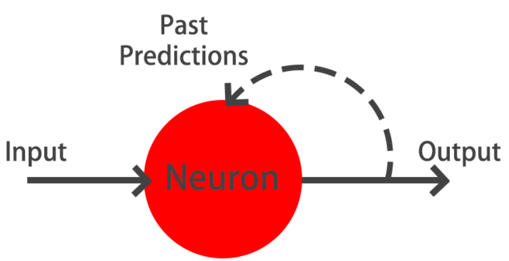
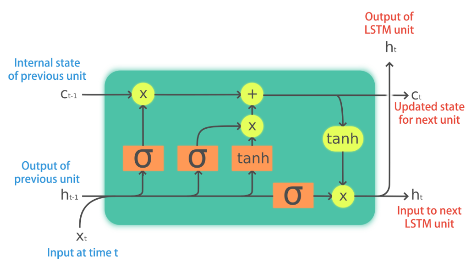

## Keras {.unnumbered}

<h3 class="course__description-title">Miguel Esteban</h3>
<p class="course__instructor-description display-none-mobile-course-page-experiment">
    Miguel is an entrepreneur and data scientist. He has worked at companies like Endesa, where he applied Deep Learning to solve and automate problems related to electrical consumption curves.  He is currently one of the founders at XtremeAI, where he is working in building products delivering automatic data extraction from complex documents.

In it's free time he plays music,  takes pictures,  experiments with AI and thinks about the next big idea to built. 

You can follow or contact him on <a href="https://twitter.com/mikstevan">Twitter</a>  and  <a href="https://www.linkedin.com/in/mikstevan">LinkedIn</a>.
  </p>

**Course Description**

<p class="course__description">Deep learning is here to stay! It's the go-to technique to solve complex problems that arise with unstructured data and an incredible tool for innovation. Keras is one of the frameworks that make it easier to start developing deep learning models, and it's versatile enough to build industry-ready models in no time. In this course, you will learn regression and save the earth by predicting asteroid trajectories, apply binary classification to distinguish between real and fake dollar bills, use multiclass classification to decide who threw which dart at a dart board, learn to use neural networks to reconstruct noisy images and much more. Additionally, you will learn how to better control your models during training and how to tune them to boost their performance.</p>

### Introducing Keras {.unnumbered}

<p class="chapter__description">
    In this first chapter, you will get introduced to neural networks, understand what kind of problems they can solve, and when to use them. You will also build several networks and save the earth by training a regression model that approximates the orbit of a meteor that is approaching us!
  </p>

#### What is Keras? {.unnumbered}


##### Describing Keras {.unnumbered}

<div class=""><p>Which of the following statements about Keras is <strong>false</strong>?</p></div>

- [ ] Keras is integrated into TensorFlow, that means you can call Keras from within TensorFlow and get the best of both worlds.
- [x] Keras can work well on its own without using a backend, like TensorFlow.
- [ ] Keras is an open source project started by François Chollet.

<p class="dc-completion-pane__message dc-u-maxw-100pc">You're good at spotting lies! Keras is a wrapper around a backend library, so a backend like TensorFlow, Theano, CNTK, etc must be provided.</p>

##### Would you use deep learning? {.unnumbered}

<div class=""><p>Imagine you're building an app that allows you to take a picture of your clothes and then shows you a pair of shoes that would match well. This app needs a machine learning module that's in charge of identifying the type of clothes you are wearing, as well as their color and texture. Would you use deep learning to accomplish this task?</p></div>

- [ ] I'd use deep learning, since we are dealing with tabular data and neural networks work well with images.
- [x] I'd use deep learning since we are dealing with unstructured data and neural networks work well with images.
- [ ] This task can be easily accomplished with other machine learning algorithms, so deep learning is not required.

<p class="dc-completion-pane__message dc-u-maxw-100pc">You're right! Using deep learning would be the easiest way. The model would generalize well if enough clothing images are provided.</p>

#### Your first neural network {.unnumbered}


##### Hello nets! {.unnumbered}


<div class>
<p>You're going to build a simple neural network to get a feeling of how quickly it is to accomplish this in Keras. </p>
<p>You will build a network that <strong>takes two numbers as an input</strong>, passes them through <strong>a hidden layer of 10 neurons</strong>, and finally <strong>outputs a single non-constrained number</strong>. </p>
<p>A <strong>non-constrained output can be obtained by avoiding setting an activation function in the output layer</strong>. This is useful for problems like regression, when we want our output to be able to take any non-constrained value.</p>
<p></p>
<center>

</center>
</div>
<div class="exercise--instructions__content">


<li>Import the <code>Sequential</code> model from <code>tensorflow.keras.models</code> and the <code>Dense</code>layer from <code>tensorflow.keras.layers</code>.</li>

<li>Create an instance of the <code>Sequential</code> model.</li>

<li>Add a 10-neuron hidden <code>Dense</code> layer with an <code>input_shape</code> of two neurons.</li>

<li>Add a final 1-neuron output layer and summarize your model with <code>summary()</code>.</li>
```{python}
# edited/added
import tensorflow as tf
import numpy as np
import pandas as pd
import matplotlib.pyplot as plt
import seaborn as sns

# Import the Sequential model and Dense layer
from tensorflow.keras.models import Sequential
from tensorflow.keras.layers import Dense

# Create a Sequential model
model = Sequential()

# Add an input layer and a hidden layer with 10 neurons
model.add(Dense(10, input_shape=(2,), activation="relu"))

# Add a 1-neuron output layer
model.add(Dense(1))

# Summarise your model
model.summary()
```
</div>

<p class="">You've just build your first neural network with Keras, well done!</p>

##### Counting parameters {.unnumbered}


<div class>
<p>You've just created a neural network. But you're going to create a new one now, taking some time to think about the weights of each layer. The Keras <code>Dense</code> layer and the <code>Sequential</code> model are already loaded for you to use. </p>
<p>This is the network you will be creating:</p>
<p>
</p>
<center>

</center>
</div>
<div class="exercise--instructions__content">


<li>Instantiate a new <code>Sequential()</code> model.</li>

<li>Add a <code>Dense()</code> layer with five neurons and three neurons as input.</li>

<li>Add a final dense layer with one neuron and no activation.</li>
```{python}
# Instantiate a new Sequential model
model = Sequential()

# Add a Dense layer with five neurons and three inputs
model.add(Dense(5, input_shape=(3,), activation="relu"))

# Add a final Dense layer with one neuron and no activation
model.add(Dense(1))

# Summarize your model
model.summary()
```
</div>

<div class=""><p>Given the <code>model</code> you just built, which answer is correct regarding the number of weights (parameters) in the <strong>hidden layer</strong>?</p></div>

- [ ] There are 15 parameters, 3 for every neuron in the hidden layer.
- [x] There are 20 parameters, 15 from the connections of our inputs to our hidden layer and 5 from the bias weight of each neuron in the hidden layer.
- [ ] There are 20 parameters, no bias weights were needed in this simple model.

<p class="">Great! You certainly know where those parameters come from!</p>

##### Build as shown! {.unnumbered}


<div class>
<p>You will take on a final challenge before moving on to the next lesson. Build the network shown in the picture below. Prove your mastered Keras basics in no time!</p>
<p></p>
<center>

</center>
</div>
<div class="exercise--instructions__content">


<li>Instantiate a <code>Sequential</code> model.</li>

<li>Build the input and hidden layer.</li>

<li>Add the output layer.</li>
```{python}
# edited/added
from tensorflow.keras.models import Sequential
from tensorflow.keras.layers import Dense

# Instantiate a Sequential model
model = Sequential()

# Build the input and hidden layer
model.add(Dense(3, input_shape=(2,)))

# Add the ouput layer
model.add(Dense(1))
```
</div>

<p class="">Perfect! You've shown you can already translate a visual representation of a neural network into Keras code. Let's keep going!</p>

#### Surviving a meteor strike {.unnumbered}


##### Specifying a model {.unnumbered}


<div class>
<p>You will build a simple regression model to predict the orbit of the meteor!</p>
<p>Your training data consist of measurements taken at time steps from <strong>-10 minutes before the impact region to +10 minutes after</strong>. Each time step can be viewed as an X coordinate in our graph, which has an associated position Y for the meteor orbit at that time step.</p>
<p><em>Note that you can view this problem as approximating a quadratic function via the use of neural networks.</em></p>
<p></p>
<center>

</center> 
<p>This data is stored in two numpy arrays: one called <code>time_steps</code> , what we call <em>features</em>, and another called <code>y_positions</code>, with the <em>labels</em>. 
Go on and build your model! It should be able to predict the y positions for the meteor orbit at future time steps.</p>
<p>Keras <code>Sequential</code> model and <code>Dense</code> layers are available for you to use.</p>
</div>
<div class="exercise--instructions__content">


<li>Instantiate a <code>Sequential</code> model.</li>

<li>Add a Dense layer of 50 neurons with an input shape of 1 neuron.</li>

<li>Add two Dense layers of 50 neurons each and <code>'relu'</code> activation.</li>

<li>End your model with a Dense layer with a single neuron and no activation.</li>
```{python}
# edited/added
orbit = pd.read_csv('archive/Introduction-to-Deep-Learning-with-Keras/datasets/orbit.csv')
orbit.head()
time_steps = orbit['time_steps'].to_numpy()
y_positions = orbit['y'].to_numpy()

# Instantiate a Sequential model
model = Sequential()

# Add a Dense layer with 50 neurons and an input of 1 neuron
model.add(Dense(50, input_shape=(1,), activation='relu'))

# Add two Dense layers with 50 neurons and relu activation
model.add(Dense(50, activation='relu'))
model.add(Dense(50, activation='relu'))

# End your model with a Dense layer and no activation
model.add(Dense(1))
```
</div>

<p class="">You are closer to forecasting the meteor orbit! It's important to note we aren't using an activation function in our output layer since <code>y_positions</code> aren't bounded and they can take any value. Your model is built to perform a regression task.</p>

##### Training {.unnumbered}


<div class>
<p>You're going to train your first model in this course, and for a good cause! </p>
<p>Remember that <strong>before training your Keras models you need to compile them</strong>. This can be done with the <code>.compile()</code> method. The <code>.compile()</code> method takes arguments such as the <code>optimizer</code>, used for weight updating, and the <code>loss</code> function, which is what we want to minimize. Training your model is as easy as calling the <code>.fit()</code> method, passing on the <em>features</em>, <em>labels</em> and a number of <em>epochs</em> to train for. </p>
<p>The regression <code>model</code> you built in the previous exercise is loaded for you to use, along with the <code>time_steps</code> and <code>y_positions</code> data. Train it and evaluate it on this very same data, let's see if your model can learn the meteor's trajectory.</p>
</div>
<div class="exercise--instructions__content">


<li>Compile your model making use of the <code>'adam'</code> optimizer and <code>'mse'</code> as your loss function.</li>

<li>Fit your model using the features and labels for 30 epochs.</li>

<li>Evaluate your model with the <code>.evaluate()</code> method, passing the features and labels used during training.</li>
```{python}
# Compile your model
model.compile(optimizer = 'adam', loss = 'mse')

print("Training started..., this can take a while:")

# Fit your model on your data for 30 epochs
model.fit(time_steps, y_positions, epochs = 30)

# Evaluate your model 
print("Final loss value:",model.evaluate(time_steps, y_positions))
```
</div>

<p class="">Amazing! You can check the console to see how the loss function decreased as epochs went by. Your model is now ready to make predictions on unseen data.</p>

##### Predicting the orbit! {.unnumbered}


<div class>
<p>You've already trained a <code>model</code> that approximates the orbit of the meteor approaching Earth and it's loaded for you to use.</p>
<p>Since you trained your model for values between -10 and 10 minutes, your model hasn't yet seen any other values for different time steps. 
You will now visualize how your model behaves on unseen data. </p>
<p>If you want to check the source code of <code>plot_orbit</code>, paste <code>show_code(plot_orbit)</code> into the console.</p>
<p>Hurry up, the Earth is running out of time!</p>
<p><em>Remember <code>np.arange(x,y)</code> produces a range of values from <strong>x</strong> to <strong>y-1</strong>. That is the <code>[x, y)</code> interval.</em></p>
</div>
<div class="exercise--instructions__content">

<p>Use the model's <code>.predict()</code> method to predict from <code>-10</code> to <code>10</code> minutes.</p></div>


<div class="exercise--instructions__content">

<p>Use the model's <code>.predict()</code> method to predict from <code>-40</code> to <code>40</code> minutes.</p></div>
```{python}
# edited/added
def plot_orbit(model_preds):
    axeslim = int(len(model_preds) / 2)
    plt.plot(np.arange(-axeslim, axeslim + 1),np.arange(-axeslim, axeslim + 1) ** 2,
             color="mediumslateblue")
    plt.plot(np.arange(-axeslim, axeslim + 1),model_preds,color="orange")
    plt.axis([-40, 41, -5, 550])
    plt.legend(["Scientist's Orbit", 'Your orbit'],loc="lower left")
    plt.title("Predicted orbit vs Scientist's Orbit")
    plt.show()
    plt.close()
    
# Predict the twenty minutes orbit
twenty_min_orbit = model.predict(np.arange(-10, 11))

# Plot the twenty minute orbit 
plot_orbit(twenty_min_orbit)

# Predict the eighty minute orbit
eighty_min_orbit = model.predict(np.arange(-40, 41))

# Plot the eighty minute orbit 
plot_orbit(eighty_min_orbit)
```

<p class="">Your model fits perfectly to the scientists trajectory for time values between -10 to +10, the region where the meteor crosses the impact region, so we won't be hit! However, it starts to diverge when predicting for new values we haven't trained for. This shows neural networks learn according to the data they are fed with. Data quality and diversity are very important. You've barely scratched the surface of what neural networks can do. Are you prepared for the next chapter?</p>

### Going Deeper {.unnumbered}

<p class="chapter__description">
    By the end of this chapter, you will know how to solve binary, multi-class, and multi-label problems with neural networks. All of this by solving problems like detecting fake dollar bills, deciding who threw which dart at a board, and building an intelligent system to water your farm. You will also be able to plot model training metrics and to stop training and save your models when they no longer improve.
  </p>

#### Binary classification {.unnumbered}


##### Exploring dollar bills {.unnumbered}


<div class>
<p>You will practice building classification models in Keras with the <strong>Banknote Authentication</strong> dataset. </p>
<p>Your goal is to distinguish between real and fake dollar bills. In order to do this, the dataset comes with 4 features: <code>variance</code>,<code>skewness</code>,<code>kurtosis</code> and <code>entropy</code>. These features are calculated by applying mathematical operations over the dollar bill images. The labels are found in the dataframe's <code>class</code> column.</p>
<p></p>
<center>

</center>
<p>A pandas DataFrame named <code>banknotes</code> is ready to use, let's do some data exploration!</p>
</div>
<div class="exercise--instructions__content">


<li>Import <code>seaborn</code> as <code>sns</code>.</li>

<li>Use <code>seaborn</code>'s <code>pairplot()</code> on <code>banknotes</code> and set <code>hue</code> to be the name of the column containing the labels.</li>

<li>Generate descriptive statistics for the banknotes authentication data.</li>

<li>Count the number of observations per label with <code>.value_counts()</code>.</li>
```{python}
# edited/added
banknotes = pd.read_csv('archive/Introduction-to-Deep-Learning-with-Keras/datasets/banknotes.csv')

# Normlize the data
X = banknotes.iloc[:, :4]
X = ((X - X.mean()) / X.std()).to_numpy()
y = banknotes['class'].to_numpy()

# Import seaborn
import seaborn as sns

# Use pairplot and set the hue to be our class column
sns.pairplot(banknotes, hue='class') 

# Show the plot
#plt.show()
plt.close() # edited/added

# Describe the data
print('Dataset stats: \n', banknotes.describe())

# Count the number of observations per class
print('Observations per class: \n', banknotes['class'].value_counts())
```
</div>

<p class="">Your pairplot shows that there are features for which the classes spread out noticeably. This gives us an intuition about our classes being easily separable. Let's build a model to find out what it can do!</p>

##### A binary classification model {.unnumbered}


<div class>
<p>Now that you know what the <strong>Banknote Authentication</strong> dataset looks like, we'll build a simple model to distinguish between real and fake bills. </p>
<p>You will perform binary classification by using a single neuron as an output. The input layer will have 4 neurons since we have 4 features in our dataset. The model's output will be a value constrained between 0 and 1. </p>
<p>We will interpret this output number as the probability of our input variables coming from a fake dollar bill, with 1 meaning we are certain it's a fake bill.</p>
<p></p>
<center>

</center>
</div>
<div class="exercise--instructions__content">


<li>Import the <code>Sequential</code> model and <code>Dense</code> layer from tensorflow.keras.</li>

<li>Create a sequential model.</li>

<li>Add a 4 neuron input layer with the <code>input_shape</code> parameter and a 1 neuron output layer with <code>sigmoid</code> activation. </li>

<li>Compile your model using <code>sgd</code> as an optimizer.</li>
```{python}
# Import the sequential model and dense layer
from tensorflow.keras.models import Sequential
from tensorflow.keras.layers import Dense

# Create a sequential model
model = Sequential()

# Add a dense layer 
model.add(Dense(1, input_shape=(4,), activation='sigmoid'))

# Compile your model
model.compile(loss='binary_crossentropy', optimizer='sgd', metrics=['accuracy'])

# Display a summary of your model
model.summary()
```
</div>

<p class="">That was fast! Let's use this classification model to detect fake dollar bills!</p>

##### Is this dollar bill fake ? {.unnumbered}


<div class><p>You are now ready to train your <code>model</code> and check how well it performs when classifying new bills!
The dataset has already been partitioned into features: <code>X_train</code> &amp; <code>X_test</code>, and labels: <code>y_train</code> &amp; <code>y_test</code>.</p></div>
<div class="exercise--instructions__content">


<li>Train your model for 20 epochs calling <code>.fit()</code>, passing in the training data.</li>

<li>Check your model accuracy using the <code>.evaluate()</code> method on the test data.</li>

<li>Print <code>accuracy</code>.</li>
```{python}
# edited/added
from sklearn.model_selection import train_test_split
X_train, X_test, y_train, y_test = train_test_split(X, y, test_size=0.25, stratify=y)

# Train your model for 20 epochs
model.fit(X_train, y_train, epochs = 20)

# Evaluate your model accuracy on the test set
accuracy = model.evaluate(X_test, y_test)[1]

# Print accuracy
print('Accuracy:', accuracy)
```
</div>

<p class="">Alright! It looks like you are getting a high accuracy even with this simple model!</p>

#### Multi-class classification {.unnumbered}


##### A multi-class model {.unnumbered}


<div class>
<p>You're going to build a model that predicts who threw which dart only based on where that dart landed! (That is the dart's x and y coordinates on the board.)</p>
<p>This problem is a multi-class classification problem since each dart can only be thrown by one of 4 competitors. So classes/labels are mutually exclusive, and therefore we can build a neuron with as many output as competitors and use the <code>softmax</code> activation function to achieve a total sum of probabilities of 1 over all competitors.</p>
<p>The <code>Sequential</code> model and <code>Dense</code> layers are already imported for you to use.</p>
</div>
<div class="exercise--instructions__content">


<li>Instantiate a <code>Sequential</code> model.</li>

<li>Add 3 dense layers of 128, 64 and 32 neurons each.</li>

<li>Add a final dense layer with as many neurons as competitors.</li>

<li>Compile your model using <code>categorical_crossentropy</code> loss.</li>
```{python}
# edited/added
darts = pd.read_csv('archive/Introduction-to-Deep-Learning-with-Keras/datasets/darts.csv')

# Instantiate a sequential model
model = Sequential()

# Add 3 dense layers of 128, 64 and 32 neurons each
model.add(Dense(128, input_shape=(2,), activation='relu'))
model.add(Dense(64, activation='relu'))
model.add(Dense(32, activation='relu'))

# Add a dense layer with as many neurons as competitors
model.add(Dense(4, activation='softmax'))

# Compile your model using categorical_crossentropy loss
model.compile(loss='categorical_crossentropy',
              optimizer='adam',
              metrics=['accuracy'])
```
</div>

<p class="">Good job! Your models are increasing in depth, just as your knowledge on neural networks!</p>

##### Prepare your dataset {.unnumbered}


<div class>
<p>In the console you can check that your labels, <code>darts.competitor</code> are not yet in a format to be understood by your network. They contain the names of the competitors as strings. You will first turn these competitors into unique numbers,then use the <code>to_categorical()</code> function from <code>keras.utils</code> to turn these numbers into their one-hot encoded representation. </p>
<p>This is useful for multi-class classification problems, since there are as many output neurons as classes and for every observation in our dataset we just want one of the neurons to be activated.</p>
<p>The dart's dataset is loaded as <code>darts</code>. Pandas is imported as <code>pd</code>. Let's prepare this dataset!</p>
</div>
<div class="exercise--instructions__content">


<li>Use the <code>Categorical()</code> method from pandas to transform the <code>competitor</code> column.</li>

<li>Assign a number to each competitor using the <code>cat.codes</code> attribute from the competitor column.</li>

</div>


<li>Import <code>to_categorical</code> from <code>tensorflow.keras.utils</code>.</li>


<li>Apply <code>to_categorical()</code> to your labels.</li>
```{python}
# edited/added
from tensorflow.keras.utils import to_categorical

# Transform into a categorical variable
darts.competitor = pd.Categorical(darts.competitor)

# Assign a number to each category (label encoding)
darts.competitor = darts.competitor.cat.codes 

# Print the label encoded competitors
print('Label encoded competitors: \n',darts.competitor.head())

# Import to_categorical from keras utils module
from tensorflow.keras.utils import to_categorical

coordinates = darts.drop(['competitor'], axis=1)
# Use to_categorical on your labels
competitors = to_categorical(darts.competitor)

# Now print the one-hot encoded labels
print('One-hot encoded competitors: \n',competitors)
```

<p class="">Great! Each competitor is now a vector of length 4, full of zeroes except for the position representing her or himself.</p>

##### Training on dart throwers {.unnumbered}


<div class>
<p>Your model is now ready, just as your dataset. It's time to train!</p>
<p>The <code>coordinates</code> features and <code>competitors</code> labels you just transformed have been partitioned into <code>coord_train</code>,<code>coord_test</code> and <code>competitors_train</code>,<code>competitors_test</code>.</p>
<p>Your <code>model</code> is also loaded. Feel free to visualize your training data or <code>model.summary()</code> in the console. </p>
<p>Let's find out who threw which dart just by looking at the board!</p>
</div>
<div class="exercise--instructions__content">


<li>Train your <code>model</code> on the training data for 200 <code>epochs</code>.</li>

<li>Evaluate your <code>model</code> accuracy on the test data.</li>
```{python}
# edited/added
coordinates = darts[['xCoord', 'yCoord']]
coord_train, coord_test, competitors_train, competitors_test = train_test_split(coordinates, competitors, test_size=0.25, stratify=competitors)

# Fit your model to the training data for 200 epochs
model.fit(coord_train, competitors_train, epochs=200)

# Evaluate your model accuracy on the test data
accuracy = model.evaluate(coord_test, competitors_test)[1]

# Print accuracy
print('Accuracy:', accuracy)
```
</div>

<p class="">Your model just trained for 200 epochs! The accuracy on the test set is quite high. How are the predictions looking? Let's find out!</p>

##### Softmax predictions {.unnumbered}


<div class>
<p>Your recently trained <code>model</code> is loaded for you. This model is generalizing well!, that's why you got a high accuracy on the test set.  </p>
<p>Since you used the <code>softmax</code> activation function, for every input of 2 coordinates provided to your model there's an output vector of 4 numbers. Each of these numbers encodes the probability of a given dart being thrown by one of the 4 possible competitors. </p>
<p>When computing accuracy with the model's <code>.evaluate()</code> method, your model takes the class with the highest probability as the prediction. <code>np.argmax()</code> can help you do this since it returns the index with the highest value in an array. </p>
<p>Use the collection of test throws stored in <code>coords_small_test</code> and <code>np.argmax()</code>to check this out!</p>
</div>
<div class="exercise--instructions__content">


<li>Predict with your <code>model</code> on  <code>coords_small_test</code>.</li>

<li>Print the model predictions.</li>

</div>

<li>Use <code>np.argmax()</code>to extract the index of the highest probable competitor from each <code>pred</code> vector in <code>preds</code>.</li>
```{python}
# edited/added
coords_small_test = pd.DataFrame({
    'xCoord':[0.209048, 0.082103, 0.198165, -0.348660, 0.214726],
    'yCoord':[-0.077398, -0.721407, -0.674646, 0.035086, 0.183894]
})

competitors_small_test = np.array([[0., 0., 1., 0.], [0., 0., 0., 1.],
                                   [0., 0., 0., 1.], [1., 0., 0., 0.],
                                   [0., 0., 1., 0.]])
                                   
# Predict on coords_small_test
preds = model.predict(coords_small_test)

# Print preds vs true values
print("{:45} | {}".format('Raw Model Predictions','True labels'))
for i,pred in enumerate(preds):
  print("{} | {}".format(pred,competitors_small_test[i]))
  
# Extract the position of highest probability from each pred vector
preds_chosen = [np.argmax(pred) for pred in preds]

# Print preds vs true values
print("{:10} | {}".format('Rounded Model Predictions','True labels'))
for i,pred in enumerate(preds_chosen):
  print("{:25} | {}".format(pred,competitors_small_test[i]))
```

<p class="">Well done! As you've seen you can easily interpret the softmax output. This can also help you spot those observations where your network is less certain on which class to predict, since you can see the probability distribution among classes per prediction. Let's learn how to solve new problems with neural networks!</p>

#### Multi-label classification {.unnumbered}


##### An irrigation machine {.unnumbered}


<div class>
<p>You're going to automate the watering of farm parcels by making an intelligent irrigation machine. Multi-label classification problems differ from multi-class problems in that each observation can be labeled with zero or more classes. So classes/labels are not mutually exclusive, you could water all, none or any combination of farm parcels based on the inputs.</p>
<p>To account for this behavior what we do is have an output layer with as many neurons as classes but this time, unlike in multi-class problems, each output neuron has a <code>sigmoid</code> activation function. This makes each neuron in the output layer able to output a number between 0 and 1 independently.</p>
<p>The <code>Sequential()</code> model and <code>Dense()</code> layers are ready to be used. It's time to build an intelligent irrigation machine!</p>
<p></p>
<center>

</center>
</div>
<div class="exercise--instructions__content">


<li>Instantiate a <code>Sequential()</code> model.</li>

<li>Add a hidden layer of 64 neurons with as many input neurons as there are sensors and <code>relu</code> activation.</li>

<li>Add an output layer with as many neurons as parcels and <code>sigmoid</code>activation.</li>

<li>Compile your model with the <code>adam</code> optimizer and <code>binary_crossentropy</code> loss.</li>
```{python}
# edited/added
irrigation = pd.read_csv('archive/Introduction-to-Deep-Learning-with-Keras/datasets/irrigation_machine.csv', index_col=0)

# Instantiate a Sequential model
model = Sequential()

# Add a hidden layer of 64 neurons and a 20 neuron's input
model.add(Dense(64, input_shape=(20,), activation='relu'))

# Add an output layer of 3 neurons with sigmoid activation
model.add(Dense(3, activation='sigmoid'))

# Compile your model with binary crossentropy loss
model.compile(optimizer = 'adam',
              loss = 'binary_crossentropy',
              metrics = ['accuracy'])

model.summary()
```
</div>

<p class="">Great! You've already built 3 models for 3 different problems! Hopefully you're starting to get a feel for how different problems can be modeled in the neural network realm.</p>

##### Training with multiple labels {.unnumbered}


<div class>
<p>An output of your multi-label <code>model</code> could look like this: <code>[0.76 , 0.99 , 0.66 ]</code>.  If we round up probabilities higher than 0.5, this observation will be classified as containing all 3 possible labels <code>[1,1,1]</code>. For this particular problem, this would mean watering all 3 parcels in your farm is the right thing to do, according to the network, given the input sensor measurements.</p>
<p>You will now train and predict with the <code>model</code> you just built.
<code>sensors_train</code>, <code>parcels_train</code>, <code>sensors_test</code> and <code>parcels_test</code> are already loaded for you to use. </p>
<p>Let's see how well your intelligent machine performs!</p>
</div>
<div class="exercise--instructions__content">


<li>Train the model for 100 <code>epochs</code> using a <code>validation_split</code> of 0.2.</li>

<li>Predict with your <code>model</code> using the test data.</li>

<li>Round up your <code>preds</code> with <code>np.round()</code>.</li>

<li>Evaluate your model's accuracy on the test data.</li>
```{python}
# edited/added
parcels = irrigation[['parcel_0', 'parcel_1', 'parcel_2']].to_numpy()
sensors = irrigation.drop(['parcel_0', 'parcel_1', 'parcel_2'], axis=1).to_numpy()
sensors_train, sensors_test, parcels_train, parcels_test = train_test_split(sensors, parcels, test_size=0.3, stratify=parcels)

# Train for 100 epochs using a validation split of 0.2
model.fit(sensors_train, parcels_train, epochs=100, validation_split=0.2)

# Predict on sensors_test and round up the predictions
preds = model.predict(sensors_test)
preds_rounded = np.round(preds)

# Print rounded preds
print('Rounded Predictions: \n', preds_rounded)

# Evaluate your model's accuracy on the test data
accuracy = model.evaluate(sensors_test, parcels_test)[1]

# Print accuracy
print('Accuracy:', accuracy)
```
</div>

<p class="">Great work on automating this farm! You can see how the <code>validation_split</code> argument is useful for evaluating how your model performs as it trains. Let's move on and improve your model training by using callbacks!</p>

#### Keras callbacks {.unnumbered}


##### The history callback {.unnumbered}


<div class>
<p>The history callback is returned by default every time you train a model with the <code>.fit()</code> method. To access these metrics you can access the <code>history</code> dictionary parameter inside the returned <code>h_callback</code> object with the corresponding keys.</p>
<p>The irrigation machine <code>model</code> you built in the previous lesson is loaded for you to train, along with its features and labels now loaded as <code>X_train</code>, <code>y_train</code>, <code>X_test</code>, <code>y_test</code>.
This time you will store the model's <code>history</code>callback and use the <code>validation_data</code> parameter as it trains.</p>
<p>You will plot the results stored in <code>history</code> with <code>plot_accuracy()</code> and <code>plot_loss()</code>, two simple matplotlib functions. 
You can check their code in the console by pasting <code>show_code(plot_loss)</code>. </p>
<p>Let's see the behind the scenes of our training!</p>
</div>
<div class="exercise--instructions__content">


<li>Train your model on <code>X_train</code> and <code>y_train</code>, validate each epoch on <code>X_test</code> and <code>y_test</code>.</li>

<li>Use <code>plot_loss</code>extracting <code>loss</code>and <code>val_loss</code> from <code>h_callback</code>.</li>

<li>Use <code>plot_accuracy</code>extracting <code>accuracy</code>and <code>val_accuracy</code> from <code>h_callback</code>.</li>
```{python}
# edited/added
def plot_accuracy(acc,val_acc):
    # Plot training & validation accuracy values
    plt.figure();
    plt.plot(acc);
    plt.plot(val_acc);
    plt.title('Model accuracy');
    plt.ylabel('Accuracy');
    plt.xlabel('Epoch');
    plt.legend(['Train', 'Test'], loc='upper left');
    plt.show()
    plt.close()
def plot_loss(loss,val_loss):
    plt.figure();
    plt.plot(loss);
    plt.plot(val_loss);
    plt.title('Model loss');
    plt.ylabel('Loss');
    plt.xlabel('Epoch');
    plt.legend(['Train', 'Test'], loc='upper right')
    plt.show()
    plt.close()
X_train, y_train = sensors_train, parcels_train
X_test, y_test = sensors_test, parcels_test

# Train your model and save its history
h_callback = model.fit(X_train, y_train, epochs = 25,
                    validation_data=(X_test, y_test))
                    
# Plot train vs test loss during training
plot_loss(h_callback.history['loss'], h_callback.history['val_loss'])

# Plot train vs test accuracy during training
plot_accuracy(h_callback.history['accuracy'], h_callback.history['val_accuracy'])
```
</div>

<p class="">Awesome! These graphs are really useful for detecting overfitting and to know if your neural network would benefit from more training data. More on this in the next chapter!</p>

##### Early stopping your model {.unnumbered}


<div class>
<p>The early stopping callback is useful since it allows for you to stop the model training if it no longer improves after a given number of epochs. To make use of this functionality you need to pass the callback inside a list to the model's callback parameter in the <code>.fit()</code> method.</p>
<p>The <code>model</code> you built to detect fake dollar bills is loaded for you to train, this time with early stopping. <code>X_train</code>, <code>y_train</code>, <code>X_test</code> and <code>y_test</code> are also available for your use.</p>
</div>
<div class="exercise--instructions__content">


<li>Import the <code>EarlyStopping</code>callback from <code>tensorflow.keras.callbacks</code>.</li>

<li>Define a callback, monitor <code>'val_accuracy'</code> with a <code>patience</code> of 5 epochs.</li>

<li>Train your model using the early stopping callback.</li>
```{python}
# edited/added
X_train, X_test, y_train, y_test = train_test_split(X, y, test_size=0.25, stratify=y)

# Create a sequential model
model = Sequential()

# Add a dense layer
model.add(Dense(1, input_shape=(4, ), activation='sigmoid'))

# Compile your model
model.compile(loss='binary_crossentropy', optimizer='sgd', metrics=['accuracy'])

# Import the early stopping callback
from tensorflow.keras.callbacks import EarlyStopping

# Define a callback to monitor val_accuracy
monitor_val_acc = EarlyStopping(monitor='val_accuracy', 
                                patience=5)
                                
# Train your model using the early stopping callback
model.fit(X_train, y_train, 
          epochs=1000, validation_data=(X_test, y_test),
          callbacks=[monitor_val_acc])
```
</div>

<p class="">Great! Now you won't ever fall short of epochs! Your model will stop early if the quantity monitored doesn't improve for the given amount of epochs.</p>

##### A combination of callbacks {.unnumbered}


<div class>
<p>Deep learning models can take a long time to train, especially when you move to deeper architectures and bigger datasets. Saving your model every time it improves as well as stopping it when it no longer does allows you to worry less about choosing the number of epochs to train for. You can also restore a saved model anytime and resume training where you left it. </p>
<p>The model training and validation data are available in your workspace as <code>X_train</code>, <code>X_test</code>, <code>y_train</code>, and <code>y_test</code>.</p>
<p>Use the <code>EarlyStopping()</code> and the <code>ModelCheckpoint()</code> callbacks so that you can go eat a jar of cookies while you leave your computer to work!</p>
</div>
<div class="exercise--instructions__content">


<li>Import both the <code>EarlyStopping</code> and <code>ModelCheckpoint</code> callbacks from <code>tensorflow.keras</code>.</li>

<li>Create <code>monitor_val_acc</code> as an <code>EarlyStopping</code> callback that will monitor <code>'val_accuracy'</code>, with a <code>patience</code> of 3 epochs. </li>

<li>Create <code>model_checkpoint</code> as a <code>ModelCheckpoint</code>callback, save the best model as <code>best_banknote_model.hdf5</code>.</li>

<li>Fit your model providing a <strong>list</strong> with the defined callbacks and <code>X_test</code> and <code>y_test</code> as validation data.</li>
```{python}
# Import the EarlyStopping and ModelCheckpoint callbacks
from tensorflow.keras.callbacks import EarlyStopping, ModelCheckpoint

# Early stop on validation accuracy
monitor_val_acc = EarlyStopping(monitor = 'val_accuracy', patience = 3)

# Save the best model as best_banknote_model.hdf5
model_checkpoint = ModelCheckpoint('archive/Introduction-to-Deep-Learning-with-Keras/datasets/best_banknote_model.hdf5', save_best_only = True)

# Fit your model for a stupid amount of epochs
h_callback = model.fit(X_train, y_train,
                    epochs = 1000000000000,
                    callbacks = [monitor_val_acc, model_checkpoint],
                    validation_data = (X_test, y_test))
```
</div>

<p class="">You've learned a powerful callback combo! Nice moves! Now you always save the model that performed best, even if you early stopped at one that was already performing worse.</p>


### Improving Your Model Performance {.unnumbered}

<p class="chapter__description">
    In the previous chapters, you've trained a lot of models! You will now learn how to interpret learning curves to understand your models as they train. You will also visualize the effects of activation functions, batch-sizes, and batch-normalization. Finally, you will learn how to perform automatic hyperparameter optimization to your Keras models using sklearn.
  </p>

#### Learning curves {.unnumbered}


##### Learning the digits {.unnumbered}


<div class>
<p>You're going to build a model on the <strong>digits dataset</strong>, a sample dataset that comes pre-loaded with scikit learn. The <strong>digits dataset</strong> consist of <strong>8x8 pixel handwritten digits from 0 to 9</strong>:
</p>
<center>

</center>
You want to distinguish between each of the 10 possible digits given an image, so we are dealing with <strong>multi-class classification</strong>.
<p>The dataset has already been partitioned into <code>X_train</code>, <code>y_train</code>, <code>X_test</code>, and <code>y_test</code>, using 30% of the data as testing data. The labels are already one-hot encoded vectors, so you don't need to use Keras <code>to_categorical()</code> function. </p>
<p>Let's build this new <code>model</code>!</p>
</div>
<div class="exercise--instructions__content">


<li>Add a <code>Dense</code> layer of 16 neurons with <code>relu</code> activation and an <code>input_shape</code> that takes the <strong>total number of pixels</strong> of the 8x8 digit image.</li>

<li>Add a <code>Dense</code> layer with 10 outputs and <code>softmax</code> activation.</li>

<li>Compile your model with <code>adam</code>, <code>categorical_crossentropy</code>, and <code>accuracy</code> metrics.</li>

<li>Make sure your model works by predicting on <code>X_train</code>.</li>
```{python}
# edited/added
from tensorflow.keras.utils import to_categorical
from sklearn.model_selection import train_test_split
X = np.load('archive/Introduction-to-Deep-Learning-with-Keras/datasets/digits_pixels.npy')
y = np.load('archive/Introduction-to-Deep-Learning-with-Keras/datasets/digits_target.npy')
y = to_categorical(y)
X_train, X_test, y_train, y_test = train_test_split(X, y, test_size=0.3)

# Instantiate a Sequential model
model = Sequential()

# Input and hidden layer with input_shape, 16 neurons, and relu 
model.add(Dense(16, input_shape = (64,), activation = 'relu'))

# Output layer with 10 neurons (one per digit) and softmax
model.add(Dense(10, activation = 'softmax'))

# Compile your model
model.compile(optimizer = 'adam', loss = 'categorical_crossentropy', metrics = ['accuracy'])

# Test if your model is well assembled by predicting before training
print(model.predict(X_train))
```
</div>

<p class="">Great! Predicting on training data inputs before training can help you quickly check that your model works as expected.</p>

##### Is the model overfitting? {.unnumbered}


<div class>
<p>Let's train the <code>model</code> you just built and plot its learning curve to check out if it's overfitting!
You can make use of the loaded function <code>plot_loss()</code> to plot training loss against validation loss, you can get both from the history callback.</p>
<p>If you want to inspect the <code>plot_loss()</code> function code, paste this in the console: <code>show_code(plot_loss)</code></p>
</div>
<div class="exercise--instructions__content">

<li>Train your model for 60 <code>epochs</code>, using <code>X_test</code> and <code>y_test</code> as validation data.</li>

<li>Use <code>plot_loss()</code> passing <code>loss</code> and <code>val_loss</code> as extracted from the history attribute of the <code>h_callback</code> object.</li>
```{python}
# Train your model for 60 epochs, using X_test and y_test as validation data
h_callback = model.fit(X_train, y_train, epochs=60, validation_data=(X_test, y_test), verbose=0)

# Extract from the h_callback object loss and val_loss to plot the learning curve
plot_loss(h_callback.history['loss'], h_callback.history['val_loss'])
```
</div>

<p>Just by looking at the picture, do you think the learning curve shows this model is overfitting after having trained for 60 epochs?</p>

- [ ] Yes, it started to overfit since the test loss is higher than the training loss.
- [x] No, the test loss is not getting higher as the epochs go by.

<p class="">Awesome choice! This graph doesn't show overfitting but convergence. It looks like your model has learned all it could from the data and it no longer improves. The test loss, although higher than the training loss, is not getting worse, so we aren't overfitting to the training data.</p>


##### Do we need more data? {.unnumbered}


<div class>
<p>It's time to check whether the <strong>digits dataset</strong> <code>model</code> you built benefits from more training examples!</p>
<p>In order to keep code to a minimum, various things are already initialized and ready to use:</p>

<li>The <code>model</code> you just built.</li>

<li>
<code>X_train</code>,<code>y_train</code>,<code>X_test</code>, and <code>y_test</code>.</li>

<li>The <code>initial_weights</code> of your model, saved after using <code>model.get_weights()</code>.</li>

<li>A pre-defined list of training sizes: <code>training_sizes</code>.</li>

<li>A pre-defined early stopping callback monitoring loss: <code>early_stop</code>.</li>

<li>Two empty lists to store the evaluation results: <code>train_accs</code> and <code>test_accs</code>.</li>


<p>Train your model on the different training sizes and evaluate the results on <code>X_test</code>.
End by plotting the results with <code>plot_results()</code>.</p>
<p>The full code for this exercise can be found on the slides!</p>
</div>
<div class="exercise--instructions__content">


<li>Get a fraction of the training data determined by the <code>size</code> we are currently evaluating in the loop.</li>

<li>Set the model weights to the <code>initial_weights</code> with <code>set_weights()</code> and train your model on the fraction of training data using <code>early_stop</code> as a callback.</li>

<li>Evaluate and store the accuracy for the training fraction and the test set.</li>

<li>Call <code>plot_results()</code> passing in the training and test accuracies for each training size.</li>
```{python}
# edited/added
def plot_results(train_accs,test_accs):
    plt.plot(training_sizes, train_accs, 'o-', label="Training Accuracy");
    plt.plot(training_sizes, test_accs, 'o-', label="Test Accuracy");
    plt.title('Accuracy vs Number of training samples');
    plt.xlabel('# of training samples');
    plt.ylabel('Accuracy');
    plt.legend(loc="best");
    plt.show()
    plt.close()
initial_weights = model.get_weights()
early_stop = EarlyStopping(monitor='loss', patience=1)
train_accs, test_accs = [], []
training_sizes = np.array([125, 502, 879, 1255])

for size in training_sizes:
  	# Get a fraction of training data (we only care about the training data)
    X_train_frac, y_train_frac = X_train[:size], y_train[:size]
    # Reset the model to the initial weights and train it on the new training data fraction
    model.set_weights(initial_weights)
    model.fit(X_train_frac, y_train_frac, epochs = 50, callbacks = [early_stop])
    # Evaluate and store both: the training data fraction and the complete test set results
    train_accs.append(model.evaluate(X_train_frac, y_train_frac)[1])
    test_accs.append(model.evaluate(X_test, y_test)[1])

# Plot train vs test accuracies
plot_results(train_accs, test_accs)
```

</div>

<p class="">Good job, that was a lot of code to understand! The results shows that your model would not benefit a lot from more training data, since the test set accuracy is already starting to flatten. It's time to look at activation funtions!</p>

#### Activation functions {.unnumbered}


##### Different activation functions {.unnumbered}


<div class>
<p>The <code>sigmoid()</code>,<code>tanh()</code>, <code>ReLU()</code>, and <code>leaky_ReLU()</code> functions have been defined and ready for you to use. Each function receives an input number <em>X</em> and returns its corresponding <em>Y</em> value.</p>
<p>Which of the statements below is <strong>false</strong>?</p>
</div>

- [ ] The <code>sigmoid()</code> takes a value of <em>0.5</em> when <em>X = 0</em> whilst <code>tanh()</code> takes a value of <em>0</em>.
- [ ] The <code>leaky_ReLU()</code> takes a value of <em>-0.01</em> when <em>X = -1</em> whilst <code>ReLU()</code> takes a value of <em>0</em>.
- [x] The <code>sigmoid()</code> and <code>tanh()</code> both take values close to <em>-1</em> for big negative numbers.

<p class="">Great! For big negative numbers the sigmoid approaches <em>0</em> not <em>-1</em> whilst the <code>tanh()</code> does take values close to <em>-1</em>.</p>

##### Comparing activation functions {.unnumbered}


<div class>
<p>Comparing activation functions involves a bit of coding, but nothing you can't do! </p>
<p>You will try out different activation functions on the <strong>multi-label model</strong> you built for your farm irrigation machine in chapter 2. The function <code>get_model('relu')</code> returns a copy of this model and applies the <code>'relu'</code> activation function to its hidden layer. </p>
<p>You will loop through several activation functions, generate a new model for each and train it. By storing the history callback in a dictionary you will be able to visualize which activation function performed best in the next exercise!</p>
<p><code>X_train</code>, <code>y_train</code>, <code>X_test</code>, <code>y_test</code> are ready for you to use when training your models.</p>
</div>
<div class="exercise--instructions__content">


<li>Fill up the activation functions array  with <code>relu</code>,<code>leaky_relu</code>, <code>sigmoid</code>, and <code>tanh</code>.</li>

<li>Get a new model for each iteration with <code>get_model()</code> passing the current activation function as a parameter.</li>

<li>Fit your model providing the train and <code>validation_data</code>, use 20 <code>epochs</code> and set verbose to 0.</li>
```{python}
# edited/added
irrigation = pd.read_csv('archive/Introduction-to-Deep-Learning-with-Keras/datasets/irrigation_machine.csv', index_col=0)
parcels = irrigation[['parcel_0', 'parcel_1', 'parcel_2']].to_numpy()
sensors = irrigation.drop(['parcel_0', 'parcel_1', 'parcel_2'], axis=1).to_numpy()
X_train, X_test, y_train, y_test = train_test_split(sensors, parcels, test_size=0.3, stratify=parcels)

# Return a new model with the given activation
def get_model(act_function):
    model = Sequential()
    if act_function == 'leaky_relu':
        model.add(Dense(64, input_shape=(20, ), activation=tf.nn.leaky_relu))
    else:
        model.add(Dense(64, input_shape=(20, ), activation=act_function))
    # Add an output layer of 3 neurons with sigmoid activation
    model.add(Dense(3, activation='sigmoid'))
    # Compile your model with binary crossentropy loss
    model.compile(optimizer='adam',
              loss='binary_crossentropy',
              metrics=['accuracy'])
    return model
  
# Activation functions to try
activations = ['relu', 'leaky_relu', 'sigmoid', 'tanh']

# Loop over the activation functions
activation_results = {}

for act in activations:
  # Get a new model with the current activation
  model = get_model(act)
  # Fit the model and store the history results
  h_callback = model.fit(X_train, y_train, validation_data=(X_test,y_test), epochs=20, verbose=0)
  activation_results[act] = h_callback
```
</div>

<p class="">Awesome job! You've trained 4 models, each with a different activation function, let's see how well they performed!</p>

##### Comparing activation functions II {.unnumbered}


<div class>
<p>What you coded in the previous exercise has been executed to obtain the<code>activation_results</code> variable, this time <strong>100 epochs were used instead of 20</strong>. This way you will have more epochs to further compare how the training evolves per activation function.</p>
<p>For every <code>h_callback</code> of each activation function in <code>activation_results</code>:</p>

<li>The <code>h_callback.history['val_loss']</code> has been extracted.</li>

<li>The <code>h_callback.history['val_accuracy']</code> has been extracted.</li>


<p>Both are saved into two dictionaries: <code>val_loss_per_function</code> and <code>val_acc_per_function</code>.</p>
<p>Pandas is also loaded as <code>pd</code> for you to use. Let's plot some quick validation loss and accuracy charts!</p>
</div>
<div class="exercise--instructions__content">


<li>Use <code>pd.DataFrame()</code>to create a new DataFrame from the <code>val_loss_per_function</code> dictionary.</li>

<li>Call <code>plot()</code> on the DataFrame.</li>

<li>Create another pandas DataFrame from <code>val_acc_per_function</code>.</li>

<li>Once again, plot the DataFrame.</li>
```{python}
# edited/added
val_loss_per_function = {}
val_acc_per_function = {}
for k, v in activation_results.items():
    val_loss_per_function[k] = v.history['val_loss']
    val_acc_per_function[k] = v.history['val_accuracy']
    
# Create a dataframe from val_loss_per_function
val_loss= pd.DataFrame(val_loss_per_function)

# Call plot on the dataframe
val_loss.plot()
plt.show()
plt.close() # edited/added

# Create a dataframe from val_acc_per_function
val_acc = pd.DataFrame(val_acc_per_function)

# Call plot on the dataframe
val_acc.plot()
plt.show()
plt.close() # edited/added
```
</div>

<p class="">You've plotted both: loss and accuracy curves. It looks like sigmoid activation worked best for this particular model as the hidden layer's activation function. It led to a model with lower validation loss and higher accuracy after 100 epochs.</p>

#### Batch size and batch normalization {.unnumbered}

* Mini-batches
  * Advantages
    * Networks train faster (more weight updates in same amount of time)
    * Less RAM memory required, can train on huge datasets
    * Noise can help networks reach a lower error, escaping local minima
  * Disadvantage
    * More iterations need to be run
    * Need to be adjusted, we need to find a good batch size
 
* Batch Normalization
  * Advantages
    * Improves gradient flow
    * Allows higher learning rates
    * Reduces dependence on weight initializations
    * Acts as an unintended form of regularization
    * Limits inter covariate shift

##### Changing batch sizes {.unnumbered}


<div class>
<p>You've seen models are usually trained in batches of a fixed size. The smaller a batch size, the more weight updates per epoch, but at a cost of a more unstable gradient descent. Specially if the batch size is too small and it's not representative of the entire training set. </p>
<p>Let's see how different batch sizes affect the accuracy of a simple binary classification model that separates red from blue dots.</p>
<p>You'll use a batch size of one, updating the weights once per sample in your training set for each epoch. Then you will use the entire dataset, updating the weights only once per epoch.</p>
</div>
<div class="exercise--instructions__content">

<p>Use <code>get_model()</code> to get a new, already compiled, model, then train your model for 5 <code>epochs</code> with a <code>batch_size</code> of 1.</p></div>


<div class="exercise--instructions__content">

<p>Now train a new model with <code>batch_size</code> equal to the size of the training set.</p></div>
```{python}
# edited/added
dots = pd.read_csv('archive/Introduction-to-Deep-Learning-with-Keras/datasets/dots.csv')
X = dots.iloc[:, :-1]
y = dots.iloc[:, -1]
X_train, X_test, y_train, y_test = train_test_split(X, y, test_size=0.3)
def get_model():
    model = Sequential()
    model.add(Dense(4,input_shape=(2,),activation='relu'))
    model.add(Dense(1,activation="sigmoid"))
    model.compile('sgd', 'binary_crossentropy', metrics=['accuracy'])
    return model
  
# Get a fresh new model with get_model
model = get_model()

# Train your model for 5 epochs with a batch size of 1
model.fit(X_train, y_train, epochs=5, batch_size=1)
print("\n The accuracy when using a batch of size 1 is: ",
      model.evaluate(X_test, y_test)[1])
      
model = get_model()

# Fit your model for 5 epochs with a batch of size the training set
model.fit(X_train, y_train, epochs=5, batch_size=X_train.shape[0])
print("\n The accuracy when using the whole training set as batch-size was: ",
      model.evaluate(X_test, y_test)[1])
```

<p class="">Great work! You can see that accuracy is lower when using a batch size equal to the training set size. This is not because the network had more trouble learning the optimization function: <strong>Even though the same number of epochs were used for both batch sizes the number of resulting weight updates was very different!</strong>. With a batch of size the training set and 5 epochs we only get 5 updates total, each update computes and averaged gradient descent with all the training set observations. To obtain similar results with this batch size we should increase the number of epochs so that more weight updates take place.</p>

##### Batch normalizing a familiar model {.unnumbered}


<div class>
<p>Remember the <strong>digits dataset</strong> you trained in the first exercise of this chapter? </p>
<p>
</p>
<center>

</center>

<p>A multi-class classification problem that you solved using <code>softmax</code> and 10 neurons in your output layer.</p>
<p>You will now build a new deeper model consisting of 3 hidden layers of 50 neurons each, using batch normalization in between layers. 
The <code>kernel_initializer</code> parameter is used to initialize weights in a similar way.</p>
</div>
<div class="exercise--instructions__content">


<li>Import <code>BatchNormalization</code> from <code>tensorflow.keras</code> layers.</li>

<li>Build your deep network model, use <strong>50 neurons for each hidden layer</strong> adding batch normalization in between layers.</li>

<li>Compile your model with stochastic gradient descent, <code>sgd</code>, as an optimizer.</li>
```{python}
# Import batch normalization from keras layers
from tensorflow.keras.layers import BatchNormalization

# Build your deep network
batchnorm_model = Sequential()
batchnorm_model.add(Dense(50, input_shape=(64,), activation='relu', kernel_initializer='normal'))
batchnorm_model.add(BatchNormalization())
batchnorm_model.add(Dense(50, activation='relu', kernel_initializer='normal'))
batchnorm_model.add(BatchNormalization())
batchnorm_model.add(Dense(50, activation='relu', kernel_initializer='normal'))
batchnorm_model.add(BatchNormalization())
batchnorm_model.add(Dense(10, activation='softmax', kernel_initializer='normal'))

# Compile your model with sgd
batchnorm_model.compile(optimizer='sgd', loss='categorical_crossentropy', metrics=['accuracy'])
```
</div>

<p class="">Congratulations! That was a deep model indeed. Let's compare how it performs against this very same model without batch normalization!</p>

##### Batch normalization effects {.unnumbered}


<div class>
<p>Batch normalization tends to increase the learning speed of our models and make their learning curves more stable. Let's see how two identical models with and without batch normalization compare.</p>
<p>The model you just built <code>batchnorm_model</code> is loaded for you to use. An exact copy of it without batch normalization: <code>standard_model</code>, is available as well. You can check their <code>summary()</code> in the console. <code>X_train</code>, <code>y_train</code>, <code>X_test</code>, and <code>y_test</code> are also loaded so that you can train both models. </p>
<p>You will compare the accuracy learning curves for both models plotting them with <code>compare_histories_acc()</code>.</p>
<p>You can check the function pasting <code>show_code(compare_histories_acc)</code> in the console.</p>
</div>
<div class="exercise--instructions__content">


<li>Train the <code>standard_model</code>  for 10 epochs passing in train and validation data, storing its history in <code>h1_callback</code>.</li>

<li>Train your <code>batchnorm_model</code> for 10 epochs passing in train and validation data, storing its history in <code>h2_callback</code>.</li>

<li>Call <code>compare_histories_acc</code> passing in <code>h1_callback</code> and <code>h2_callback</code>.</li>
```{python}
# edited/added
def compare_histories_acc(h1,h2):
    plt.plot(h1.history['accuracy']);
    plt.plot(h1.history['val_accuracy']);
    plt.plot(h2.history['accuracy']);
    plt.plot(h2.history['val_accuracy']);
    plt.title("Batch Normalization Effects");
    plt.xlabel('Epoch');
    plt.ylabel('Accuracy');
    plt.legend(['Train', 'Test', 'Train with Batch Normalization', 'Test with Batch Normalization'], loc='best')
    plt.show()
    plt.close()
X = np.load('archive/Introduction-to-Deep-Learning-with-Keras/datasets/digits_pixels.npy')
y = np.load('archive/Introduction-to-Deep-Learning-with-Keras/datasets/digits_target.npy')
y = to_categorical(y)
X_train, X_test, y_train, y_test = train_test_split(X, y, test_size=0.3)

# Build your deep network
standard_model = Sequential()
standard_model.add(Dense(50, input_shape=(64, ), activation='relu', kernel_initializer='normal'))
standard_model.add(Dense(50, activation='relu', kernel_initializer='normal'))
standard_model.add(Dense(50, activation='relu', kernel_initializer='normal'))
standard_model.add(Dense(10, activation='softmax', kernel_initializer='normal'))

# Compile your model with sgd
standard_model.compile(optimizer='sgd', loss='categorical_crossentropy', metrics=['accuracy'])

# Train your standard model, storing its history callback
h1_callback = standard_model.fit(X_train, y_train, validation_data=(X_test, y_test), epochs=10, verbose=0)

# Train the batch normalized model you recently built, store its history callback
h2_callback = batchnorm_model.fit(X_train, y_train, validation_data=(X_test, y_test), epochs=10, verbose=0)

# Call compare_histories_acc passing in both model histories
compare_histories_acc(h1_callback, h2_callback)
```
</div>

<p class="">Outstanding! You can see that for this deep model batch normalization proved to be useful, helping the model obtain high accuracy values just over the first 10 training epochs.</p>

#### Hyperparameter tuning {.unnumbered}

* Neural network hyperparameters
  * Number of layers
  * Number of neurons per layer
  * Layer order
  * Layer activations
  * Batch sizes
  * Learning rates
  * Optimizers
* Tips for neural networks hyperparameter tuning
  * Random search is preferred over grid search
  * Don't use many epochs
  * Use a smaller sample of your dataset
  * Play with batch sizes, activations, optimizers and learning rates

##### Preparing a model for tuning {.unnumbered}


<div class>
<p>Let's tune the hyperparameters of a <strong>binary classification</strong> model that does well classifying the <strong>breast cancer dataset</strong>.</p>
<p>You've seen that the first step to turn a model into a sklearn estimator is to build a function that creates it. The definition of this function is important since hyperparameter tuning is carried out by varying the arguments your function receives. </p>
<p>Build a simple <code>create_model()</code> function that receives both a learning rate and an activation function as arguments. The <code>Adam</code> optimizer has been imported as an object from <code>tensorflow.keras.optimizers</code> so that you can also change its learning rate parameter.</p>
</div>
<div class="exercise--instructions__content">


<li>Set the learning rate of the <code>Adam</code> optimizer object to the one passed in the arguments.</li>

<li>Set the hidden layers activations to the one passed in the arguments.</li>

<li>Pass the optimizer and the binary cross-entropy loss to the <code>.compile()</code> method.</li>
```{python}
# edited/added
from tensorflow.keras.optimizers import Adam

# Creates a model given an activation and learning rate
def create_model(learning_rate=0.01,activation='relu'):
  	# Create an Adam optimizer with the given learning rate
  	opt = Adam(lr = learning_rate)
  	# Create your binary classification model  
  	model = Sequential()
  	model.add(Dense(128, input_shape = (30,), activation = activation))
  	model.add(Dense(256, activation = activation))
  	model.add(Dense(1, activation = 'sigmoid'))
  	# Compile your model with your optimizer, loss, and metrics
  	model.compile(optimizer = opt, loss = 'binary_crossentropy', metrics = ['accuracy'])
  	return model
```
</div>

<p class="">Well done! With this function ready you can now create a sklearn estimator and generate different models to perform simple hyperparameter tuning on!</p>

##### Tuning the model parameters {.unnumbered}


<div class>
<p>It's time to try out different parameters on your model and see how well it performs!</p>
<p>The <code>create_model()</code> function you built in the previous exercise is ready for you to use.</p>
<p>Since fitting the <code>RandomizedSearchCV</code> object would take too long, the results you'd get are printed in the <code>show_results()</code> function.
You could try <code>random_search.fit(X,y)</code> in the console yourself to check it does work after you have built everything else, but you will probably timeout the exercise (so copy your code first if you try this or you can lose your progress!).</p>
<p>You don't need to use the optional <code>epochs</code> and <code>batch_size</code> parameters when building your <code>KerasClassifier</code> object since you are passing them as <code>params</code> to the random search and this works already.</p>
</div>
<div class="exercise--instructions__content">


<li>Import <code>KerasClassifier</code> from <code>tensorflow.keras</code> scikit_learn wrappers.</li>

<li>Use your <code>create_model</code> function when instantiating your <code>KerasClassifier</code>.</li>

<li>Set <code>'relu'</code> and <code>'tanh'</code> as <code>activation</code>, 32, 128, and 256 as <code>batch_size</code>, 50, 100, and 200 <code>epochs</code>, and <code>learning_rate</code> of 0.1, 0.01, and 0.001.</li>

<li>Pass your converted <code>model</code> and the chosen <code>params</code> as you build your <code>RandomizedSearchCV</code> object.</li>
```{python}
# edited/added
from sklearn.model_selection import RandomizedSearchCV
from sklearn.model_selection import KFold
from sklearn.datasets import load_breast_cancer
X, y = load_breast_cancer(return_X_y=True)

# Import KerasClassifier from tensorflow.keras scikit learn wrappers
from tensorflow.keras.wrappers.scikit_learn import KerasClassifier

# Create a KerasClassifier
model = KerasClassifier(build_fn = create_model)

# Define the parameters to try out
params = {'activation':['relu', 'tanh'], 'batch_size':[32, 128, 256], 
          'epochs':[50, 100, 200], 'learning_rate':[0.1, 0.01, 0.001]}
          
# Create a randomize search cv object passing in the parameters to try
random_search = RandomizedSearchCV(model, param_distributions = params, cv = KFold(3))

# Running random_search.fit(X,y) would start the search,but it takes too long!
random_search_results = random_search.fit(X, y, verbose=0)

# Print results
print("Best: {} using {}".format(random_search_results.best_score_,
                                 random_search_results.best_params_))
```
</div>

<p class="">That was great! Phew, I'm glad you didn't run <code>random_search.fit(X,y)</code>,datacamp servers are still working. Now that we have a better idea of which parameters perform best, lets use them!</p>

##### Training with cross-validation {.unnumbered}


<div class>
<p>Time to train your model with the best parameters found: <strong>0.001</strong> for the <strong>learning rate</strong>, <strong>50 epochs</strong>, <strong>a 128 batch_size</strong> and <strong>relu activations</strong>. </p>
<p>The <code>create_model()</code> function from the previous exercise is ready for you to use. <code>X</code> and <code>y</code> are loaded as features and labels. </p>
<p>Use the best values found for your model when creating your <code>KerasClassifier</code> object so that they are used when performing cross_validation.</p>
<p>End this chapter by training an awesome tuned model on the <strong>breast cancer dataset</strong>!</p>
</div>
<div class="exercise--instructions__content">


<li>Import <code>KerasClassifier</code> from <code>tensorflow.keras</code> scikit_learn wrappers.</li>

<li>Create a <code>KerasClassifier</code> object providing the best parameters found.</li>

<li>Pass your <code>model</code>, features and labels to <code>cross_val_score</code> to perform cross-validation with 3 folds.</li>
```{python}
# edited/added
from sklearn.model_selection import cross_val_score

# Import KerasClassifier from tensorflow.keras wrappers
from tensorflow.keras.wrappers.scikit_learn import KerasClassifier

# Create a KerasClassifier
model = KerasClassifier(build_fn = create_model, epochs = 50, batch_size = 128, verbose = 0) # edited/added

# Calculate the accuracy score for each fold
kfolds = cross_val_score(model, X, y, cv = 3)

# Print the mean accuracy
print('The mean accuracy was:', kfolds.mean())

# Print the accuracy standard deviation
print('With a standard deviation of:', kfolds.std())
```
</div>

<p class="">Amazing! You can now test out different parameters on your networks and find the best models. Congratulations on making it this far, this chapter was quite a challengue! You're now left with a final chapter full of fun models to play with.</p>

### Advanced Model Architectures {.unnumbered}

<p class="chapter__description">
    It's time to get introduced to more advanced architectures! You will create an autoencoder to reconstruct noisy images, visualize convolutional neural network activations, use deep pre-trained models to classify images and learn more about recurrent neural networks and working with text as you build a network that predicts the next word in a sentence.
  </p>

#### Tensors, layers, and autoencoders {.unnumbered}


##### It's a flow of tensors {.unnumbered}


<div class>
<p>If you have already built a model, you can use the <code>model.layers</code> and the <code>tensorflow.keras.backend</code> to build functions that, provided with a valid input tensor, return the corresponding output tensor.</p>
<p>This is a useful tool when we want to obtain the output of a network at an intermediate layer.</p>
<p>For instance, if you get the input and output from the first layer of a network, you can build an <code>inp_to_out</code> function that returns the result of carrying out forward propagation through only the first layer for a given input tensor.</p>
<p>So that's what you're going to do right now! </p>
<p><code>X_test</code> from the <strong>Banknote Authentication</strong> dataset and its <code>model</code> are preloaded. Type <code>model.summary()</code> in the console to check it.</p>
</div>
<div class="exercise--instructions__content">


<li>Import <code>tensorflow.keras.backend</code> as <code>K</code>.</li>

<li>Use the <code>model.layers</code> list to get a reference to the input and output of the first layer.</li>

<li>Use <code>K.function()</code> to define a function that maps <code>inp</code> to <code>out</code>.</li>

<li>Print the results of passing <code>X_test</code> through the 1st layer.</li>
```{python}
# edited/added
from sklearn.model_selection import train_test_split
from tensorflow.keras import Sequential
from tensorflow.keras.layers import Dense
banknote = pd.read_csv('archive/Introduction-to-Deep-Learning-with-Keras/datasets/banknotes.csv')
X = banknote.drop(['class'], axis=1)
X = ((X - X.mean()) / X.std()).to_numpy()
y = banknote['class']
X_train, X_test, y_train, y_test = train_test_split(X, y, test_size=0.3)
model = Sequential()
model.add(Dense(2, input_shape=(4, ), activation='relu'))
model.add(Dense(1, activation='sigmoid'))

# Import tensorflow.keras backend
import tensorflow.keras.backend as K

# Input tensor from the 1st layer of the model
inp = model.layers[0].input

# Output tensor from the 1st layer of the model
out = model.layers[0].output

# Define a function from inputs to outputs
inp_to_out = K.function([inp], [out])

# Print the results of passing X_test through the 1st layer
print(inp_to_out([X_test]))
```
</div>

<p class="">Nice job! Let's use this function for something more interesting.</p>

##### Neural separation {.unnumbered}


<div class>
<p>Put on your gloves because you're going to perform brain surgery! </p>
<p>Neurons learn by updating their weights to output values that help them better distinguish between the different output classes in your dataset.
You will make use of the <code>inp_to_out()</code> function you just built to visualize the output of two neurons in the first layer of the <strong>Banknote Authentication</strong> <code>model</code> as it learns. </p>
<p>The <code>model</code> you built in chapter 2 is ready for you to use, just like <code>X_test</code> and <code>y_test</code>. Paste <code>show_code(plot)</code> in the console if you want to check <code>plot()</code>.</p>
<p>You're performing heavy duty, once all is done, click through the graphs to watch the separation live!</p>
</div>
<div class="exercise--instructions__content">


<li>Use the previously defined <code>inp_to_out()</code> function to get the outputs of the first layer when fed with <code>X_test</code>.</li>

<li>Use the <code>model.evaluate()</code> method to obtain the validation accuracy for the test dataset at each epoch.</li>
```{python}
# edited/added
def plot():
  fig, ax = plt.subplots()
  plt.scatter(layer_output[:, 0], layer_output[:, 1],c = y_test,edgecolors='none')
  plt.title('Epoch: {}, Test Accuracy: {:3.1f} %'.format(i+1, test_accuracy * 100.0))
  plt.show()
  plt.close()
model.compile(optimizer='sgd', loss='binary_crossentropy', metrics=['accuracy'])
layer_outputs = []
test_accuracies = []

for i in range(0, 21):
  	# Train model for 1 epoch
    h = model.fit(X_train, y_train, batch_size = 16, epochs = 1, verbose = 0)
    if i%4==0: 
      # Get the output of the first layer
      layer_output = inp_to_out([X_test])[0]
      # Evaluate model accuracy for this epoch
      test_accuracy = model.evaluate(X_test, y_test)[1] 
      # Plot 1st vs 2nd neuron output
      plot()
```


</div>

<p class="">That took a while! If you take a look at the graphs you can see how the neurons are learning to spread out the inputs based on whether they are fake or legit dollar bills. (A single fake dollar bill is represented as a purple dot in the graph) At the start the outputs are closer to each other, the weights are learned as epochs go by so that fake and legit dollar bills get a different, further and further apart output. Click in between the graphs fast, it's like a movie!</p>

##### Building an autoencoder {.unnumbered}


<div class>
<p>Autoencoders have several interesting applications like anomaly detection or image denoising. They aim at producing an output identical to its inputs. The input will be compressed into a lower dimensional space, <strong>encoded</strong>. The model then learns to <strong>decode</strong> it back to its original form. </p>
<p>You will encode and decode the <strong>MNIST</strong> dataset of handwritten digits, the hidden layer will encode a 32-dimensional representation of the image, which originally consists of 784 pixels (28 x 28). The autoencoder will essentially learn to turn the 784 pixels original image into a compressed 32 pixels image and learn how to use that encoded representation to bring back the original 784 pixels image.</p>
<p>The <code>Sequential</code> model and <code>Dense</code> layers are ready for you to use.</p>
<p>Let's build an autoencoder!</p>
</div>
<div class="exercise--instructions__content">


<li>Create a <code>Sequential</code> model.</li>

<li>Add a dense layer with as many neurons as the encoded image dimensions and <code>input_shape</code> the number of pixels in the original image.</li>

<li>Add a final layer with as many neurons as pixels in the input image.</li>

<li>Compile your <code>autoencoder</code> using <code>adadelta</code> as an optimizer and <code>binary_crossentropy</code> loss, then summarise it.</li>
```{python}
# Start with a sequential model
autoencoder = Sequential(name='autoencoder')

# Add a dense layer with input the original image pixels and neurons the encoded representation
autoencoder.add(Dense(32, input_shape=(784, ), activation="relu"))

# Add an output layer with as many neurons as the orginal image pixels
autoencoder.add(Dense(784, activation = "sigmoid"))

# Compile your model with adadelta
autoencoder.compile(optimizer='adam', loss='binary_crossentropy', metrics=['accuracy']) # edited/added

# Summarize your model structure
autoencoder.summary()
```
</div>

<p class="">Great start! Your autoencoder is now ready. Let's see what you can do with it!</p>

##### De-noising like an autoencoder {.unnumbered}


<div class>
<p>Okay, you have just built an <code>autoencoder</code> model. Let's see how it handles a more challenging task.</p>
<p>First, you will build a model that encodes images, and you will check how different digits are represented with <code>show_encodings()</code>. To build the encoder you will make use of your <code>autoencoder</code>, that has already being trained. You will just use the first half of the network, which contains the input and the bottleneck output. That way, you will obtain a 32 number output which represents the encoded version of the input image. </p>
<p>Then, you will apply your <code>autoencoder</code> to noisy images from <code>MNIST</code>, it should be able to clean the noisy artifacts. </p>
<p><code>X_test_noise</code> is loaded in your workspace. The digits in this noisy dataset look like this:</p>
<p></p>
<p>Apply the power of the autoencoder!</p>
</div>
<div class="exercise--instructions__content">


<li>Build an <code>encoder</code> model with the first layer of your trained <code>autoencoder</code> model.</li>

<li>Predict on <code>X_test_noise</code> with your <code>encoder</code> and show the results with <code>show_encodings()</code>.</li>

</div>


<li>Predict on <code>X_test_noise</code> with your <code>autoencoder</code>, this will effectively perform both the encoding and decoding.</li>


<li>Plot noisy vs decoded images with <code>compare_plot()</code>.</li>
```{python}
# edited/added
from tensorflow.keras.datasets import mnist
(X_train, y_train), (X_test, y_test) = mnist.load_data()
X_train = X_train.astype('float32') / 255.
X_test = X_test.astype('float32') / 255.
X_train = X_train.reshape((len(X_train), np.prod(X_train.shape[1:])))
X_test = X_test.reshape((len(X_test), np.prod(X_test.shape[1:])))
X_test_noise = np.load('archive/Introduction-to-Deep-Learning-with-Keras/datasets/X_test_MNIST_noise.npy')
X_test_noise = X_test_noise.reshape((len(X_test_noise), np.prod(X_test.shape[1:])))
y_test_noise = np.load('archive/Introduction-to-Deep-Learning-with-Keras/datasets/y_test_MNIST.npy')
def show_encodings(encoded_imgs,number=1):
    n = 5  # how many digits we will display
    original = X_test_noise
    original = original[np.where(y_test_noise == number)]
    encoded_imgs = encoded_imgs[np.where(y_test_noise==number)]
    plt.figure(figsize=(20, 4))
    #plt.title('Original '+str(number)+' vs Encoded representation')
    for i in range(min(n,len(original))):
        # display original imgs
        ax = plt.subplot(2, n, i + 1)
        plt.imshow(original[i].reshape(28, 28))
        plt.gray()
        ax.get_xaxis().set_visible(False)
        ax.get_yaxis().set_visible(False)
        # display encoded imgs
        ax = plt.subplot(2, n, i + 1 + n)
        plt.imshow(np.tile(encoded_imgs[i],(32,1)))
        plt.gray()
        ax.get_xaxis().set_visible(False)
        ax.get_yaxis().set_visible(False)
    plt.show()
    plt.close()
def compare_plot(original,decoded_imgs):
    n = 4  # How many digits we will display
    plt.figure(figsize=(20, 4))
    for i in range(n):
        # Display original
        ax = plt.subplot(2, n, i + 1)
        plt.imshow(original[i].reshape(28, 28))
        plt.gray()
        ax.get_xaxis().set_visible(False)
        ax.get_yaxis().set_visible(False)
        # Display reconstruction
        ax = plt.subplot(2, n, i + 1 + n)
        plt.imshow(decoded_imgs[i].reshape(28, 28))
        plt.gray()
        ax.get_xaxis().set_visible(False)
        ax.get_yaxis().set_visible(False)
    plt.title('Noisy vs Decoded images')
    plt.show()
    plt.close()
autoencoder.fit(X_train, X_train,
                epochs=100,
                batch_size=256,
                shuffle=True,
                validation_data=(X_test, X_test), verbose=0);
                
# Build your encoder by using the first layer of your autoencoder
encoder = Sequential()
encoder.add(autoencoder.layers[0])

# Encode the noisy images and show the encodings for your favorite number [0-9]
encodings = encoder.predict(X_test_noise)
show_encodings(encodings, number = 1)

# Predict on the noisy images with your autoencoder
decoded_imgs = autoencoder.predict(X_test)

# Plot noisy vs decoded images
compare_plot(X_test_noise, decoded_imgs)
```

<p class="">Amazing! The noise is gone now! You could get a better reconstruction by using a convolutional autoencoder. I hope this new model opened up your mind to the many possible architectures and non-classical ML problems that neural networks can solve :)</p>

#### Intro to CNNs {.unnumbered}


##### Building a CNN model {.unnumbered}


<div class>
<p>Building a CNN model in Keras isn't much more difficult than building any of the models you've already built throughout the course! You just need to make use of convolutional layers.</p>
<p>You're going to build a shallow convolutional <code>model</code> that classifies the <strong>MNIST</strong> digits dataset. The same one you de-noised with your autoencoder! The images are 28 x 28 pixels and <strong>just have one channel</strong>, since they are black and white pictures. </p>
<p>Go ahead and build this small convolutional model!</p>
</div>
<div class="exercise--instructions__content">


<li>Import the <code>Conv2D</code> and <code>Flatten</code> layers and instantiate your model.</li>

<li>Add a first convolutional layer with 32 filters of size 3x3 and the corresponding 3D tuple as <code>input_shape</code>.</li>

<li>Add a second convolutional layer with 16 filters of size 3x3 with relu activation.</li>

<li>Flatten the previous layer output to create a one-dimensional vector.</li>
```{python}
# Import the Conv2D and Flatten layers and instantiate model
from tensorflow.keras.layers import Conv2D, Flatten
model = Sequential()

# Add a convolutional layer of 32 filters of size 3x3 
model.add(Conv2D(32, kernel_size = 3, input_shape = (28, 28, 1), activation = 'relu'))

# Add a convolutional layer of 16 filters of size 3x3
model.add(Conv2D(16, kernel_size = 3, activation = 'relu'))

# Flatten the previous layer output 
model.add(Flatten())

# Add as many outputs as classes with softmax activation
model.add(Dense(10, activation = 'softmax'))
```
</div>

<p class="">Well done! You can see that the key concepts are the same, you just have to use new layers!</p>

##### Looking at convolutions {.unnumbered}


<div class>
<p>Inspecting the activations of a convolutional layer is a cool thing. You have to do it at least once in your lifetime!</p>
<p>To do so, you will build a new model with the Keras <code>Model</code> object, which takes in a list of inputs and a list of outputs. The outputs you will provide to this new model is the first convolutional layer outputs when given an <strong>MNIST</strong> digit as input image.</p>
<p>The convolutional <code>model</code> you built in the previous exercise has already been trained for you. It can now correctly classify <strong>MNIST</strong> handwritten images. You can check it with <code>model.summary()</code> in the console.</p>
<p>Let's look at the convolutional masks that were learned in the first convolutional layer of this model!</p>
</div>
<div class="exercise--instructions__content">


<li>Obtain a reference to the outputs of the first convolutional layer in the model.</li>

<li>Build a new model using the model's first layer input and the <code>first_layer_output</code> as outputs.</li>

<li>Use this <code>first_layer_model</code> to predict on <code>X_test</code>.</li>

<li>Plot the activations of the first digit of <code>X_test</code> for the <strong>15th</strong> and the <strong>18th</strong> neuron filter.</li>
```{python}
# edited/added
(X_train, y_train), (X_test, y_test) = mnist.load_data()
X_train = np.reshape(X_train, [-1, 28, 28, 1])
X_test = np.reshape(X_test, [-1, 28, 28, 1])
model.compile(optimizer='adam', loss='sparse_categorical_crossentropy', metrics=['accuracy'])
model.fit(X_train, y_train, epochs=6, batch_size=32);
fig, axs = plt.subplots(1, 2)

# Obtain a reference to the outputs of the first layer
first_layer_output = model.layers[0].output

# Build a model using the model input and the first layer output
first_layer_model = tf.keras.models.Model(inputs = model.layers[0].input, outputs = first_layer_output)

# Use this model to predict on X_test
activations = first_layer_model.predict(X_test)

# Plot the first digit of X_test for the 15th filter
axs[0].matshow(activations[0,:,:,14], cmap = 'viridis')

# Do the same but for the 18th filter now
axs[1].matshow(activations[0,:,:,17], cmap = 'viridis')
plt.show()
plt.close() # edited/added
```
</div>

<p class="">Hurrah! Each neuron filter of the first layer learned a different convolution. The 15th filter (a.k.a convolutional mask) learned to detect horizontal traces in your digits. On the other hand, filter 18th seems to be checking for vertical traces.</p>

##### Preparing your input image {.unnumbered}


<div class>
<p>The original <strong>ResNet50 model</strong> was trained with images of size <strong>224 x 224 pixels</strong> and a number of preprocessing operations; like the subtraction of the mean pixel value in the training set for all training images. You need to pre-process the images you want to predict on in the same way.</p>
<p>When predicting on a single image you need it to fit the model's input shape, which in this case looks like this: 
(batch-size, width, height, channels),<code>np.expand_dims</code> with parameter <code>axis = 0</code> adds the batch-size dimension, representing that a single image will be passed to predict. This batch-size dimension value is 1, since we are only predicting on one image.</p>
<p>You will go over these preprocessing steps as you prepare this dog's (named Ivy) image into one that can be classified by <strong>ResNet50</strong>.</p>
<p></p>
<center>

</center>
</div>
<div class="exercise--instructions__content">


<li>Import <code>image</code> from <code>tensorflow.keras.preprocessing</code> and <code>preprocess_input</code> from <code>tensorflow.keras.applications.resnet50</code>.</li>

<li>Load the image with the right <code>target_size</code> for your model.</li>

<li>Turn it into an array with <code>image.img_to_array()</code>.</li>

<li>Pre-process <code>img_expanded</code> the same way the original ResNet50 training images were processed with <code>preprocess_input()</code>.</li>
```{python}
# edited/added
img_path = 'archive/Introduction-to-Deep-Learning-with-Keras/datasets/dog.png'

# Import image and preprocess_input
from tensorflow.keras.preprocessing import image
from tensorflow.keras.applications.resnet50 import preprocess_input

# Load the image with the right target size for your model
img = image.load_img(img_path, target_size = (224, 224))

# Turn it into an array
img_array = image.img_to_array(img)

# Expand the dimensions of the image, this is so that it fits the expected model input format
img_expanded = np.expand_dims(img_array, axis = 0)

# Pre-process the img in the same way original images were
img_ready = preprocess_input(img_expanded)
```
</div>

<p class="">Alright! Ivy is now ready for ResNet50. Do you know this dog's breed? Let's see what this model thinks it is!</p>

##### Using a real world model {.unnumbered}


<div class>
<p>Okay, so Ivy's picture is ready to be used by <strong>ResNet50</strong>. It is stored in <code>img_ready</code> and now looks like this:</p>
<p></p>
<center>

</center>
<p><strong>ResNet50</strong> is a model trained on the <strong>Imagenet dataset</strong> that is able to distinguish between 1000 different labeled objects. <strong>ResNet50</strong> is a deep model with 50 layers, you can check it in 3D <a href="https://tensorspace.org/html/playground/resnet50.html">here</a>.</p>
<p><code>ResNet50</code> and <code>decode_predictions</code> have both been imported from <code>tensorflow.keras.applications.resnet50</code> for you.</p>
<p>It's time to use this trained model to find out Ivy's breed!</p>
</div>
<div class="exercise--instructions__content">


<li>Instantiate a <code>ResNet50</code> model, setting the weights parameter to be <code>'imagenet'</code>.</li>

<li>Use the <code>model</code> to predict on your processed image.</li>

<li>Decode the first 3 predictions with <code>decode_predictions()</code>.</li>
```{python}
# edited/added
from tensorflow.keras.applications.resnet50 import ResNet50, decode_predictions

# Instantiate a ResNet50 model with 'imagenet' weights
model = ResNet50(weights='imagenet')

# Predict with ResNet50 on your already processed img
preds = model.predict(img_ready)

# Decode the first 3 predictions
print('Predicted:', decode_predictions(preds, top=3)[0])
```
</div>

<p class="">Amazing! Check the console! Now you know Ivy is quite probably a Beagle and that deep learning models that have already been trained for you are easy to use!</p>

##### Custom dog image {.unnumbered}


```{python}
# Load the image with the right target size for your model
img = image.load_img('archive/Introduction-to-Deep-Learning-with-Keras/datasets/grace.jpg', target_size=(224, 224))
img_array = image.img_to_array(img)
img_expanded = np.expand_dims(img_array, axis=0)
img_ready = preprocess_input(img_expanded)

# Predict with ResNet50 on your already processed img
preds = model.predict(img_ready)

# Decode the first 3 predictions
print('Predicted:', decode_predictions(preds, top=3)[0])
```

#### Intro to LSTMs {.unnumbered}

* Recurrent Neural Network (RNN),
,
* Long Short Term Memory (LSTM),
,
* When to use LSTM?,
    * Image captioning,
    * Speech to text,
    * Text translation,
    * Document summarization,
    * Text generation,
    * Musical composition

##### Text prediction with LSTMs {.unnumbered}


<div class>
<p>During the following exercises you will build a toy LSTM model that is able to predict the next word using a small text dataset. 
This dataset consist of cleaned quotes from the <strong>The Lord of the Ring</strong> movies. You can find them in the <code>text</code> variable.</p>
<p>You will turn this <code>text</code> into <code>sequences</code> of <strong>length 4</strong> and make use of the Keras <code>Tokenizer</code> to prepare the features and labels for your model!</p>
<p>The Keras <code>Tokenizer</code> is already imported for you to use. It assigns a unique number to each unique word, and stores the mappings in a dictionary. This is important since the model deals with numbers but we later will want to decode the output numbers back into words.</p>
</div>
<div class="exercise--instructions__content">


<li>Split the text into an array of words using <code>.split()</code>.</li>

<li>Make sentences of 4 words each, moving one word at a time.</li>

<li>Instantiate a <code>Tokenizer()</code>, then fit it on the sentences with <code>.fit_on_texts()</code>.</li>

<li>Turn <code>sentences</code> into a sequence of numbers calling <code>.texts_to_sequences()</code>.</li>
```{python}
# edited/added
from tensorflow.keras.preprocessing.text import Tokenizer
text = '''
it is not the strength of the body but the strength of the spirit it is useless to meet revenge 
with revenge it will heal nothing even the smallest person can change the course of history all we have 
to decide is what to do with the time that is given us the burned hand teaches best after that advice about 
fire goes to the heart END
'''

# Split text into an array of words
words = text.split()

# Make sentences of 4 words each, moving one word at a time
sentences = []
for i in range(4, len(words)):
  sentences.append(' '.join(words[i-4:i]))
  
# Instantiate a Tokenizer, then fit it on the sentences
tokenizer = Tokenizer()
tokenizer.fit_on_texts(sentences)

# Turn sentences into a sequence of numbers
sequences = tokenizer.texts_to_sequences(sentences)
print("Sentences: \n {} \n Sequences: \n {}".format(sentences[:5],sequences[:5]))
```
</div>

<p class="">Great! Your sentences are now sequences of numbers, check that identical words are assigned the same number.</p>

##### Build your LSTM model {.unnumbered}


<div class>
<p>You've already prepared your sequences of text. It's time to build your LSTM model!</p>
<p>Remember your sequences had 4 words each, your model will be trained on the first three words of each sequence, predicting the 4th one. You are going to use an <code>Embedding</code> layer that will essentially learn to turn words into meaningful vectors. These vectors will then be passed to a simple <code>LSTM</code> layer. Our output is a <code>Dense</code> layer with as many neurons as words in the vocabulary and <code>softmax</code> activation. This is because we want to obtain the highest probable next word out of all possible words.</p>
<p>The size of the vocabulary of words (the unique number of words) is stored in <code>vocab_size</code>.</p>
</div>
<div class="exercise--instructions__content">


<li>Import the <code>Embedding</code>, <code>LSTM</code> and <code>Dense</code> layer from <code>tensorflow.keras</code> layers.</li>

<li>Add an <code>Embedding()</code> layer of the vocabulary size, that will turn words into 8 number vectors and receive sequences of length 3.</li>

<li>Add a 32 neuron <code>LSTM()</code> layer.</li>

<li>Add a hidden <code>Dense()</code> layer of 32 neurons and an output layer of <code>vocab_size</code> neurons with <code>softmax</code>.</li>
```{python}
# edited/added
vocab_size = len(tokenizer.word_counts) + 1

# Import the Embedding, LSTM and Dense layer
from tensorflow.keras.layers import Embedding, LSTM

model = Sequential()

# Add an Embedding layer with the right parameters
model.add(Embedding(input_dim = vocab_size, input_length = 3, output_dim = 8))

# Add a 32 unit LSTM layer
model.add(LSTM(32))

# Add a hidden Dense layer of 32 units and an output layer of vocab_size with softmax
model.add(Dense(32, activation='relu'))
model.add(Dense(vocab_size, activation='softmax'))
model.summary()
```
</div>

<p class="">That's a nice looking model you've built! You'll see that this model is powerful enough to learn text relationships, we aren't using a lot of text in this tiny example and our sequences are quite short. This model is to be trained as usual, you would just need to compile it with an optimizer like adam and use crossentropy loss. This is because we have modeled this next word prediction task as a classification problem with all the unique words in our vocabulary as candidate classes.</p>

##### Decode your predictions {.unnumbered}


<div class>
<p>Your LSTM <code>model</code> has already been trained (details in the previous exercise success message) so that you don't have to wait. It's time to <strong>define a function</strong> that decodes its predictions. The trained <code>model</code> will be passed as a default parameter to this function.</p>
<p>Since you are predicting on a model that uses the softmax function, numpy's <code>argmax()</code> can be used to obtain the index/position representing the most probable next word out of the output vector of probabilities.</p>
<p>The <code>tokenizer</code> you previously created and fitted, is loaded for you.  You will be making use of its internal <code>index_word</code> dictionary to turn the <code>model</code>'s next word prediction (which is an integer) into the actual written word it represents. </p>
<p>You're very close to experimenting with your model!</p>
</div>
<div class="exercise--instructions__content">


<li>Use <code>texts_to_sequences()</code> to turn the <code>test_text</code> parameter into a sequence of numbers.</li>

<li>Get the model's next word prediction by passing in <code>test_seq</code> . The index/position representing the word with the highest probability is obtained by calling <code>.argmax(axis=1)[0]</code> on the numpy array of predictions.</li>

<li>Return the word that maps to the prediction using the tokenizer's <code>index_word</code> dictionary.</li>
```{python}
# edited/added
np_sequences = np.array(sequences)
X = np_sequences[:, :3]
y = np_sequences[:, 3]
y = to_categorical(y, num_classes=vocab_size)
model.compile(optimizer='adam', loss='categorical_crossentropy', metrics=['accuracy'])
history = model.fit(X, y, epochs=500, verbose=0);

def predict_text(test_text, model = model):
  if len(test_text.split()) != 3:
    print('Text input should be 3 words!')
    return False
  
  # Turn the test_text into a sequence of numbers
  test_seq = tokenizer.texts_to_sequences([test_text])
  test_seq = np.array(test_seq)
  
  # Use the model passed as a parameter to predict the next word
  pred = model.predict(test_seq).argmax(axis = 1)[0]
  
  # Return the word that maps to the prediction
  return tokenizer.index_word[pred]
```
</div>

<p class="">Great job! It's finally time to try out your model and see how well it does!</p>

##### Test your model! {.unnumbered}


<div class>
<p>The function you just built, <code>predict_text()</code>, is ready to use. <em>Remember that the model object is already passed by default as the second parameter so you just need to provide the function with your 3 word sentences.</em></p>
<p>Try out these strings on your LSTM model:</p>

<li><code>'meet revenge with'</code></li>

<li><code>'the course of'</code></li>

<li><code>'strength of the'</code></li>


<p>Which sentence could be made with the word output from the sentences above?</p>
</div>


```{python}
# edited/added
predict_text('meet revenge with')
predict_text('the course of')
predict_text('strength of the')
def plot_graphs(history, string):
    plt.plot(history.history[string])
    plt.xlabel('Epochs')
    plt.ylabel(string)
    plt.show()
    plt.close()
plot_graphs(history, 'accuracy')
```

- [ ] A <strong>worthless</strong> <strong>gnome</strong> is <strong>king</strong>
- [x] <strong>Revenge</strong> is your <strong>history</strong> and <strong>spirit</strong>
- [ ] Take a <strong>sword</strong> and <strong>ride</strong> to <strong>Florida</strong>

<p class="">That's right!</p>

#### You're done! {.unnumbered}

##### You're done! {.unnumbered}

If you've finished the whole course you've probably put a lot of energy and work into understanding all of these new concepts, so

##### Congratulations! {.unnumbered}

congratulations! I hope you had fun! Now you have a better understanding of many key points when it comes to building a variety of neural networks and what you can use them for!

##### You've learned a lot {.unnumbered}

You've learned a lot! You completed 44 exercises and 14 lessons, you should be proud! You have a lot of power in your hands.

##### What you've learned {.unnumbered}

You've learned the basics of neural networks. Built sequential models and learned to solve regression, binary classification, multi-class and multi-label problems with neural networks. You've explored activation functions and carried out hyperparameter tuning, turning your keras models into sklearn estimators. You've used autoencoders and de-noised images with them. You've learned key concepts about CNN networks and used the pre-trained resnet50 model to classify images. You visualized convolutions for the MNIST dataset. You learned about LSTMs concepts and worked with text and embedding layers. You've used a lot of different datasets along the way also learning a lot of keras utility functions.

##### What could you learn next? {.unnumbered}

To keep on improving your understanding and learning on neural networks you should go deeper into CNNs, there's an specific course here on Datacamp. You can also go deeper into LSTMs, there's a lot more to learn. You could also check how to work with the Keras functional API which allows you to build more powerful models with shared layers and several branches. And finally, consider getting creative with Generative Adversarial Networks and taking on some Deeplearning projects of your own.

##### Goodbye! {.unnumbered}

If you liked this course consider spreading the word so other people can also experience your journey! And feel free to give me a follow on Twitter or LinkedIn if you'd like. And remember, your adventures with neural networks just begun, have a good one!

##### Have a good one! {.unnumbered}

¡Hasta la vista!
