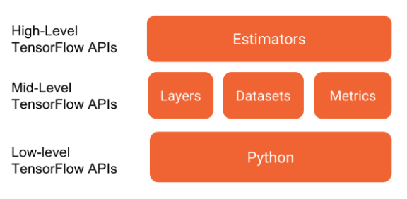

## TensorFlow {.unnumbered}

<h3 class="course__description-title">Isaiah Hull</h3>
<p class="course__instructor-description display-none-mobile-course-page-experiment">
    Isaiah Hull is a visiting associate professor of finance at BI Norwegian Business School and the author of <a href="https://link.springer.com/book/10.1007/978-1-4842-6373-0">Machine Learning for Economics and Finance in TensorFlow 2</a>. He holds a PhD in economics from Boston College and conducts research on computational economics, machine learning, and quantum computing.
  </p>

**Course Description**

<p class="course__description">Not long ago, cutting-edge computer vision algorithms couldn’t differentiate between images of cats and dogs. Today, a skilled data scientist equipped with nothing more than a laptop can classify tens of thousands of objects with greater accuracy than the human eye. In this course, you will use TensorFlow 2.6 to develop, train, and make predictions with the models that have powered major advances in recommendation systems, image classification, and FinTech. You will learn both high-level APIs, which will enable you to design and train deep learning models in 15 lines of code, and low-level APIs, which will allow you to move beyond off-the-shelf routines. You will also learn to accurately predict housing prices, credit card borrower defaults, and images of sign language gestures.</p>


### Introduction to TensorFlow {.unnumbered}

<p class="chapter__description">
    Before you can build advanced models in TensorFlow 2, you will first need to understand the basics. In this chapter, you’ll learn how to define constants and variables, perform tensor addition and multiplication, and compute derivatives. Knowledge of linear algebra will be helpful, but not necessary.
  </p>


#### Constants and variables {.unnumbered}


##### Defining data as constants {.unnumbered}


<div class>
<p>Throughout this course, we will use <code>tensorflow</code> version 2.6.0 and will exclusively import the submodules needed to complete each exercise. This will usually be done for you, but you will do it in this exercise by importing <code>constant</code> from <code>tensorflow</code>.</p>
<p>After you have imported <code>constant</code>, you will use it to transform a <code>numpy</code> array, <code>credit_numpy</code>, into a <code>tensorflow</code> constant, <code>credit_constant</code>. This array contains feature columns from a dataset on credit card holders and is previewed in the image below. We will return to this dataset in later chapters.</p>
<p>Note that <code>tensorflow</code> 2 allows you to use data as either a <code>numpy</code> array or a <code>tensorflow</code> <code>constant</code> object. Using a <code>constant</code> will ensure that any operations performed with that object are done in <code>tensorflow</code>.  </p>
<p></p>
</div>
<div class="exercise--instructions__content">


<li>Import the <code>constant</code> submodule from the <code>tensorflow</code> module.</li>

<li>Convert the <code>credit_numpy</code> array into a <code>constant</code> object in <code>tensorflow</code>. Do not set the data type.</li>
```{python}
# edited/added
import tensorflow as tf
import pandas as pd
import numpy as np
from tensorflow import Variable
credit = pd.read_csv('archive/Introduction-to-TensorFlow-in-Python/datasets/credit.csv')
credit_numpy = credit.to_numpy()
tf.random.set_seed(8)

# Import constant from TensorFlow
from tensorflow import constant

# Convert the credit_numpy array into a tensorflow constant
credit_constant = constant(credit_numpy)

# Print constant datatype
print('\n The datatype is:', credit_constant.dtype)

# Print constant shape
print('\n The shape is:', credit_constant.shape)
```
</div>

<p class="">Excellent! You now understand how constants are used in <code>tensorflow</code>. In the following exercise, you'll practice defining variables.</p>

##### Defining variables {.unnumbered}


<div class>
<p>Unlike a constant, a variable's value can be modified. This will be useful when we want to train a model by updating its parameters.</p>
<p>Let's try defining and printing a variable. We'll then convert the variable to a <code>numpy</code> array, print again, and check for differences. Note that <code>Variable()</code>, which is used to create a variable tensor, has been imported from <code>tensorflow</code> and is available to use in the exercise.</p>
</div>
<div class="exercise--instructions__content">


<li>Define a variable, <code>A1</code>, as the 1-dimensional tensor: [1, 2, 3, 4].</li>

<li>Apply <code>.numpy()</code> to <code>A1</code> and assign it to <code>B1</code>.</li>
```{python}
# Define the 1-dimensional variable A1
A1 = Variable([1, 2, 3, 4])

# Print the variable A1
print('\n A1: ', A1)

# Convert A1 to a numpy array and assign it to B1
B1 = A1.numpy()

# Print B1
print('\n B1: ', B1)
```
</div>

<p class="">Nice work! Did you notice any differences between the print statements for <code>A1</code> and <code>B1</code>? In our next exercise, we'll review how to check the properties of a tensor after it is already defined.</p>

#### Basic operations {.unnumbered}

* TensorFlow operation,
  * model of computation that revolves around the use of graphs,
  * Graph contains edges and nodes, where edges are tensors and the nodes are operations,

* Performing tensor addition,
  * The `add()` operation performs **element-wise addition** with two tensors,
  * Element-wise addition requires both tensors to have the same shape:,
  * Scalar addition: $1 + 2 = 3$,
  * Vector addition: $[1, 2] + [3, 4] = [4, 6]$,
  * Matrix addition: $$\begin{bmatrix} 1 & 2 \\\\ 3 & 4 \\end{bmatrix} + \\begin{bmatrix} 5 & 6 \\\\ 7 & 8 \\end{bmatrix} = \\begin{bmatrix} 6 & 8 \\\\ 10 & 12 \\end{bmatrix}$$,
  * Operator is overloaded with $+$,

* Performing tensor multiplication,
  * **Element-wise multiplication** performed using `multiply()` operation,
  * Matrix multiplication performed with `matmul()` operator,
  * The `matmul(A, B)` operation multiplies A by B,
  * Number of columns of A must equal the number of rows of B,

* Summing over tensor dimensions,
  * The `reduce_sum()` operator sums over the dimensions of a tensor,
  * `reduce_sum(A)` sums over all dimensions of A,
  * `reduce_sum(A, i)` sums over dimension i,

##### Performing element-wise multiplication {.unnumbered}


<div class>
<p>Element-wise multiplication in TensorFlow is performed using two tensors with identical shapes. This is because the operation multiplies elements in corresponding positions in the two tensors. An example of an element-wise multiplication, denoted by the \(\odot\) symbol, is shown below:</p>
<p>\(\begin{bmatrix} 1 &amp; 2 \\ 2 &amp; 1 \end{bmatrix} \odot \begin{bmatrix} 3 &amp; 1 \\ 2 &amp; 5 \end{bmatrix} = \begin{bmatrix} 3 &amp; 2 \\ 4 &amp; 5 \end{bmatrix}\)</p>
<p>In this exercise, you will perform element-wise multiplication, paying careful attention to the shape of the tensors you multiply. Note that <code>multiply()</code>, <code>constant()</code>, and <code>ones_like()</code> have been imported for you.</p>
</div>
<div class="exercise--instructions__content">


<li>Define the tensors <code>A1</code> and <code>A23</code> as constants.</li>

<li>Set <code>B1</code> to be a tensor of ones with the same shape as <code>A1</code>.</li>

<li>Set <code>B23</code> to be a tensor of ones with the same shape as <code>A23</code>.</li>

<li>Set <code>C1</code> and <code>C23</code> equal to the element-wise products of <code>A1</code> and <code>B1</code>, and <code>A23</code> and <code>B23</code>, respectively.</li>
```{python}
# edited/added
from tensorflow import ones_like
from tensorflow import multiply

# Define tensors A1 and A23 as constants
A1 = constant([1, 2, 3, 4])
A23 = constant([[1, 2, 3], [1, 6, 4]])

# Define B1 and B23 to have the correct shape
B1 = ones_like(A1)
B23 = ones_like(A23)

# Perform element-wise multiplication
C1 = multiply(A1, B1)
C23 = multiply(A23, B23)

# Print the tensors C1 and C23
print('\n C1: {}'.format(C1.numpy()))
print('\n C23: {}'.format(C23.numpy()))
```
</div>

<p class="">Excellent work! Notice how performing element-wise multiplication with tensors of ones leaves the original tensors unchanged.</p>

##### Making predictions with matrix multiplication {.unnumbered}


<div class>
<p>In later chapters, you will learn to train linear regression models. This process will yield a vector of parameters that can be multiplied by the input data to generate predictions. In this exercise, you will use input data, <code>features</code>, and a target vector, <code>bill</code>, which are taken from a credit card dataset we will use later in the course.</p>
<p>\(features = \begin{bmatrix} 2 &amp; 24 \\ 2 &amp; 26 \\ 2 &amp; 57 \\ 1 &amp; 37 \end{bmatrix}\),
\(bill = \begin{bmatrix} 3913 \\ 2682 \\ 8617 \\ 64400 \end{bmatrix}\),
\(params = \begin{bmatrix} 1000 \\ 150 \end{bmatrix}\)</p>
<p>The matrix of input data, <code>features</code>, contains two columns: education level and age. The target vector, <code>bill</code>, is the size of the credit card borrower's bill. </p>
<p>Since we have not trained the model, you will enter a guess for the values of the parameter vector, <code>params</code>. You will then use <code>matmul()</code> to perform matrix multiplication of <code>features</code> by <code>params</code> to generate predictions, <code>billpred</code>, which you will compare with <code>bill</code>. Note that we have imported <code>matmul()</code> and <code>constant()</code>.</p>
</div>
<div class="exercise--instructions__content">


<li>Define <code>features</code>, <code>params</code>, and <code>bill</code> as constants.</li>

<li>Compute the predicted value vector, <code>billpred</code>, by multiplying the input data, <code>features</code>, by the parameters, <code>params</code>. Use matrix multiplication, rather than the element-wise product.</li>

<li>Define <code>error</code> as the targets, <code>bill</code>, minus the predicted values, <code>billpred</code>.</li>
```{python}
# edited/added
from tensorflow import matmul

# Define features, params, and bill as constants
features = constant([[2, 24], [2, 26], [2, 57], [1, 37]])
params = constant([[1000], [150]])
bill = constant([[3913], [2682], [8617], [64400]])

# Compute billpred using features and params
billpred = matmul(features, params)

# Compute and print the error
error = bill - billpred
print(error.numpy())
```
</div>

<p class="">Nice job! Understanding matrix multiplication will make things simpler when we start making predictions with linear models.</p>

##### Summing over tensor dimensions {.unnumbered}


<div class>
<p>You've been given a matrix, <code>wealth</code>. This contains the value of bond and stock wealth for five individuals in thousands of dollars.</p>
<p><code>wealth</code> = \(\begin{bmatrix} 11 &amp; 50 \\ 7 &amp; 2 \\ 4 &amp; 60 \\ 3 &amp; 0 \\ 25 &amp; 10 \end{bmatrix}\)</p>
<p>The first column corresponds to bonds and the second corresponds to stocks. Each row gives the bond and stock wealth for a single individual. Use <code>wealth</code>, <code>reduce_sum()</code>, and <code>.numpy()</code> to determine which statements are correct about <code>wealth</code>.</p>
</div>

```{python}
# edited/added
wealth = tf.constant([[11, 50], [7, 2], [4, 60], [3, 0], [25, 10]])
tf.reduce_sum(wealth)
tf.reduce_sum(wealth, 1)
```

- [ ] The individual in the first row has the highest total wealth (i.e. stocks + bonds).
- [ ] Combined, the 5 individuals hold $50,000 in stocks.
- [x] Combined, the 5 individuals hold $50,000 in bonds.
- [ ] The individual in the second row has the lowest total wealth (i.e. stocks + bonds).

<p class="">Excellent work! Understanding how to sum over tensor dimensions will be helpful when preparing datasets and training models.</p>


#### Advanced operations {.unnumbered}

* Finding th optimum,
  * In many problems, we will want to find the optimum of a function,
    * Minimum: Lowest value of a loss function,
    * Maximum: Highest value of objective function,
  * We can do this using the `gradient()` operation,
    * Optimum: Find a point where gradient = 0,
    * Minimum: Change in gradient > 0,
    * Maximum: Change in gradient < 0

##### Reshaping tensors {.unnumbered}


<div class>
<p>Later in the course, you will classify images of sign language letters using a neural network. In some cases, the network will take 1-dimensional tensors as inputs, but your data will come in the form of images, which will either be either 2- or 3-dimensional tensors, depending on whether they are grayscale or color images.</p>
<p>The figure below shows grayscale and color images of the sign language letter A. The two images have been imported for you and converted to the numpy arrays <code>gray_tensor</code> and <code>color_tensor</code>. Reshape these arrays into 1-dimensional vectors using the <code>reshape</code> operation, which has been imported for you from <code>tensorflow</code>. Note that the shape of <code>gray_tensor</code> is 28x28 and the shape of <code>color_tensor</code> is 28x28x3.</p>
<p></p>
</div>
<div class="exercise--instructions__content">


<li>Reshape <code>gray_tensor</code> from a 28x28 matrix into a 784x1 vector named <code>gray_vector</code>.</li>

<li>Reshape <code>color_tensor</code> from a 28x28x3 tensor into a 2352x1 vector named <code>color_vector</code>.</li>
```{python}
# edited/added
import matplotlib.pyplot as plt
from tensorflow import reshape
gray_tensor = pd.read_csv('archive/Introduction-to-TensorFlow-in-Python/datasets/gray_tensor.csv').to_numpy()
color_tensor = pd.read_csv('archive/Introduction-to-TensorFlow-in-Python/datasets/color_tensor.csv').to_numpy().reshape(28, 28, 3)
plt.imshow(gray_tensor, cmap=plt.cm.binary)

# Reshape the grayscale image tensor into a vector
gray_vector = reshape(gray_tensor, (784, 1))

# Reshape the color image tensor into a vector
color_vector = reshape(color_tensor, (2352, 1))
```
</div>

<p class="">Excellent work! Notice that there are 3 times as many elements in <code>color_vector</code> as there are in <code>gray_vector</code>, since <code>color_tensor</code> has 3 color channels.</p>

##### Optimizing with gradients {.unnumbered}


<div class>
<p>You are given a loss function, \(y = x^{2}\), which you want to minimize. You can do this by computing the slope using the <code>GradientTape()</code> operation at different values of <code>x</code>. If the slope is positive, you can decrease the loss by lowering <code>x</code>. If it is negative, you can decrease it by increasing <code>x</code>. This is how gradient descent works.</p>
<p></p>
<p>In practice, you will use a high level <code>tensorflow</code> operation to perform gradient descent automatically. In this exercise, however, you will compute the slope at <code>x</code> values of -1, 1, and 0. The following operations are available: <code>GradientTape()</code>, <code>multiply()</code>, and <code>Variable()</code>.</p>
</div>
<div class="exercise--instructions__content">


<li>Define <code>x</code> as a variable with the initial value <code>x0</code>.</li>

<li>Set the loss function, <code>y</code>, equal to <code>x</code> multiplied by <code>x</code>. Do not make use of operator overloading.</li>

<li>Set the function to return the gradient of <code>y</code> with respect to <code>x</code>.</li>
```{python}
# edited/added
from tensorflow import GradientTape

def compute_gradient(x0):
  	# Define x as a variable with an initial value of x0
	x = Variable(x0)
	with GradientTape() as tape:
		tape.watch(x)
        # Define y using the multiply operation
		y = multiply(x, x)
    # Return the gradient of y with respect to x
	return tape.gradient(y, x).numpy()

# Compute and print gradients at x = -1, 1, and 0
print(compute_gradient(-1.0))
print(compute_gradient(1.0))
print(compute_gradient(0.0))
```
</div>

<p class="">Excellent work! Notice that the slope is positive at <code>x</code> = 1, which means that we can lower the loss by reducing <code>x</code>. The slope is negative at <code>x</code> = -1, which means that we can lower the loss by increasing <code>x</code>. The slope at <code>x</code> = 0 is 0, which means that we cannot lower the loss by either increasing or decreasing <code>x</code>. This is because the loss is minimized at <code>x</code> = 0.</p>

##### Working with image data {.unnumbered}


<div class>
<p>You are given a black-and-white image of a letter, which has been encoded as a tensor, <code>letter</code>. You want to determine whether the letter is an X or a K. You don't have a trained neural network, but you do have a simple model, <code>model</code>, which can be used to classify <code>letter</code>.</p>
<p>The 3x3 tensor, <code>letter</code>, and the 1x3 tensor, <code>model</code>, are available in the Python shell. You can determine whether <code>letter</code> is a K by multiplying <code>letter</code> by <code>model</code>, summing over the result, and then checking if it is equal to 1. As with more complicated models, such as neural networks, <code>model</code> is a collection of weights, arranged in a tensor.</p>
<p>Note that the functions <code>reshape()</code>, <code>matmul()</code>, and <code>reduce_sum()</code> have been imported from <code>tensorflow</code> and are available for use.</p>
</div>
<div class="exercise--instructions__content">


<li>The model, <code>model</code>, is 1x3 tensor, but should be a 3x1. Reshape <code>model</code>.</li>

<li>Perform a matrix multiplication of the 3x3 tensor, <code>letter</code>, by the 3x1 tensor, <code>model</code>.</li>

<li>Sum over the resulting tensor, <code>output</code>, and assign this value to <code>prediction</code>.</li>

<li>Print <code>prediction</code> using the <code>.numpy()</code> method to determine whether <code>letter</code> is K.</li>
```{python}
# edited/added
from tensorflow import reduce_sum
letter = np.array([[1.0, 0, 1.0], [1., 1., 0], [1., 0, 1.] ])
model = np.array([[1., 0., -1.]])

# Reshape model from a 1x3 to a 3x1 tensor
model = reshape(model, (3, 1))

# Multiply letter by model
output = matmul(letter, model)

# Sum over output and print prediction using the numpy method
prediction = reduce_sum(output)
print(prediction.numpy())
```
</div>

<p class="">Excellent work! Your model found that <code>prediction</code>=1.0 and correctly classified the letter as a K. In the coming chapters, you will use data to train a model, <code>model</code>, and then combine this with matrix multiplication, <code>matmul(letter, model)</code>, as we have done here, to make predictions about the classes of objects.</p>

### Linear models {.unnumbered}

<p class="chapter__description">
    In this chapter, you will learn how to build, solve, and make predictions with models in TensorFlow 2. You will focus on a simple class of models – the linear regression model – and will try to predict housing prices. By the end of the chapter, you will know how to load and manipulate data, construct loss functions, perform minimization, make predictions, and reduce resource use with batch training.
  </p>

#### Input data {.unnumbered}


##### Load data using pandas {.unnumbered}


<div class>
<p>Before you can train a machine learning model, you must first import data. There are several valid ways to do this, but for now, we will use a simple one-liner from <code>pandas</code>: <code>pd.read_csv()</code>. Recall from the video that the first argument specifies the path or URL. All other arguments are optional.</p>
<p>In this exercise, you will import the King County housing dataset, which we will use to train a linear model later in the chapter.</p>
</div>
<div class="exercise--instructions__content">


<li>Import <code>pandas</code> under the alias <code>pd</code>.</li>

<li>Assign the path to a string variable with the name <code>data_path</code>.</li>

<li>Load the dataset as a pandas dataframe named <code>housing</code>.</li>

<li>Print the <code>price</code> column of <code>housing</code>.</li>
```{python}
# Import pandas under the alias pd
import pandas as pd

# Assign the path to a string variable named data_path
data_path = 'archive/Introduction-to-TensorFlow-in-Python/datasets/kc_house_data.csv'

# Load the dataset as a dataframe named housing
housing = pd.read_csv(data_path)

# Print the price column of housing
print(housing['price'])
```
</div>

<p class="">Excellent work! Notice that you did not have to specify a delimiter with the <code>sep</code> parameter, since the dataset was stored in the default, comma-separated format.</p>

##### Setting the data type {.unnumbered}


<div class><p>In this exercise, you will both load data and set its type. Note that <code>housing</code> is available and <code>pandas</code> has been imported as <code>pd</code>. You will import <code>numpy</code> and <code>tensorflow</code>, and define tensors that are usable in <code>tensorflow</code> using columns in <code>housing</code> with a given data type. Recall that you can select the <code>price</code> column, for instance, from <code>housing</code> using <code>housing['price']</code>.</p></div>
<div class="exercise--instructions__content">


<li>Import <code>numpy</code> and <code>tensorflow</code> under their standard aliases.</li>

<li>Use a <code>numpy</code> array to set the tensor <code>price</code> to have a data type of 32-bit floating point number</li>

<li>Use the <code>tensorflow</code> function <code>cast()</code> to set the tensor <code>waterfront</code> to have a Boolean data type.</li>

<li>Print <code>price</code> and then <code>waterfront</code>. Did you notice any important differences?</li>
```{python}
# Import numpy and tensorflow with their standard aliases
import numpy as np
import tensorflow as tf

# Use a numpy array to define price as a 32-bit float
price = np.array(housing['price'], np.float32)

# Define waterfront as a Boolean using cast
waterfront = tf.cast(housing['waterfront'], tf.bool)

# Print price and waterfront
print(price)
print(waterfront)
```
</div>

<p class="">Great job! Notice that printing <code>price</code> yielded a <code>numpy</code> array; whereas printing <code>waterfront</code> yielded a <code>tf.Tensor()</code>.</p>

#### Loss functions {.unnumbered}

* Loss function,
  * Fundamental tensorflow operation,
    * Used to train model,
    * Measure a model fit,
  * Higher value -> worse fit,
    * Minimize the loss function,
* Common loss functions in Tensorflow,
  * Mean squared error (MSE),
  * Mean absolute error (MAE),
  * Huber error,
* Why do we care about loss functions?,
  * MSE,
    * Strongly penalizes outliers,
    * High (gradient) sensitivity near minimum,
  * MAE,
    * Scales linearly with size of error,
    * Low sensitivity near minimum,
  * Huber,
    * Similar to MSE near minimum,
    * Similar to MAE away from minimum

##### Loss functions in TensorFlow {.unnumbered}


<div class><p>In this exercise, you will compute the loss using data from the King County housing dataset. You are given a target, <code>price</code>, which is a tensor of house prices, and <code>predictions</code>, which is a tensor of predicted house prices. You will evaluate the loss function and print out the value of the loss.</p></div>
<div class="exercise--instructions__content">

<p>Import the <code>keras</code> module from <code>tensorflow</code>. Then, use <code>price</code> and <code>predictions</code> to compute the mean squared error (mse).</p></div>


<div class="exercise--instructions__content">

<p>Modify your code to compute the mean absolute error (mae), rather than the mean squared error (mse).</p></div>
```{python}
# edited/added
kc_sample = pd.read_csv('archive/Introduction-to-TensorFlow-in-Python/datasets/loss_price.csv')
price = kc_sample['price'].to_numpy()
predictions = kc_sample['pred'].to_numpy()

# Import the keras module from tensorflow
from tensorflow import keras

# Compute the mean squared error (mse)
loss = keras.losses.mse(price, predictions)

# Print the mean squared error (mse)
print(loss.numpy())

# Import the keras module from tensorflow
from tensorflow import keras

# Compute the mean absolute error (mae)
loss = keras.losses.mae(price, predictions)

# Print the mean absolute error (mae)
print(loss.numpy())
```

<p class="">Great work! You may have noticed that the MAE was much smaller than the MSE, even though <code>price</code> and <code>predictions</code> were the same. This is because the different loss functions penalize deviations of <code>predictions</code> from <code>price</code> differently. MSE does not like large deviations and punishes them harshly.</p>

##### Modifying the loss function {.unnumbered}


<div class><p>In the previous exercise, you defined a <code>tensorflow</code> loss function and then evaluated it once for a set of actual and predicted values. In this exercise, you will compute the loss within another function called <code>loss_function()</code>, which first generates predicted values from the data and variables. The purpose of this is to construct a function of the trainable model variables that returns the loss. You can then repeatedly evaluate this function for different variable values until you find the minimum. In practice, you will pass this function to an optimizer in <code>tensorflow</code>. Note that <code>features</code> and <code>targets</code> have been defined and are available. Additionally, <code>Variable</code>, <code>float32</code>, and <code>keras</code> are available.</p></div>
<div class="exercise--instructions__content">


<li>Define a variable, <code>scalar</code>, with an initial value of 1.0 and a type of <code>float32</code>.</li>

<li>Define a function called <code>loss_function()</code>, which takes <code>scalar</code>, <code>features</code>, and <code>targets</code> as arguments in that order.</li>

<li>Use a mean absolute error loss function.</li>
```{python}
# edited/added
from tensorflow import float32
features = tf.constant([1, 2, 3, 4, 5], dtype=float32)
targets = tf.constant([2, 4, 6, 8, 10], dtype=float32)

# Initialize a variable named scalar
scalar = Variable(1.0, float32)

# Define the model
def model(scalar, features = features):
  	return scalar * features

# Define a loss function
def loss_function(scalar, features = features, targets = targets):
	# Compute the predicted values
	predictions = model(scalar, features)
    
	# Return the mean absolute error loss
	return keras.losses.mae(targets, predictions)

# Evaluate the loss function and print the loss
print(loss_function(scalar).numpy())
```
</div>

<p class="">Great work! As you will see in the following lessons, this exercise was the equivalent of evaluating the loss function for a linear regression where the intercept is 0.</p>

#### Linear regression {.unnumbered}


##### Set up a linear regression {.unnumbered}


<div class>
<p>A univariate linear regression identifies the relationship between a single feature and the target tensor. In this exercise, we will use a property's lot size and price. Just as we discussed in the video, we will take the natural logarithms of both tensors, which are available as <code>price_log</code> and <code>size_log</code>.</p>
<p>In this exercise, you will define the model and the loss function. You will then evaluate the loss function for two different values of <code>intercept</code> and <code>slope</code>. Remember that the predicted values are given by <code>intercept + features*slope</code>. Additionally, note that <code>keras.losses.mse()</code> is available for you. Furthermore, <code>slope</code> and <code>intercept</code> have been defined as variables.</p>
</div>
<div class="exercise--instructions__content">


<li>Define a function that returns the predicted values for a linear regression using <code>intercept</code>, <code>features</code>, and <code>slope</code>, and without using <code>add()</code> or <code>multiply()</code>.</li>

<li>Complete the <code>loss_function()</code> by adding the model's variables, <code>intercept</code> and <code>slope</code>, as arguments.</li>

<li>Compute the mean squared error using <code>targets</code> and <code>predictions</code>.</li>
```{python}
# edited/added
size_log = np.log(np.array(housing['sqft_lot'], np.float32))
price_log = np.log(np.array(housing['price'], np.float32))
bedrooms = np.array(housing['bedrooms'], np.float32)

# Define a linear regression model
def linear_regression(intercept, slope, features = size_log):
	return intercept + features*slope

# Set loss_function() to take the variables as arguments
def loss_function(intercept, slope, features = size_log, targets = price_log):
	# Set the predicted values
	predictions = linear_regression(intercept, slope, features)
    
  # Return the mean squared error loss
	return keras.losses.mse(targets, predictions)

# Compute the loss for different slope and intercept values
print(loss_function(0.1, 0.1).numpy())
print(loss_function(0.1, 0.5).numpy())
```
</div>

<p class="">Great work! In the next exercise, you will actually run the regression and train <code>intercept</code> and <code>slope</code>.</p>

##### Train a linear model {.unnumbered}


<div class>
<p>In this exercise, we will pick up where the previous exercise ended. The intercept and slope, <code>intercept</code> and <code>slope</code>, have been defined and initialized. Additionally, a function has been defined, <code>loss_function(intercept, slope)</code>, which computes the loss using the data and model variables. </p>
<p>You will now define an optimization operation as <code>opt</code>. You will then train a univariate linear model by minimizing the loss to find the optimal values of <code>intercept</code> and <code>slope</code>. Note that the <code>opt</code> operation will try to move closer to the optimum with each step, but will require many steps to find it. Thus, you must repeatedly execute the operation.</p>
</div>
<div class="exercise--instructions__content">


<li>Initialize an Adam optimizer as <code>opt</code> with a learning rate of 0.5.</li>

<li>Apply the <code>.minimize()</code> method to the optimizer.</li>

<li>Pass <code>loss_function()</code> with the appropriate arguments as a lambda function to <code>.minimize()</code>.</li>

<li>Supply the list of variables that need to be updated to <code>var_list</code>.</li>
```{python}
# edited/added
import matplotlib.pyplot as plt
def plot_results(intercept, slope):
    size_range = np.linspace(6,14,100)
    price_pred = [intercept + slope * s for s in size_range]
    plt.figure(figsize=(8, 8))
    plt.scatter(size_log, price_log, color = 'black');
    plt.plot(size_range, price_pred, linewidth=3.0, color='red');
    plt.xlabel('log(size)');
    plt.ylabel('log(price)');
    plt.title('Scatterplot of data and fitted regression line')
    plt.show()
    plt.close()
intercept = tf.Variable(0.0, tf.float32)
slope = tf.Variable(0.0, tf.float32)

# Initialize an Adam optimizer
opt = keras.optimizers.Adam(0.5)

for j in range(100):
	# Apply minimize, pass the loss function, and supply the variables
	opt.minimize(lambda: loss_function(intercept, slope), var_list=[intercept, slope])

	# Print every 10th value of the loss
	if j % 10 == 0:
		print(loss_function(intercept, slope).numpy())

# Plot data and regression line
plot_results(intercept, slope)
```
</div>

<p class="">Excellent! Notice that we printed <code>loss_function(intercept, slope)</code> every 10th execution for 100 executions. Each time, the loss got closer to the minimum as the optimizer moved the <code>slope</code> and <code>intercept</code> parameters closer to their optimal values.</p>

##### Multiple linear regression {.unnumbered}


<div class>
<p>In most cases, performing a univariate linear regression will not yield a model that is useful for making accurate predictions. In this exercise, you will perform a multiple regression, which uses more than one feature. </p>
<p>You will use <code>price_log</code> as your target and <code>size_log</code> and <code>bedrooms</code> as your features. Each of these tensors has been defined and is available. You will also switch from using the the mean squared error loss to the mean absolute error loss: <code>keras.losses.mae()</code>. Finally, the predicted values are computed as follows: <code>params[0] + feature1*params[1] + feature2*params[2]</code>. Note that we've defined a vector of parameters, <code>params</code>, as a variable, rather than using three variables. Here, <code>params[0]</code> is the intercept and <code>params[1]</code> and <code>params[2]</code> are the slopes.</p>
</div>
<div class="exercise--instructions__content">


<li>Define a linear regression model that returns the predicted values.</li>

<li>Set <code>loss_function()</code> to take the parameter vector as an input.</li>

<li>Use the mean absolute error loss.</li>

<li>Complete the minimization operation.</li>
```{python}
# edited/added
def print_results(params):
    return print('loss: {:0.3f}, intercept: {:0.3f}, slope_1: {:0.3f}, slope_2: {:0.3f}'
                 .format(loss_function(params).numpy(), 
                         params[0].numpy(), 
                         params[1].numpy(), 
                         params[2].numpy()))
params = tf.Variable([0.1, 0.05, 0.02], tf.float32)

# Define the linear regression model
def linear_regression(params, feature1 = size_log, feature2 = bedrooms):
	return params[0] + feature1*params[1] + feature2*params[2]

# Define the loss function
def loss_function(params, targets = price_log, feature1 = size_log, feature2 = bedrooms):
	# Set the predicted values
	predictions = linear_regression(params, feature1, feature2)
  
	# Use the mean absolute error loss
	return keras.losses.mae(targets, predictions)

# Define the optimize operation
opt = keras.optimizers.Adam()

# Perform minimization and print trainable variables
for j in range(10):
	opt.minimize(lambda: loss_function(params), var_list=[params])
	print_results(params)
```
</div>

<p class="">Great job! Note that <code>params[2]</code> tells us how much the price will increase in percentage terms if we add one more bedroom. You could train <code>params[2]</code> and the other model parameters by increasing the number of times we iterate over <code>opt</code>.</p>

#### Batch training {.unnumbered}


##### Preparing to batch train {.unnumbered}


<div class>
<p>Before we can train a linear model in batches, we must first define variables, a loss function, and an optimization operation. In this exercise, we will prepare to train a model that will predict <code>price_batch</code>, a batch of house prices, using <code>size_batch</code>, a batch of lot sizes in square feet. In contrast to the previous lesson, we will do this by loading batches of data using <code>pandas</code>, converting it to <code>numpy</code> arrays, and then using it to minimize the loss function in steps.</p>
<p><code>Variable()</code>, <code>keras()</code>, and <code>float32</code> have been imported for you. Note that you should not set default argument values for either the model or loss function, since we will generate the data in batches during the training process.</p>
</div>
<div class="exercise--instructions__content">


<li>Define <code>intercept</code> as having an initial value of 10.0 and a data type of 32-bit float.</li>

<li>Define the model to return the predicted values using <code>intercept</code>, <code>slope</code>, and <code>features</code>.</li>

<li>Define a function called <code>loss_function()</code> that takes <code>intercept</code>, <code>slope</code>, <code>targets</code>, and <code>features</code> as arguments and in that order. Do not set default argument values.</li>

<li>Define the mean squared error loss function using <code>targets</code> and <code>predictions</code>.</li>
```{python}
# Define the intercept and slope
intercept = Variable(10.0, float32)
slope = Variable(0.5, float32)

# Define the model
def linear_regression(intercept, slope, features):
	# Define the predicted values
	return intercept + features*slope

# Define the loss function
def loss_function(intercept, slope, targets, features):
	# Define the predicted values
	predictions = linear_regression(intercept, slope, features)
    
 	# Define the MSE loss
	return keras.losses.mse(targets, predictions)
```
</div>

<p class="">Excellent work! Notice that we did not use default argument values for the input data, <code>features</code> and <code>targets</code>. This is because the input data has not been defined in advance. Instead, with batch training, we will load it during the training process.</p>

##### Training a linear model in batches {.unnumbered}


<div class>
<p>In this exercise, we will train a linear regression model in batches, starting where we left off in the previous exercise. We will do this by stepping through the dataset in batches and updating the model's variables, <code>intercept</code> and <code>slope</code>, after each step. This approach will allow us to train with datasets that are otherwise too large to hold in memory.</p>
<p>Note that the loss function,<code>loss_function(intercept, slope, targets, features)</code>, has been defined for you. Additionally, <code>keras</code> has been imported for you and <code>numpy</code> is available as <code>np</code>. The trainable variables should be entered into <code>var_list</code> in the order in which they appear as loss function arguments.</p>
</div>
<div class="exercise--instructions__content">


<li>Use the <code>.Adam()</code> optimizer.</li>

<li>Load in the data from <code>'kc_house_data.csv'</code> in batches with a <code>chunksize</code> of 100.</li>

<li>Extract the <code>price</code> column from <code>batch</code>, convert it to a <code>numpy</code> array of type 32-bit float, and assign it to <code>price_batch</code>.</li>

<li>Complete the loss function, fill in the list of trainable variables, and perform minimization.</li>
```{python}
# edited/added
intercept = tf.Variable(10.0, tf.float32)
slope = tf.Variable(0.5, tf.float32)

# Initialize Adam optimizer
opt = keras.optimizers.Adam()

# Load data in batches
for batch in pd.read_csv('archive/Introduction-to-TensorFlow-in-Python/datasets/kc_house_data.csv', chunksize=100):
	size_batch = np.array(batch['sqft_lot'], np.float32)

	# Extract the price values for the current batch
	price_batch = np.array(batch['price'], np.float32)

	# Complete the loss, fill in the variable list, and minimize
	opt.minimize(lambda: loss_function(intercept, slope, price_batch, size_batch), var_list=[intercept, slope])

# Print trained parameters
print(intercept.numpy(), slope.numpy())
```
</div>

<p class="">Great work! Batch training will be very useful when you train neural networks, which we will do next.</p>

### Neural Networks {.unnumbered}

<p class="chapter__description">
    The previous chapters taught you how to build models in TensorFlow 2. In this chapter, you will apply those same tools to build, train, and make predictions with neural networks. You will learn how to define dense layers, apply activation functions, select an optimizer, and apply regularization to reduce overfitting. You will take advantage of TensorFlow's flexibility by using both low-level linear algebra and high-level Keras API operations to define and train models.
  </p>

#### Dense layers {.unnumbered}


##### The linear algebra of dense layers {.unnumbered}


<div class>
<p>There are two ways to define a dense layer in <code>tensorflow</code>. The first involves the use of low-level, linear algebraic operations. The second makes use of high-level <code>keras</code> operations. In this exercise, we will use the first method to construct the network shown in the image below.</p>
<p></p>
<center>

</center>
<p>The input layer contains 3 features -- education, marital status, and age -- which are available as <code>borrower_features</code>. The hidden layer contains 2 nodes and the output layer contains a single node.</p>
<p>For each layer, you will take the previous layer as an input, initialize a set of weights, compute the product of the inputs and weights, and then apply an activation function. Note that <code>Variable()</code>, <code>ones()</code>, <code>matmul()</code>, and <code>keras()</code> have been imported from <code>tensorflow</code>.</p>
</div>
<div class="exercise--instructions__content">


<li>Initialize <code>weights1</code> as a variable using a 3x2 tensor of ones.</li>

<li>Compute the product of <code>borrower_features</code> by <code>weights1</code> using matrix multiplication.</li>

<li>Use a sigmoid activation function to transform <code>product1 + bias1</code>.</li>

</div>


<li>Initialize <code>weights2</code> as a variable using a 2x1 tensor of ones.</li>


<li>Compute the product of <code>dense1</code> by <code>weights2</code> using matrix multiplication.</li>


<li>Use a sigmoid activation function to transform <code>product2 + bias2</code>.</li>
```{python}
# edited/added
from tensorflow import ones
borrower_features = np.array([[2., 2., 43.]], np.float32)

# Initialize bias1
bias1 = Variable(1.0)

# Initialize weights1 as 3x2 variable of ones
weights1 = Variable(ones((3, 2)))

# Perform matrix multiplication of borrower_features and weights1
product1 = matmul(borrower_features, weights1)

# Apply sigmoid activation function to product1 + bias1
dense1 = keras.activations.sigmoid(product1 + bias1)

# Print shape of dense1
print("\n dense1's output shape: {}".format(dense1.shape))

# Initialize bias2 and weights2
bias2 = Variable(1.0)
weights2 = Variable(ones((2, 1)))

# Perform matrix multiplication of dense1 and weights2
product2 = matmul(dense1, weights2)

# Apply activation to product2 + bias2 and print the prediction
prediction = keras.activations.sigmoid(product2 + bias2)
print('\n prediction: {}'.format(prediction.numpy()[0,0]))
print('\n actual: 1')
```

<p class="">Excellent work! Our model produces predicted values in the interval between 0 and 1. For the example we considered, the actual value was 1 and the predicted value was a probability between 0 and 1. This, of course, is not meaningful, since we have not yet trained our model's parameters.</p>

##### The low-level approach with multiple examples {.unnumbered}


<div class>
<p>In this exercise, we'll build further intuition for the low-level approach by constructing the first dense hidden layer for the case where we have multiple examples. We'll assume the model is trained and the first layer weights, <code>weights1</code>, and bias, <code>bias1</code>, are available. We'll then perform matrix multiplication of the <code>borrower_features</code> tensor by the <code>weights1</code> variable. Recall that the <code>borrower_features</code> tensor includes education, marital status, and age. Finally, we'll apply the sigmoid function to the elements of <code>products1 + bias1</code>, yielding <code>dense1</code>.</p>
<p>\(products1 = \begin{bmatrix} 3 &amp; 3 &amp; 23 \\ 2 &amp; 1 &amp; 24 \\ 1 &amp; 1 &amp;   49 \\ 1 &amp; 1 &amp; 49 \\ 2 &amp; 1 &amp; 29 \end{bmatrix} \begin{bmatrix} -0.6 &amp; 0.6 \\ 0.8 &amp; -0.3 \\ -0.09 &amp; -0.08 \end{bmatrix}\)</p>
<p>Note that <code>matmul()</code> and <code>keras()</code> have been imported from <code>tensorflow</code>.</p>
</div>
<div class="exercise--instructions__content">


<li>Compute <code>products1</code> by matrix multiplying the features tensor by the weights.</li>

<li>Use a sigmoid activation function to transform <code>products1 + bias1</code>.</li>

<li>Print the shapes of <code>borrower_features</code>, <code>weights1</code>, <code>bias1</code>, and <code>dense1</code>.</li>
```{python}
# edited/added
bias1 = tf.Variable([0.1], tf.float32)

# Compute the product of borrower_features and weights1
products1 = matmul(borrower_features, weights1)

# Apply a sigmoid activation function to products1 + bias1
dense1 = keras.activations.sigmoid(products1 + bias1)

# Print the shapes of borrower_features, weights1, bias1, and dense1
print('\n shape of borrower_features: ', borrower_features.shape)
print('\n shape of weights1: ', weights1.shape)
print('\n shape of bias1: ', bias1.shape)
print('\n shape of dense1: ', dense1.shape)
```
</div>

<p class="">Good job! Note that our input data, <code>borrower_features</code>, is 5x3 because it consists of 5 examples for 3 features. The shape of <code>weights1</code> is 3x2, as it was in the previous exercise, since it does not depend on the number of examples. Additionally, <code>bias1</code> is a scalar. Finally, <code>dense1</code> is 5x2, which means that we can multiply it by the following set of weights, <code>weights2</code>, which we defined to be 2x1 in the previous exercise.</p>

##### Using the dense layer operation {.unnumbered}


<div class>
<p>We've now seen how to define dense layers in <code>tensorflow</code> using linear algebra. In this exercise, we'll skip the linear algebra and let <code>keras</code> work out the details. This will allow us to construct the network below, which has 2 hidden layers and 10 features, using less code than we needed for the network with 1 hidden layer and 3 features.</p>
<p></p>
<p>To construct this network, we'll need to define three dense layers, each of which takes the previous layer as an input, multiplies it by weights, and applies an activation function. Note that input data has been defined and is available as a 100x10 tensor: <code>borrower_features</code>. Additionally, the <code>keras.layers</code> module is available.</p>
</div>
<div class="exercise--instructions__content">


<li>Set <code>dense1</code> to be a dense layer with 7 output nodes and a sigmoid activation function.</li>

<li>Define <code>dense2</code> to be dense layer with 3 output nodes and a sigmoid activation function.</li>

<li>Define <code>predictions</code> to be a dense layer with 1 output node and a sigmoid activation function.</li>

<li>Print the shapes of <code>dense1</code>, <code>dense2</code>, and <code>predictions</code> in that order using the <code>.shape</code> method. Why does each of these tensors have 100 rows?</li>
```{python}
# edited/added
df = pd.read_csv('archive/Introduction-to-TensorFlow-in-Python/datasets/uci_credit_card.csv')
features = df.columns[1:11].tolist()
borrower_features = df[features].values
borrower_features = tf.convert_to_tensor(borrower_features, np.float32)
idx = tf.constant(list(range(0,100)))
borrower_features = tf.gather(borrower_features, idx)

# Define the first dense layer
dense1 = keras.layers.Dense(7, activation='sigmoid')(borrower_features)

# Define a dense layer with 3 output nodes
dense2 = keras.layers.Dense(3, activation='sigmoid')(dense1)

# Define a dense layer with 1 output node
predictions = keras.layers.Dense(1, activation='sigmoid')(dense2)

# Print the shapes of dense1, dense2, and predictions
print('\n shape of dense1: ', dense1.shape)
print('\n shape of dense2: ', dense2.shape)
print('\n shape of predictions: ', predictions.shape)
```
</div>

<p class="">Great work! With just 8 lines of code, you were able to define 2 dense hidden layers and an output layer. This is the advantage of using high-level operations in <code>tensorflow</code>. Note that each layer has 100 rows because the input data contains 100 examples.</p>

#### Activation functions {.unnumbered}


##### Binary classification problems {.unnumbered}


<div class>
<p>In this exercise, you will again make use of credit card data. The target variable, <code>default</code>, indicates whether a credit card holder defaults on his or her payment in the following period. Since there are only two options--default or not--this is a binary classification problem. While the dataset has many features, you will focus on just three: the size of the three latest credit card bills. Finally, you will compute predictions from your untrained network, <code>outputs</code>, and compare those the target variable, <code>default</code>.</p>
<p>The tensor of features has been loaded and is available as <code>bill_amounts</code>. Additionally, the <code>constant()</code>, <code>float32</code>, and <code>keras.layers.Dense()</code> operations are available.</p>
</div>
<div class="exercise--instructions__content">


<li>Define <code>inputs</code> as a 32-bit floating point constant tensor using <code>bill_amounts</code>.</li>

<li>Set <code>dense1</code> to be a dense layer with 3 output nodes and a <code>relu</code> activation function.</li>

<li>Set <code>dense2</code> to be a dense layer with 2 output nodes and a <code>relu</code> activation function.</li>

<li>Set the output layer to be a dense layer with a single output node and a <code>sigmoid</code> activation function.</li>
```{python}
# edited/added
bill_amounts = df[['BILL_AMT1', 'BILL_AMT2', 'BILL_AMT3']].to_numpy()
default = df[['default.payment.next.month']].to_numpy()

# Construct input layer from features
inputs = constant(bill_amounts, float32)

# Define first dense layer
dense1 = keras.layers.Dense(3, activation='relu')(inputs)

# Define second dense layer
dense2 = keras.layers.Dense(2, activation='relu')(dense1)

# Define output layer
outputs = keras.layers.Dense(1, activation='sigmoid')(dense2)

# Print error for first five examples
error = default[:5] - outputs.numpy()[:5]
print(error)
```
</div>

<p class="">Excellent work! If you run the code several times, you'll notice that the errors change each time. This is because you're using an untrained model with randomly initialized parameters. Furthermore, the errors fall on the interval between -1 and 1 because <code>default</code> is a binary variable that takes on values of 0 and 1 and <code>outputs</code> is a probability between 0 and 1.</p>

##### Multiclass classification problems {.unnumbered}


<div class>
<p>In this exercise, we expand beyond binary classification to cover multiclass problems. A multiclass problem has targets that can take on three or more values. In the credit card dataset, the education variable can take on 6 different values, each corresponding to a different level of education. We will use that as our target in this exercise and will also expand the feature set from 3 to 10 columns.</p>
<p>As in the previous problem, you will define an input layer, dense layers, and an output layer. You will also print the untrained model's predictions, which are probabilities assigned to the classes. The tensor of features has been loaded and is available as <code>borrower_features</code>. Additionally, the <code>constant()</code>, <code>float32</code>, and <code>keras.layers.Dense()</code> operations are available.</p>
</div>
<div class="exercise--instructions__content">


<li>Define the input layer as a 32-bit constant tensor using <code>borrower_features</code>.</li>

<li>Set the first dense layer to have 10 output nodes and a <code>sigmoid</code> activation function.</li>

<li>Set the second dense layer to have 8 output nodes and a rectified linear unit activation function.</li>

<li>Set the output layer to have 6 output nodes and the appropriate activation function.</li>
```{python}
# edited/added
features = df.columns[1:11].tolist()
borrower_features = df[features].values

# Construct input layer from borrower features
inputs = constant(borrower_features, float32)

# Define first dense layer
dense1 = keras.layers.Dense(10, activation='sigmoid')(inputs)

# Define second dense layer
dense2 = keras.layers.Dense(8, activation='relu')(dense1)

# Define output layer
outputs = keras.layers.Dense(6, activation='softmax')(dense2)

# Print first five predictions
print(outputs.numpy()[:5])
```
</div>

<p class="">Great work! Notice that each row of <code>outputs</code> sums to one. This is because a row contains the predicted class probabilities for one example. As with the previous exercise, our predictions are not yet informative, since we are using an untrained model with randomly initialized parameters. This is why the model tends to assign similar probabilities to each class.</p>

#### Optimizers {.unnumbered}

* Stochastic Gradient Descent (SGD) optimizer,
  * Simple and easy to interpret,
    * Root Mean Squared (RMS) propagation optimizer,
  * Applies different learning rates to each feature,
  * Allows for momentum to both build and decay,
    * Adaptive Momemtum (Adam) optimizer,
  * performs well with default parameter values

##### The dangers of local minima {.unnumbered}


<div class>
<p>Consider the plot of the following loss function, <code>loss_function()</code>, which contains a global minimum, marked by the dot on the right, and several local minima, including the one marked by the dot on the left.</p>
<p></p>
<p>In this exercise, you will try to find the global minimum of <code>loss_function()</code> using <code>keras.optimizers.SGD()</code>. You will do this twice, each time with a different initial value of the input to <code>loss_function()</code>. First, you will use <code>x_1</code>, which is a variable with an initial value of 6.0. Second, you will use <code>x_2</code>, which is a variable with an initial value of 0.3. Note that <code>loss_function()</code> has been defined and is available.</p>
</div>
<div class="exercise--instructions__content">


<li>Set <code>opt</code> to use the stochastic gradient descent optimizer (SGD) with a learning rate of 0.01.</li>

<li>Perform minimization using the loss function, <code>loss_function()</code>, and the variable with an initial value of 6.0, <code>x_1</code>.</li>

<li>Perform minimization using the loss function, <code>loss_function()</code>, and the variable with an initial value of 0.3, <code>x_2</code>.</li>

<li>Print <code>x_1</code> and <code>x_2</code> as <code>numpy</code> arrays and check whether the values differ. These are the minima that the algorithm identified.</li>
```{python}
# edited/added
import math
def loss_function(x):
    return 4.0 * math.cos(x - 1) + math.cos(2.0 * math.pi * x) / x
  
# Initialize x_1 and x_2
x_1 = Variable(6.0,float32)
x_2 = Variable(0.3,float32)

# Define the optimization operation
opt = keras.optimizers.SGD(learning_rate=0.01)

for j in range(100):
	# Perform minimization using the loss function and x_1
	opt.minimize(lambda: loss_function(x_1), var_list=[x_1])
	# Perform minimization using the loss function and x_2
	opt.minimize(lambda: loss_function(x_2), var_list=[x_2])
	
# Print x_1 and x_2 as numpy arrays
print(x_1.numpy(), x_2.numpy())
```
</div>

<p class="">Great work! Notice that we used the same optimizer and loss function, but two different initial values. When we started at 6.0 with <code>x_1</code>, we found the global minimum at 4.38, marked by the dot on the right. When we started at 0.3, we stopped around 0.42 with <code>x_2</code>, the local minimum marked by a dot on the far left.</p>

##### Avoiding local minima {.unnumbered}


<div class>
<p>The previous problem showed how easy it is to get stuck in local minima. We had a simple optimization problem in one variable and gradient descent still failed to deliver the global minimum when we had to travel through local minima first. One way to avoid this problem is to use momentum, which allows the optimizer to break through local minima. We will again use the loss function from the previous problem, which has been defined and is available for you as <code>loss_function()</code>.</p>
<p></p>
<p>Several optimizers in <code>tensorflow</code> have a momentum parameter, including <code>SGD</code> and <code>RMSprop</code>. You will make use of <code>RMSprop</code> in this exercise. Note that <code>x_1</code> and <code>x_2</code> have been initialized to the same value this time. Furthermore, <code>keras.optimizers.RMSprop()</code> has also been imported for you from <code>tensorflow</code>.</p>
</div>
<div class="exercise--instructions__content">


<li>Set the <code>opt_1</code> operation to use a learning rate of 0.01 and a momentum of 0.99.</li>

<li>Set <code>opt_2</code> to use the root mean square propagation (RMS) optimizer with a learning rate of 0.01 and a momentum of 0.00.</li>

<li>Define the minimization operation for <code>opt_2</code>.</li>

<li>Print <code>x_1</code> and <code>x_2</code> as <code>numpy</code> arrays.</li>
```{python}
# Initialize x_1 and x_2
x_1 = Variable(0.05,float32)
x_2 = Variable(0.05,float32)

# Define the optimization operation for opt_1 and opt_2
opt_1 = keras.optimizers.RMSprop(learning_rate=0.01, momentum=0.99)
opt_2 = keras.optimizers.RMSprop(learning_rate=0.01, momentum=0.00)

for j in range(100):
	opt_1.minimize(lambda: loss_function(x_1), var_list=[x_1])
    # Define the minimization operation for opt_2
	opt_2.minimize(lambda: loss_function(x_2), var_list=[x_2])
	
# Print x_1 and x_2 as numpy arrays
print(x_1.numpy(), x_2.numpy())
```
</div>

<p class="">Good work! Recall that the global minimum is approximately 4.38. Notice that <code>opt_1</code> built momentum, bringing <code>x_1</code> closer to the global minimum. To the contrary, <code>opt_2</code>, which had a <code>momentum</code> parameter of 0.0, got stuck in the local minimum on the left.</p>

#### Training a network in TensorFlow {.unnumbered}

##### Initialization in TensorFlow {.unnumbered}


<div class><p>A good initialization can reduce the amount of time needed to find the global minimum. In this exercise, we will initialize weights and biases for a neural network that will be used to predict credit card default decisions. To build intuition, we will use the low-level, linear algebraic approach, rather than making use of convenience functions and high-level <code>keras</code> operations. We will also expand the set of input features from 3 to 23. Several operations have been imported from <code>tensorflow</code>: <code>Variable()</code>, <code>random()</code>, and <code>ones()</code>.</p></div>
<div class="exercise--instructions__content">

<li>Initialize the layer 1 weights, <code>w1</code>, as a <code>Variable()</code> with shape <code>[23, 7]</code>, drawn from a normal distribution.</li>

<li>Initialize the layer 1 bias using ones.</li>

<li>Use a draw from the normal distribution to initialize <code>w2</code> as a <code>Variable()</code> with shape <code>[7, 1]</code>.</li>

<li>Define <code>b2</code> as a <code>Variable()</code> and set its initial value to 0.0.</li>
```{python}
# edited/added
from tensorflow import random

# Define the layer 1 weights
w1 = Variable(random.normal([23, 7]))

# Initialize the layer 1 bias
b1 = Variable(ones([7]))

# Define the layer 2 weights
w2 = Variable(random.normal([7, 1]))

# Define the layer 2 bias
b2 = Variable(0.0)
```
</div>

<p class="">Excellent work! In the next exercise, you will start where we've ended and will finish constructing the neural network.</p>

##### Defining the model and loss function {.unnumbered}


<div class>
<p>In this exercise, you will train a neural network to predict whether a credit card holder will default. The features and targets you will use to train your network are available in the Python shell as <code>borrower_features</code> and <code>default</code>. You defined the weights and biases in the previous exercise.</p>
<p>Note that the <code>predictions</code> layer is defined as \(\sigma(layer1*w2+b2)\), where \(\sigma\) is the sigmoid activation, <code>layer1</code> is a tensor of nodes for the first hidden dense layer, <code>w2</code> is a tensor of weights, and <code>b2</code> is the bias tensor. </p>
<p>The trainable variables are <code>w1</code>, <code>b1</code>, <code>w2</code>, and <code>b2</code>. Additionally, the following operations have been imported for you: <code>keras.activations.relu()</code> and <code>keras.layers.Dropout()</code>.</p>
</div>
<div class="exercise--instructions__content">


<li>Apply a rectified linear unit activation function to the first layer.</li>

<li>Apply 25% dropout to <code>layer1</code>.</li>

<li>Pass the target, <code>targets</code>, and the predicted values, <code>predictions</code>, to the cross entropy loss function.</li>
```{python}
# edited/added
from sklearn.model_selection import train_test_split
df_sample = df.sample(3500, random_state = 7)
df_train, df_test = train_test_split(df_sample, test_size=500/3500, stratify=df_sample['default.payment.next.month'])
borrower_features = df_train.iloc[:,1:24].astype(np.float32).to_numpy()
borrower_targets = df_train[['default.payment.next.month']]
test_features = df_test.iloc[:,1:24].astype(np.float32).to_numpy()
test_targets = df_test[['default.payment.next.month']]
default = borrower_targets

# Define the model
def model(w1, b1, w2, b2, features = borrower_features):
	# Apply relu activation functions to layer 1
	layer1 = keras.activations.relu(matmul(features, w1) + b1)
  # Apply dropout rate of 0.25
	dropout = keras.layers.Dropout(0.25)(layer1)
	return keras.activations.sigmoid(matmul(dropout, w2) + b2)

# Define the loss function
def loss_function(w1, b1, w2, b2, features = borrower_features, targets = default):
	predictions = model(w1, b1, w2, b2)
	# Pass targets and predictions to the cross entropy loss
	return keras.losses.binary_crossentropy(targets, predictions)
```
</div>

<p class="">Nice work! One of the benefits of using <code>tensorflow</code> is that you have the option to customize models down to the linear algebraic-level, as we've shown in the last two exercises. If you print <code>w1</code>, you can see that the objects we're working with are simply tensors.</p>

##### Training neural networks with TensorFlow {.unnumbered}


<div class><p>In the previous exercise, you defined a model, <code>model(w1, b1, w2, b2, features)</code>, and a loss function, <code>loss_function(w1, b1, w2, b2, features, targets)</code>, both of which are available to you in this exercise. You will now train the model and then evaluate its performance by predicting default outcomes in a test set, which consists of <code>test_features</code> and <code>test_targets</code> and is available to you. The trainable variables are <code>w1</code>, <code>b1</code>, <code>w2</code>, and <code>b2</code>. Additionally, the following operations have been imported for you: <code>keras.activations.relu()</code> and <code>keras.layers.Dropout()</code>.</p></div>
<div class="exercise--instructions__content">


<li>Set the optimizer to perform minimization.</li>

<li>Add the four trainable variables to <code>var_list</code> in the order in which they appear as arguments to <code>loss_function().</code>
</li>

<li>Use the model and <code>test_features</code> to predict the values for <code>test_targets</code>.</li>
```{python}
# edited/added
import numpy as np
import pandas as pd
import matplotlib.pyplot as plt
import seaborn as sns
from sklearn.model_selection import train_test_split
import tensorflow as tf
import tensorflow.keras as keras
from tensorflow import Variable
from tensorflow import random
from tensorflow import ones
from tensorflow import matmul
df = pd.read_csv('archive/Introduction-to-TensorFlow-in-Python/datasets/uci_credit_card.csv')
df_sample = df.sample(3500, random_state = 7)
df_train, df_test = train_test_split(df_sample, test_size=500/3500, stratify=df_sample['default.payment.next.month'])
borrower_features = df_train.iloc[:,1:24].astype(np.float32).to_numpy()
borrower_targets = df_train[['default.payment.next.month']]
test_features = df_test.iloc[:,1:24].astype(np.float32).to_numpy()
test_targets = df_test[['default.payment.next.month']]
default = borrower_targets
def model(w1, b1, w2, b2, features = borrower_features):
	layer1 = keras.activations.relu(matmul(features, w1) + b1)
	dropout = keras.layers.Dropout(0.25)(layer1)
	return keras.activations.sigmoid(matmul(dropout, w2) + b2)
def loss_function(w1, b1, w2, b2, features = borrower_features, targets = default):
	predictions = model(w1, b1, w2, b2)
	return keras.losses.binary_crossentropy(targets, predictions)
def confusion_matrix(default, model_predictions):
    df = pd.DataFrame(np.hstack([default, model_predictions.numpy() > 0.5]),
                      columns = ['Actual','Predicted'])
    confusion_matrix = pd.crosstab(df['Actual'], df['Predicted'], 
                                   rownames=['Actual'], colnames=['Predicted'])
    sns.heatmap(confusion_matrix, cmap="Greys", fmt="d", annot=True, cbar=False)
    plt.show()
opt = tf.keras.optimizers.Adam(learning_rate=0.1, beta_1=0.9, beta_2=0.999, amsgrad=False)
w1 = Variable(random.normal([23, 7]))
b1 = Variable(ones([7]))
w2 = Variable(random.normal([7, 1]))
b2 = Variable(0.0)

# Train the model
for j in range(100):
    # Complete the optimizer
	opt.minimize(lambda: loss_function(w1, b1, w2, b2), var_list=[w1, b1, w2, b2])
	
# Make predictions with model using test features
model_predictions = model(w1, b1, w2, b2, test_features)

# Construct the confusion matrix
confusion_matrix(test_targets, model_predictions)
```
</div>

<p class="">Nice work! The diagram shown is called a ``confusion matrix.'' The diagonal elements show the number of correct predictions. The off-diagonal elements show the number of incorrect predictions. We can see that the model performs reasonably-well, but does so by overpredicting non-default. This suggests that we may need to train longer, tune the model's hyperparameters, or change the model's architecture.</p>

### High Level APIs {.unnumbered}

<p class="chapter__description">
    In the final chapter, you'll use high-level APIs in TensorFlow 2 to train a sign language letter classifier. You will use both the sequential and functional Keras APIs to train, validate, make predictions with, and evaluate models. You will also learn how to use the Estimators API to streamline the model definition and training process, and to avoid errors.
  </p>

#### Defining neural networks with Keras {.unnumbered}


##### The sequential model in Keras {.unnumbered}


<div class>
<p>In chapter 3, we used components of the <code>keras</code> API in <code>tensorflow</code> to define a neural network, but we stopped short of using its full capabilities to streamline model definition and training. In this exercise, you will use the <code>keras</code> sequential model API to define a neural network that can be used to classify images of sign language letters. You will also use the <code>.summary()</code> method to print the model's architecture, including the shape and number of parameters associated with each layer.</p>
<p>Note that the images were reshaped from (28, 28) to (784,), so that they could be used as inputs to a dense layer. Additionally, note that <code>keras</code> has been imported from <code>tensorflow</code> for you.</p>
</div>
<div class="exercise--instructions__content">


<li>Define a <code>keras</code> sequential model named <code>model</code>.</li>

<li>Set the first layer to be <code>Dense()</code> and to have 16 nodes and a <code>relu</code> activation.</li>

<li>Define the second layer to be <code>Dense()</code> and to have 8 nodes and a <code>relu</code> activation.</li>

<li>Set the output layer to have 4 nodes and use a <code>softmax</code> activation function.</li>
```{python}
# Define a Keras sequential model
model = keras.Sequential()

# Define the first dense layer
model.add(keras.layers.Dense(16, activation='relu', input_shape=(784,)))

# Define the second dense layer
model.add(keras.layers.Dense(8, activation='relu'))

# Define the output layer
model.add(keras.layers.Dense(4, activation='softmax'))

# Print the model architecture
print(model.summary())
```
</div>

<p class="">Excellent work! Notice that we've defined a model, but we haven't compiled it. The compilation step in <code>keras</code> allows us to set the optimizer, loss function, and other useful training parameters in a single line of code. Furthermore, the <code>.summary()</code> method allows us to view the model's architecture.</p>

##### Compiling a sequential model {.unnumbered}


<div class><p>In this exercise, you will work towards classifying letters from the Sign Language MNIST dataset; however, you will adopt a different network architecture than what you used in the previous exercise. There will be fewer layers, but more nodes. You will also apply dropout to prevent overfitting. Finally, you will compile the model to use the <code>adam</code> optimizer and the <code>categorical_crossentropy</code> loss. You will also use a method in <code>keras</code> to summarize your model's architecture. Note that <code>keras</code> has been imported from <code>tensorflow</code> for you and a sequential <code>keras</code> model has been defined as <code>model</code>.</p></div>
<div class="exercise--instructions__content">


<li>In the first dense layer, set the number of nodes to 16, the activation to <code>sigmoid</code>, and the <code>input_shape</code> to (784,).</li>

<li>Apply dropout at a rate of 25% to the first layer's output.</li>

<li>Set the output layer to be dense, have 4 nodes, and use a <code>softmax</code> activation function.</li>

<li>Compile the model using an <code>adam</code> optimizer and <code>categorical_crossentropy</code> loss function.</li>
```{python}
# edited/added
model = tf.keras.Sequential()

# Define the first dense layer
model.add(keras.layers.Dense(16, activation='sigmoid', input_shape=(784,)))

# Apply dropout to the first layer's output
model.add(keras.layers.Dropout(0.25))

# Define the output layer
model.add(keras.layers.Dense(4, activation='softmax'))

# Compile the model
model.compile('adam', loss='categorical_crossentropy')

# Print a model summary
print(model.summary())
```
</div>

<p class="">Great work! You've now defined and compiled a neural network using the <code>keras</code> sequential model. Notice that printing the <code>.summary()</code> method shows the layer type, output shape, and number of parameters of each layer.</p>

##### Defining a multiple input model {.unnumbered}


<div class>
<p>In some cases, the sequential API will not be sufficiently flexible to accommodate your desired model architecture and you will need to use the functional API instead. If, for instance, you want to train two models with different architectures jointly, you will need to use the functional API to do this. In this exercise, we will see how to do this. We will also use the <code>.summary()</code> method to examine the joint model's architecture.</p>
<p>Note that <code>keras</code> has been imported from <code>tensorflow</code> for you. Additionally, the input layers of the first and second models have been defined as <code>m1_inputs</code> and <code>m2_inputs</code>, respectively. Note that the two models have the same architecture, but one of them uses a <code>sigmoid</code> activation in the first layer and the other uses a <code>relu</code>.</p>
</div>
<div class="exercise--instructions__content">


<li>Pass model 1's input layer to its first layer and model 1's first layer to its second layer.</li>

<li>Pass model 2's input layer to its first layer and model 2's first layer to its second layer.</li>

<li>Use the <code>add()</code> operation to combine the second layers of model 1 and model 2.</li>

<li>Complete the functional model definition.</li>
```{python}
# edited/added
m1_inputs = tf.keras.Input(shape=(784,))
m2_inputs = tf.keras.Input(shape=(784,))

# For model 1, pass the input layer to layer 1 and layer 1 to layer 2
m1_layer1 = keras.layers.Dense(12, activation='sigmoid')(m1_inputs)
m1_layer2 = keras.layers.Dense(4, activation='softmax')(m1_layer1)

# For model 2, pass the input layer to layer 1 and layer 1 to layer 2
m2_layer1 = keras.layers.Dense(12, activation='relu')(m2_inputs)
m2_layer2 = keras.layers.Dense(4, activation='softmax')(m2_layer1)

# Merge model outputs and define a functional model
merged = keras.layers.add([m1_layer2, m2_layer2])
model = keras.Model(inputs=[m1_inputs, m2_inputs], outputs=merged)

# Print a model summary
print(model.summary())
```
</div>

<p class="">Nice work! Notice that the <code>.summary()</code> method yields a new column: <code>connected to</code>. This column tells you how layers connect to each other within the network. We can see that <code>dense_2</code>, for instance, is connected to the <code>input_2</code> layer. We can also see that the <code>add</code> layer, which merged the two models, connected to both <code>dense_1</code> and <code>dense_3</code>.</p>

#### Training and validation with Keras {.unnumbered}


##### Training with Keras {.unnumbered}


<div class>
<p>In this exercise, we return to our sign language letter classification problem. We have 2000 images of four letters--A, B, C, and D--and we want to classify them with a high level of accuracy. We will complete all parts of the problem, including the model definition, compilation, and training.</p>
<p>Note that <code>keras</code> has been imported from <code>tensorflow</code> for you. Additionally, the features are available as <code>sign_language_features</code> and the targets are available as <code>sign_language_labels</code>.</p>
</div>
<div class="exercise--instructions__content">


<li>Define a sequential model named <code>model</code>.</li>

<li>Set the output layer to be dense, have 4 nodes, and use a <code>softmax</code> activation function.</li>

<li>Compile the model with the <code>SGD</code> optimizer and <code>categorical_crossentropy</code> loss.</li>

<li>Complete the fitting operation and set the number of epochs to 5.</li>
```{python}
# edited/added
df = pd.read_csv('archive/Introduction-to-TensorFlow-in-Python/datasets/slmnist.csv', header=None)
X = df.iloc[:, 1:]
y = df.iloc[:, 0]
sign_language_features = (X -  X.mean()) / (X.max() - X.min()).to_numpy()
sign_language_labels = pd.get_dummies(y).astype(np.float32).to_numpy()

# Define a sequential model
model = keras.Sequential()

# Define a hidden layer
model.add(keras.layers.Dense(16, activation='relu', input_shape=(784,)))

# Define the output layer
model.add(keras.layers.Dense(4, activation='softmax'))

# Compile the model
model.compile('SGD', loss='categorical_crossentropy')

# Complete the fitting operation
model.fit(sign_language_features, sign_language_labels, epochs=5)
```
</div>

<p class="">Great work! You probably noticed that your only measure of performance improvement was the value of the loss function in the training sample, which is not particularly informative. You will improve on this in the next exercise.</p>

##### Metrics and validation with Keras {.unnumbered}


<div class>
<p>We trained a model to predict sign language letters in the previous exercise, but it is unclear how successful we were in doing so. In this exercise, we will try to improve upon the interpretability of our results. Since we did not use a validation split, we only observed performance improvements within the training set; however, it is unclear how much of that was due to overfitting. Furthermore, since we did not supply a metric, we only saw decreases in the loss function, which do not have any clear interpretation.</p>
<p>Note that <code>keras</code> has been imported for you from <code>tensorflow</code>.</p>
</div>
<div class="exercise--instructions__content">


<li>Set the first dense layer to have 32 nodes, use a <code>sigmoid</code> activation function, and have an input shape of (784,).</li>

<li>Use the root mean square propagation optimizer, a categorical crossentropy loss, and the accuracy metric.</li>

<li>Set the number of epochs to 10 and use 10% of the dataset for validation.</li>
```{python}
# Define sequential model
model = keras.Sequential()

# Define the first layer
model.add(keras.layers.Dense(32, activation='sigmoid', input_shape=(784,)))

# Add activation function to classifier
model.add(keras.layers.Dense(4, activation='softmax'))

# Set the optimizer, loss function, and metrics
model.compile(optimizer='RMSprop', loss='categorical_crossentropy', metrics=['accuracy'])

# Add the number of epochs and the validation split
model.fit(sign_language_features, sign_language_labels, epochs=10, validation_split=0.1)
```
</div>

<p class="">Nice work! With the <code>keras</code> API, you only needed 14 lines of code to define, compile, train, and validate a model. You may have noticed that your model performed quite well. In just 10 epochs, we achieved a classification accuracy of over 90% in the validation sample!</p>

##### Overfitting detection {.unnumbered}


<div class>
<p>In this exercise, we'll work with a small subset of the examples from the original sign language letters dataset. A small sample, coupled with a heavily-parameterized model, will generally lead to overfitting. This means that your model will simply memorize the class of each example, rather than identifying features that generalize to many examples.</p>
<p>You will detect overfitting by checking whether the validation sample loss is substantially higher than the training sample loss and whether it increases with further training. With a small sample and a high learning rate, the model will struggle to converge on an optimum. You will set a low learning rate for the optimizer, which will make it easier to identify overfitting.</p>
<p>Note that <code>keras</code> has been imported from <code>tensorflow</code>.</p>
</div>
<div class="exercise--instructions__content">


<li>Define a sequential model in <code>keras</code> named <code>model</code>.</li>

<li>Add a first dense layer with 1024 nodes, a <code>relu</code> activation, and an input shape of (784,).</li>

<li>Set the learning rate to 0.001.</li>

<li>Set the <code>fit()</code> operation to iterate over the full sample 50 times and use 50% of the sample for validation purposes.</li>
```{python}
# Define sequential model
model = keras.Sequential()

# Define the first layer
model.add(keras.layers.Dense(1024, activation='relu', input_shape=(784,)))

# Add activation function to classifier
model.add(keras.layers.Dense(4, activation='softmax'))

# Finish the model compilation
model.compile(optimizer=keras.optimizers.Adam(lr=0.001), 
              loss='categorical_crossentropy', metrics=['accuracy'])
              
# Complete the model fit operation
model.fit(sign_language_features, sign_language_labels, epochs=50, validation_split=0.5)
```
</div>

<p class="">Excellent work! You may have noticed that the validation loss, <code>val_loss</code>, was substantially higher than the training loss, <code>loss</code>. Furthermore, if <code>val_loss</code> started to increase before the training process was terminated, then we may have overfitted. When this happens, you will want to try decreasing the number of epochs.</p>

##### Evaluating models {.unnumbered}


<div class>
<p>Two models have been trained and are available: <code>large_model</code>, which has many parameters; and <code>small_model</code>, which has fewer parameters. Both models have been trained using <code>train_features</code> and <code>train_labels</code>, which are available to you. A separate test set, which consists of <code>test_features</code> and <code>test_labels</code>, is also available.</p>
<p>Your goal is to evaluate relative model performance and also determine whether either model exhibits signs of overfitting. You will do this by evaluating <code>large_model</code> and <code>small_model</code> on both the train and test sets. For each model, you can do this by applying the <code>.evaluate(x, y)</code> method to compute the loss for features <code>x</code> and labels <code>y</code>. You will then compare the four losses generated.</p>
</div>
<div class="exercise--instructions__content">


<li>Evaluate the small model using the train data.</li>

<li>Evaluate the small model using the test data.</li>

<li>Evaluate the large model using the train data.</li>

<li>Evaluate the large model using the test data.</li>
```{python}
# edited/added
from sklearn.model_selection import train_test_split
small_model = tf.keras.Sequential()
small_model.add(tf.keras.layers.Dense(8, activation='relu', input_shape=(784,)))
small_model.add(tf.keras.layers.Dense(4, activation='softmax'))
small_model.compile(optimizer=tf.keras.optimizers.SGD(lr=0.01), 
                    loss='categorical_crossentropy', 
                    metrics=['accuracy'])
                    
large_model = tf.keras.Sequential()
large_model.add(tf.keras.layers.Dense(64, activation='sigmoid', input_shape=(784,)))
large_model.add(tf.keras.layers.Dense(4, activation='softmax'))
large_model.compile(optimizer=tf.keras.optimizers.Adam(learning_rate=0.001, 
                                                       beta_1=0.9, beta_2=0.999),
                   loss='categorical_crossentropy', metrics=['accuracy'])

train_features, test_features, train_labels, test_labels = train_test_split(sign_language_features, 
                                                                            sign_language_labels,
                                                                            test_size=0.5)
                                                          
small_model.fit(train_features, train_labels, epochs=30, verbose=False)
large_model.fit(train_features, train_labels, epochs=30, verbose=False)

# Evaluate the small model using the train data
small_train = small_model.evaluate(train_features, train_labels)

# Evaluate the small model using the test data
small_test = small_model.evaluate(test_features, test_labels)

# Evaluate the large model using the train data
large_train = large_model.evaluate(train_features, train_labels)

# Evaluate the large model using the test data
large_test = large_model.evaluate(test_features, test_labels)

# Print losses
print('\n Small - Train: {}, Test: {}'.format(small_train, small_test))
print('Large - Train: {}, Test: {}'.format(large_train, large_test))
```
</div>

<p class="">Great job! Notice that the gap between the test and train set losses is high for <code>large_model</code>, suggesting that overfitting may be an issue. Furthermore, both test and train set performance is better for <code>large_model</code>. This suggests that we may want to use <code>large_model</code>, but reduce the number of training epochs.</p>

#### Training models with the Estimators API {.unnumbered}

,

* Estimators API,
  * High level submodule,
  * Less flexible,
  * Faster deployment,
  * Many premade model,

* Model specification and training,

 1. Define feature columns,
 2. Load and transform data,
 3. Define an estimator,
 4. Apply train operation

##### Preparing to train with Estimators {.unnumbered}


<div class>
<p>For this exercise, we'll return to the King County housing transaction dataset from chapter 2. We will again develop and train a machine learning model to predict house prices; however, this time, we'll do it using the <code>estimator</code> API. </p>
<p>Rather than completing everything in one step, we'll break this procedure down into parts. We'll begin by defining the feature columns and loading the data. In the next exercise, we'll define and train a premade <code>estimator</code>. Note that <code>feature_column</code> has been imported for you from <code>tensorflow</code>. Additionally, <code>numpy</code> has been imported as <code>np</code>, and the Kings County housing dataset is available as a <code>pandas</code> <code>DataFrame</code>: <code>housing</code>.</p>
</div>
<div class="exercise--instructions__content">


<li>Complete the feature column for <code>bedrooms</code> and add another numeric feature column for <code>bathrooms</code>. Use <code>bedrooms</code> and <code>bathrooms</code> as the keys.</li>

<li>Create a list of the feature columns, <code>feature_list</code>, in the order in which they were defined.</li>

<li>Set <code>labels</code> to be equal to the <code>price</code> column in <code>housing</code>.</li>

<li>Complete the <code>bedrooms</code> entry of the <code>features</code> dictionary and add another entry for <code>bathrooms</code>.</li>
```{python}
# edited/added
from tensorflow import feature_column
housing = pd.read_csv('archive/Introduction-to-TensorFlow-in-Python/datasets/kc_house_data.csv')

# Define feature columns for bedrooms and bathrooms
bedrooms = feature_column.numeric_column("bedrooms")
bathrooms = feature_column.numeric_column("bathrooms")

# Define the list of feature columns
feature_list = [bedrooms, bathrooms]

def input_fn():
	# Define the labels
	labels = np.array(housing['price'])
	# Define the features
	features = {'bedrooms':np.array(housing['bedrooms']), 
                'bathrooms':np.array(housing['bathrooms'])}
	return features, labels
```
</div>

<p class="">Excellent work! In the next exercise, we'll use the feature columns and data input function to define and train an estimator.</p>

##### Defining Estimators {.unnumbered}


<div class><p>In the previous exercise, you defined a list of feature columns, <code>feature_list</code>, and a data input function, <code>input_fn()</code>. In this exercise, you will build on that work by defining an <code>estimator</code> that makes use of input data.</p></div>
<div class="exercise--instructions__content">


<p>Use a deep neural network regressor with 2 nodes in both the first and second hidden layers and 1 training step.</p></div>


<div class="exercise--instructions__content">

<p>Modify the code to use a <code>LinearRegressor()</code>, remove the <code>hidden_units</code>, and set the number of <code>steps</code> to 2.</p></div>
```{python}
# edited/added
from tensorflow import estimator

# Define the model and set the number of steps
model = estimator.DNNRegressor(feature_columns=feature_list, hidden_units=[2,2])
model.train(input_fn, steps=1)

# Define the model and set the number of steps
model = estimator.LinearRegressor(feature_columns=feature_list)
model.train(input_fn, steps=2)
```

<p class="">Great work! Note that you have other premade <code>estimator</code> options, such as <code>BoostedTreesRegressor()</code>, and can also create your own custom estimators.</p>

#### Congratulations! {.unnumbered}

##### Congratulations! {.unnumbered}

Congratulations! You've now completed this course on the fundamentals of the TensorFlow API in Python. In this final video, we'll review what you've learned, talk about two useful TensorFlow extensions, and then wrap-up with a discussion of the transition to TensorFlow two point zero.

##### What you learned {.unnumbered}

In chapter 1, you learned low-level, basic, and advanced operations in TensorFlow. You learned how to define and manipulate variables and constants. You also learned the graph-based computational model that underlies TensorFlow and how it can be used to compute gradients and solve arbitrary optimization problems. In chapter 2, you learned how to load and transform data for use in your TensorFlow projects. You also saw how to use predefined and custom loss functions. We ended with a discussion of how to train models, and when and how to divide the training into batches.

##### What you learned {.unnumbered}

In chapter 3, we moved on to training neural networks. You learned how to define neural network architecture in TensorFlow, both using low-level linear algebra operations and high-level Keras API operations. We talked about how to select activation functions and optimizers, and, ultimately, how to train models. In chapter 4, you learned how to make full use of the Keras API to train models in TensorFlow. We discussed the training and validation process and also introduced the high-level Estimators API, which can be used to streamline the production process.

##### TensorFlow extensions {.unnumbered}

In addition to what we covered, there are also a two important TensorFlow extensions that did not fit into the course, but may be worthwhile to explore on your own. The first is TensorFlow Hub, which allows users to import pretrained models that can then be used to perform transfer learning. This will be particularly useful when you want to train an image classifier with a small number of images, but want to make use of a feature-extractor trained on a much larger set of different images. TensorFlow Probability is another exciting extension, which is also currently available as a standalone module. One benefit of using TensorFlow Probability is that it provides additional statistical distributions that can be used for random number generation. It also enables you to incorporate trainable statistical distributions into your models. Finally, TensorFlow Probability provides an extended set of optimizers that are commonly used in statistical research. This gives you additional tools beyond what the core TensorFlow module provides.

##### TensorFlow 2.0 {.unnumbered}

Finally, I will say a few words about the difference between TensorFlow 2 and TensorFlow 1. If you primarily develop in 1, you may have noticed that you do not need to define static graphs or enable eager execution. This is done automatically in 2. Furthermore, TensorFlow 2 has substantially tighter integration with Keras. In fact, the core functionality of the TensorFlow 1 train module is handled by tf.Keras operations in 2. In addition to the centrality of Keras, the Estimators API also plays a more important role in TensorFlow 2. Finally, TensorFlow 2 also allows you to use static graphs, but they are available through the tf.function operation.

##### Congratulations! {.unnumbered}

Congratulations! You've now completed the course and are ready to begin training your own models in TensorFlow.
