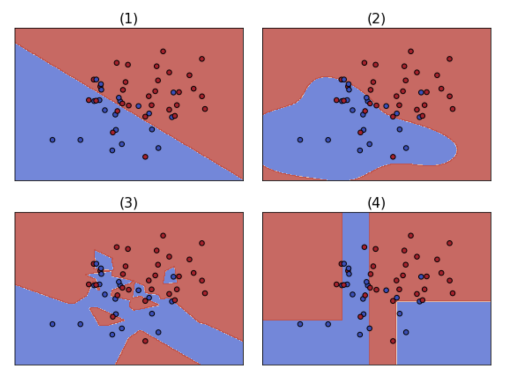
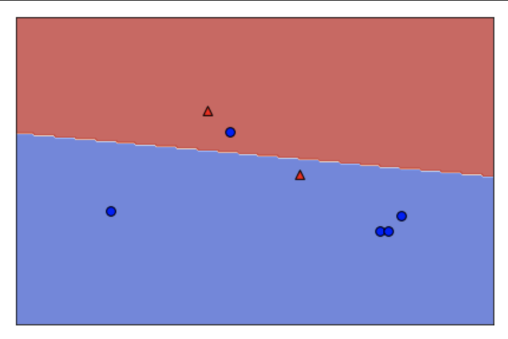
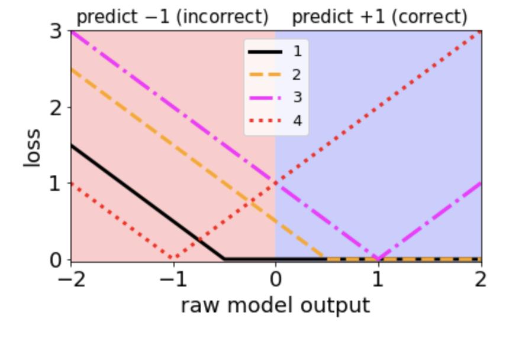
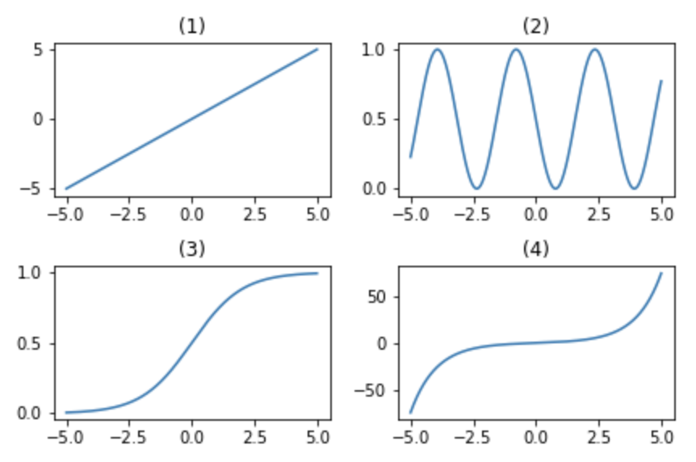
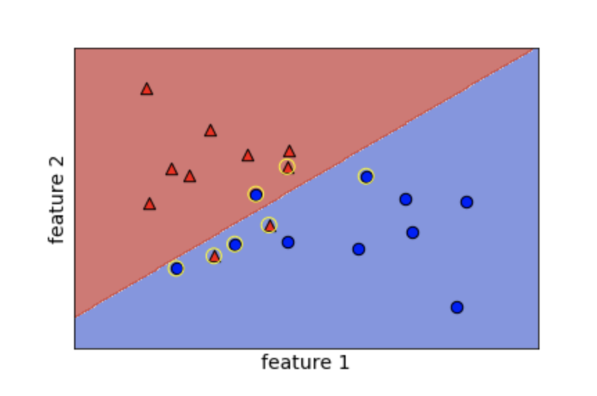
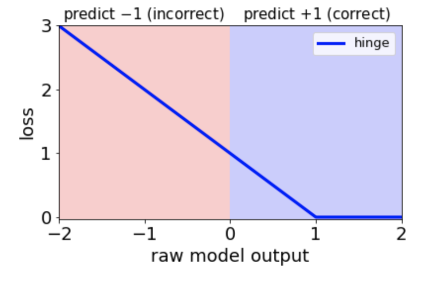

## Linear Classifiers {.unnumbered}

<h3 class="course__description-title">Mike Gelbart</h3>
<p class="course__instructor-description display-none-mobile-course-page-experiment">
    Mike Gelbart is an Instructor in the Department of Computer Science at the University of British Columbia (UBC) in Vancouver, Canada. He also teaches in, and co-designed, the Master of Data Science program at UBC. Mike received his undergraduate degree in physics from Princeton University and his PhD from the machine learning group at Harvard University, working on hyperparameter optimization for machine learning.
  </p>

**Course Description**

<p class="course__description">In this course you'll learn all about using linear classifiers, specifically logistic regression and support vector machines, with scikit-learn. Once you've learned how to apply these methods, you'll dive into the ideas behind them and find out what really makes them tick. At the end of this course you'll know how to train, test, and tune these linear classifiers in Python. You'll also have a conceptual foundation for understanding many other machine learning algorithms.</p>

### Logistic regression and SVM {.unnumbered}

<p class="chapter__description">
    In this chapter you will learn the basics of applying logistic regression and support vector machines (SVMs) to classification problems. You'll use the <code>scikit-learn</code> library to fit classification models to real data.
  </p>

#### scikit-learn refresher {.unnumbered}


##### KNN classification {.unnumbered}


<div class>
<p>In this exercise you'll explore a subset of the <a href="https://ai.stanford.edu/~amaas/data/sentiment/">Large Movie Review Dataset</a>.
The variables <code>X_train</code>, <code>X_test</code>, <code>y_train</code>, and <code>y_test</code> are already loaded into the environment. The <code>X</code> variables contain features based on the words in the movie reviews, and the <code>y</code> variables contain labels for whether the review sentiment is positive (+1) or negative (-1).</p>
<p><em>This course touches on a lot of concepts you may have forgotten, so if you ever need a quick refresher, download the <a href="http://datacamp-community-prod.s3.amazonaws.com/eb807da5-dce5-4b97-a54d-74e89f14266b">scikit-learn Cheat Sheet</a> and keep it handy!</em></p>
</div>
<div class="exercise--instructions__content">


<li>Create a KNN model with default hyperparameters.</li>

<li>Fit the model.</li>

<li>Print out the prediction for the test example 0.</li>
```{python}
# edited/added
import numpy as np
from sklearn.datasets import load_svmlight_file
X_train, y_train = load_svmlight_file('archive/Linear-Classifiers-in-Python/datasets/train_labeledBow.feat')
X_test, y_test = load_svmlight_file('archive/Linear-Classifiers-in-Python/datasets/test_labeledBow.feat')
X_train = X_train[11000:13000,:2500]
y_train = y_train[11000:13000]
y_train[y_train < 5] = -1.0
y_train[y_train >= 5] = 1.0
X_test = X_test[11000:13000,:2500]
y_test = y_test[11000:13000]
y_test[y_train < 5] = -1.0
y_test[y_train >= 5] = 1.0

from sklearn.neighbors import KNeighborsClassifier

# Create and fit the model
knn = KNeighborsClassifier()
knn.fit(X_train, y_train)


# Predict on the test features, print the results
pred = knn.predict(X_test)[0]
print("Prediction for test example 0:", pred)
```
</div>

<p class="">Nice work! Looks like you remember how to use <code>scikit-learn</code> for supervised learning.</p>

##### Comparing models {.unnumbered}


<div class>
<p>Compare k nearest neighbors classifiers with k=1 and k=5 on the handwritten digits data set, which is already loaded into the variables <code>X_train</code>, <code>y_train</code>, <code>X_test</code>, and <code>y_test</code>. You can set k with the <code>n_neighbors</code> parameter when creating the <code>KNeighborsClassifier</code> object, which is also already imported into the environment.</p>
<p>Which model has a higher test accuracy?</p>
</div>


```{python}
# Create and fit the model
knn = KNeighborsClassifier(n_neighbors=1)
knn.fit(X_train, y_train)
knn.score(X_test, y_test)

# Predict on the test features, print the results
pred = knn.predict(X_test)[0]
print("Prediction for test example 0:", pred)

# Create and fit the model
knn = KNeighborsClassifier()
knn.fit(X_train, y_train)
knn.score(X_test, y_test)

# Predict on the test features, print the results
pred = knn.predict(X_test)[0]
print("Prediction for test example 0:", pred)
```

- [ ] k=1
- [x] k=5

<p class="">Great! You've just done a bit of model selection!</p>

##### Overfitting {.unnumbered}

<div class=""><p>Which of the following situations looks like an example of overfitting?</p></div>

- [ ] Training accuracy 50%, testing accuracy 50%.
- [ ] Training accuracy 95%, testing accuracy 95%.
- [x] Training accuracy 95%, testing accuracy 50%.
- [ ] Training accuracy 50%, testing accuracy 95%.

<p class="dc-completion-pane__message dc-u-maxw-100pc">Great job! Looks like you understand overfitting.</p>

#### Applying models {.unnumbered}


##### Running LogisticRegression and SVC {.unnumbered}


<div class><p>In this exercise, you'll apply logistic regression and a support vector machine to classify images of handwritten digits.</p></div>
<div class="exercise--instructions__content">


<li>Apply logistic regression and SVM (using <code>SVC()</code>) to the handwritten digits data set using the provided train/validation split.</li>

<li>For each classifier, print out the training and validation accuracy.</li>
```{python}
# edited/added
from sklearn.model_selection import train_test_split
from sklearn.linear_model import LogisticRegression
from sklearn.svm import SVC
from sklearn import datasets
digits = datasets.load_digits()
X_train, X_test, y_train, y_test = train_test_split(digits.data, digits.target)

# Apply logistic regression and print scores
lr = LogisticRegression()
lr.fit(X_train, y_train)
print(lr.score(X_train, y_train))
print(lr.score(X_test, y_test))

# Apply SVM and print scores
svm = SVC()
svm.fit(X_train, y_train)
print(svm.score(X_train, y_train))
print(svm.score(X_test, y_test))
```
</div>

<p class="">Nicely done! Later in the course we'll look at the similarities and differences of logistic regression vs. SVMs.</p>

##### Sentiment analysis for movie reviews {.unnumbered}


<div class>
<p>In this exercise you'll explore the probabilities outputted by logistic regression on a subset of the <a href="https://ai.stanford.edu/~amaas/data/sentiment/">Large Movie Review Dataset</a>.</p>
<p>The variables <code>X</code> and <code>y</code> are already loaded into the environment. <code>X</code> contains features based on the number of times words appear in the movie reviews, and <code>y</code> contains labels for whether the review sentiment is positive (+1) or negative (-1).</p>
</div>
<div class="exercise--instructions__content">


<li>Train a logistic regression model on the movie review data.</li>

<li>Predict the probabilities of negative vs. positive for the two given reviews.</li>

<li>Feel free to write your own reviews and get probabilities for those too!</li>
```{python}
# edited/added
import numpy as np
import pandas as pd
from sklearn.datasets import load_svmlight_file
X, y = load_svmlight_file('archive/Linear-Classifiers-in-Python/datasets/train_labeledBow.feat')
X = X[11000:13000,:2500]
y = y[11000:13000]
y[y < 5] = -1.0
y[y >= 5] = 1.0
vocab = pd.read_csv('archive/Linear-Classifiers-in-Python/datasets/vocab.csv')['0'].values.tolist()
from sklearn.linear_model import LogisticRegression
from sklearn.feature_extraction.text import CountVectorizer
vectorizer = CountVectorizer(vocabulary = vocab)
def get_features(review):
    return vectorizer.transform([review])
  
# Instantiate logistic regression and train
lr = LogisticRegression()
lr.fit(X, y)

# Predict sentiment for a glowing review
review1 = "LOVED IT! This movie was amazing. Top 10 this year."
review1_features = get_features(review1)
print("Review:", review1)
print("Probability of positive review:", lr.predict_proba(review1_features)[0,1])

# Predict sentiment for a poor review
review2 = "Total junk! I'll never watch a film by that director again, no matter how good the reviews."
review2_features = get_features(review2)
print("Review:", review2)
print("Probability of positive review:", lr.predict_proba(review2_features)[0,1])
```
</div>

<p class="">Fantastic! The second probability would have been even lower, but the word "good" trips it up a bit, since that's considered a "positive" word.</p>

#### Linear classifiers {.unnumbered}


##### Which decision boundary is linear? {.unnumbered}

<p>Which of the following is a linear decision boundary?</p>



- [x] (1)
- [ ] (2)
- [ ] (3)
- [ ] (4)

<p class="dc-completion-pane__message dc-u-maxw-100pc">Good job! You correctly identified the linear decision boundary.</p>

##### Visualizing decision boundaries {.unnumbered}


<div class>
<p>In this exercise, you'll visualize the decision boundaries of various classifier types.</p>
<p>A subset of <code>scikit-learn</code>'s built-in <code>wine</code> dataset is already loaded into <code>X</code>, along with binary labels in <code>y</code>.</p>
</div>
<div class="exercise--instructions__content">


<li>Create the following classifier objects with default hyperparameters: <code>LogisticRegression</code>, <code>LinearSVC</code>, <code>SVC</code>, <code>KNeighborsClassifier</code>.</li>

<li>Fit each of the classifiers on the provided data using a <code>for</code> loop.</li>

<li>Call the <code>plot_4_classifers()</code> function (similar to the code <a href="https://scikit-learn.org/stable/auto_examples/svm/plot_iris_svc.html">here</a>), passing in <code>X</code>, <code>y</code>, and a list containing the four classifiers.</li>
```{python}
# edited/added
import matplotlib.pyplot as plt
X = np.array([[11.45,  2.4 ],
       [13.62,  4.95],
       [13.88,  1.89],
       [12.42,  2.55],
       [12.81,  2.31],
       [12.58,  1.29],
       [13.83,  1.57],
       [13.07,  1.5 ],
       [12.7 ,  3.55],
       [13.77,  1.9 ],
       [12.84,  2.96],
       [12.37,  1.63],
       [13.51,  1.8 ],
       [13.87,  1.9 ],
       [12.08,  1.39],
       [13.58,  1.66],
       [13.08,  3.9 ],
       [11.79,  2.13],
       [12.45,  3.03],
       [13.68,  1.83],
       [13.52,  3.17],
       [13.5 ,  3.12],
       [12.87,  4.61],
       [14.02,  1.68],
       [12.29,  3.17],
       [12.08,  1.13],
       [12.7 ,  3.87],
       [11.03,  1.51],
       [13.32,  3.24],
       [14.13,  4.1 ],
       [13.49,  1.66],
       [11.84,  2.89],
       [13.05,  2.05],
       [12.72,  1.81],
       [12.82,  3.37],
       [13.4 ,  4.6 ],
       [14.22,  3.99],
       [13.72,  1.43],
       [12.93,  2.81],
       [11.64,  2.06],
       [12.29,  1.61],
       [11.65,  1.67],
       [13.28,  1.64],
       [12.93,  3.8 ],
       [13.86,  1.35],
       [11.82,  1.72],
       [12.37,  1.17],
       [12.42,  1.61],
       [13.9 ,  1.68],
       [14.16,  2.51]])
y = np.array([ True,  True, False,  True,  True,  True, False, False,  True,
       False,  True,  True, False, False,  True, False,  True,  True,
        True, False,  True,  True,  True, False,  True,  True,  True,
        True,  True,  True,  True,  True, False,  True,  True,  True,
       False, False,  True,  True,  True,  True, False, False, False,
        True,  True,  True, False,  True])
        
def make_meshgrid(x, y, h=.02, lims=None):
    """Create a mesh of points to plot in
    
    Parameters
    ----------
        x: data to base x-axis meshgrid on
        y: data to base y-axis meshgrid on
        h: stepsize for meshgrid, optional
        
    Returns
    -------
        xx, yy : ndarray
    """
    
    if lims is None:
        x_min, x_max = x.min() - 1, x.max() + 1
        y_min, y_max = y.min() - 1, y.max() + 1
    else:
        x_min, x_max, y_min, y_max = lims
    xx, yy = np.meshgrid(np.arange(x_min, x_max, h),
                         np.arange(y_min, y_max, h))
    return xx, yy
  
def plot_contours(ax, clf, xx, yy, proba=False, **params):
    """Plot the decision boundaries for a classifier.
    
    Parameters
    ----------
        ax: matplotlib axes object
        clf: a classifier
        xx: meshgrid ndarray
        yy: meshgrid ndarray
        params: dictionary of params to pass to contourf, optional
    """
    if proba:
        Z = clf.predict_proba(np.c_[xx.ravel(), yy.ravel()])[:,-1]
        Z = Z.reshape(xx.shape)
        out = ax.imshow(Z,extent=(np.min(xx), np.max(xx), np.min(yy), np.max(yy)), 
                        origin='lower', vmin=0, vmax=1, **params)
        ax.contour(xx, yy, Z, levels=[0.5])
    else:
        Z = clf.predict(np.c_[xx.ravel(), yy.ravel()])
        Z = Z.reshape(xx.shape)
        out = ax.contourf(xx, yy, Z, **params)
    return out
  
def plot_classifier(X, y, clf, ax=None, ticks=False, proba=False, lims=None): 
    # assumes classifier "clf" is already fit
    X0, X1 = X[:, 0], X[:, 1]
    xx, yy = make_meshgrid(X0, X1, lims=lims)
    
    if ax is None:
        plt.figure()
        ax = plt.gca()
        show = True
    else:
        show = False
        
    # can abstract some of this into a higher-level function for learners to call
    cs = plot_contours(ax, clf, xx, yy, cmap=plt.cm.coolwarm, alpha=0.8, proba=proba)
    if proba:
        cbar = plt.colorbar(cs)
        cbar.ax.set_ylabel('probability of red $\Delta$ class', fontsize=20, rotation=270, labelpad=30)
        cbar.ax.tick_params(labelsize=14)
        #ax.scatter(X0, X1, c=y, cmap=plt.cm.coolwarm, s=30, edgecolors=\'k\', linewidth=1)
    labels = np.unique(y)
    if len(labels) == 2:
        ax.scatter(X0[y==labels[0]], X1[y==labels[0]], cmap=plt.cm.coolwarm, 
                   s=60, c='b', marker='o', edgecolors='k')
        ax.scatter(X0[y==labels[1]], X1[y==labels[1]], cmap=plt.cm.coolwarm, 
                   s=60, c='r', marker='^', edgecolors='k')
    else:
        ax.scatter(X0, X1, c=y, cmap=plt.cm.coolwarm, s=50, edgecolors='k', linewidth=1)

    ax.set_xlim(xx.min(), xx.max())
    ax.set_ylim(yy.min(), yy.max())
    #     ax.set_xlabel(data.feature_names[0])
    #     ax.set_ylabel(data.feature_names[1])
    if ticks:
        ax.set_xticks(())
        ax.set_yticks(())
        #     ax.set_title(title)
    if show:
        plt.show()
    else:
        return ax
      
def plot_4_classifiers(X, y, clfs):
    # Set-up 2x2 grid for plotting.
    fig, sub = plt.subplots(2, 2)
    plt.subplots_adjust(wspace=0.2, hspace=0.2)
    
    for clf, ax, title in zip(clfs, sub.flatten(), ("(1)", "(2)", "(3)", "(4)")):
        # clf.fit(X, y)
        plot_classifier(X, y, clf, ax, ticks=True)
        ax.set_title(title)

from sklearn.linear_model import LogisticRegression
from sklearn.svm import SVC, LinearSVC
from sklearn.neighbors import KNeighborsClassifier

# Define the classifiers
classifiers = [LogisticRegression(), LinearSVC(),
               SVC(), KNeighborsClassifier()]
               
# Fit the classifiers
for c in classifiers:
    c.fit(X, y)
    
# Plot the classifiers
plot_4_classifiers(X, y, classifiers)
plt.show()
```
</div>

<p class="">Nice! As you can see, logistic regression and linear SVM are linear classifiers whereas KNN is not. The default SVM is also non-linear, but this is hard to see in the plot because it performs poorly with default hyperparameters. With better hyperparameters, it performs well.</p>

### Loss functions {.unnumbered}

<p class="chapter__description">
    In this chapter you will discover the conceptual framework behind logistic regression and SVMs. This will let you delve deeper into the inner workings of these models.
  </p>

#### Coefficients {.unnumbered}


##### How models make predictions {.unnumbered}

<div class=""><p>Which classifiers make predictions based on the sign (positive or negative) of the raw model output?</p></div>

- [ ] Logistic regression only
- [ ] Linear SVMs only
- [ ] Neither
- [x] Both logistic regression and Linear SVMs

<p class="dc-completion-pane__message dc-u-maxw-100pc">Nice! Furthermore, since logistic regression and SVMs are both linear classifiers, the raw model output is a linear function of x.</p>

##### Changing the model coefficients {.unnumbered}


<div class>
<p>When you call <code>fit</code> with scikit-learn, the logistic regression coefficients are automatically learned from your dataset. In this exercise you will explore how the decision boundary is represented by the coefficients. To do so, you will change the coefficients manually (instead of with <code>fit</code>), and visualize the resulting classifiers.</p>
<p>A 2D dataset is already loaded into the environment as <code>X</code> and <code>y</code>, along with a linear classifier object <code>model</code>.</p>
</div>
<div class="exercise--instructions__content">


<li>Set the two coefficients and the intercept to various values and observe the resulting decision boundaries.</li>

<li>Try to build up a sense of how the coefficients relate to the decision boundary.</li>

<li>Set the coefficients and intercept such that the model makes no errors on the given training data.</li>
```{python}
# edited/added
X = np.array([[ 1.78862847,  0.43650985],
       [ 0.09649747, -1.8634927 ],
       [-0.2773882 , -0.35475898],
       [-3.08274148,  2.37299932],
       [-3.04381817,  2.52278197],
       [-1.31386475,  0.88462238],
       [-2.11868196,  4.70957306],
       [-2.94996636,  2.59532259],
       [-3.54535995,  1.45352268],
       [ 0.98236743, -1.10106763],
       [-1.18504653, -0.2056499 ],
       [-1.51385164,  3.23671627],
       [-4.02378514,  2.2870068 ],
       [ 0.62524497, -0.16051336],
       [-3.76883635,  2.76996928],
       [ 0.74505627,  1.97611078],
       [-1.24412333, -0.62641691],
       [-0.80376609, -2.41908317],
       [-0.92379202, -1.02387576],
       [ 1.12397796, -0.13191423]])
y = np.array([-1, -1, -1,  1,  1, -1,  1,  1,  1, -1, -1,  1,  1, -1,  1, -1, -1,
       -1, -1, -1])
model = LogisticRegression()
model.fit(X, y)

# Set the coefficients
model.coef_ = np.array([[-1,1]])
model.intercept_ = np.array([-3])

# Plot the data and decision boundary
plot_classifier(X,y,model)

# Print the number of errors
num_err = np.sum(y != model.predict(X))
print("Number of errors:", num_err)
```
</div>

<p class="">Great job! As you've been experiencing, the coefficients determine the slope of the boundary and the intercept shifts it.</p>

#### What is a loss function? {.unnumbered}

##### The 0-1 loss {.unnumbered}

- Least squares: the squared loss
    - scikit-learn's `LinearRegression` minimizes a loss:
    $$\sum_{i=1}^{n}(\text{true ith target value - predicted ith target value})^2$$
    - Minimization is with respect to coefficients or parameters of the model.
- Classification errors: the 0-1 loss
    - Squared loss not appropriate for classification problems
    - A natrual loss for classification problem is the number of errors
    - This is the **0-1 loss**: it's 0 for a correct prediction and 1 for an incorrect prediction
    - But this loss is hard to minimize
    
<p>In the figure below, what is the 0-1 loss (number of classification errors) of the classifier?</p>



- [ ] 0
- [ ] 1
- [x] 2
- [ ] 3

<p class="dc-completion-pane__message dc-u-maxw-100pc">Correct! There is 1 misclassified red point and 1 misclassified blue point.</p>

##### Minimizing a loss function {.unnumbered}


<div class>
<p>In this exercise you'll implement linear regression "from scratch" using <code>scipy.optimize.minimize</code>.</p>
<p>We'll train a model on the Boston housing price data set, which is already loaded into  the variables <code>X</code> and <code>y</code>. For simplicity, we won't include an intercept in our regression model.</p>
</div>
<div class="exercise--instructions__content">


<li>Fill in the loss function for least squares linear regression.</li>

<li>Print out the coefficients from fitting sklearn's <code>LinearRegression</code>.</li>
```{python}
# edited/added
import pandas as pd
from scipy.optimize import minimize
from sklearn.linear_model import LinearRegression
X = pd.read_csv('archive/Linear-Classifiers-in-Python/datasets/boston_X.csv').to_numpy()
y = pd.read_csv('archive/Linear-Classifiers-in-Python/datasets/boston_y.csv').to_numpy()

# The squared error, summed over training examples
def my_loss(w):
    s = 0
    for i in range(y.size):
        # Get the true and predicted target values for example 'i'
        y_i_true = y[i]
        y_i_pred = w@X[i]
        s = s + (y_i_true - y_i_pred)**2
    return s
  
# Returns the w that makes my_loss(w) smallest
w_fit = minimize(my_loss, X[0]).x
print(w_fit)

# Compare with scikit-learn's LinearRegression coefficients
lr = LinearRegression(fit_intercept=False).fit(X,y)
print(lr.coef_)
```
</div>

<p class="">Great job! This was a tough one. Isn't it cool how you reproduce the weights learned by <code>scikit-learn</code>?</p>

#### Loss function diagrams {.unnumbered}


##### Classification loss functions {.unnumbered}

<p>Which of the four loss functions makes sense for classification?</p>



- [ ] (1)
- [x] (2)
- [ ] (3)
- [ ] (4)

<p class="dc-completion-pane__message dc-u-maxw-100pc">Correct! This loss is very similar to the hinge loss used in SVMs (just shifted slightly).</p>

##### Comparing the logistic and hinge losses {.unnumbered}


<div class>
<p>In this exercise you'll create a plot of the logistic and hinge losses using their mathematical expressions, which are provided to you.</p>
<p>The loss function diagram from the video is shown on the right.</p>
</div>
<div class="exercise--instructions__content">


<li>Evaluate the <code>log_loss()</code> and <code>hinge_loss()</code> functions <strong>at the grid points</strong> so that they are plotted.</li>
```{python}
# Mathematical functions for logistic and hinge losses
def log_loss(raw_model_output):
   return np.log(1+np.exp(-raw_model_output))
def hinge_loss(raw_model_output):
   return np.maximum(0,1-raw_model_output)

# Create a grid of values and plot
grid = np.linspace(-2,2,1000)
plt.plot(grid, log_loss(grid), label='logistic')
plt.plot(grid, hinge_loss(grid), label='hinge')
plt.legend()
plt.show()
```
</div>

<p class="">Nice! As you can see, these match up with the loss function diagrams we saw in the video.</p>

##### Implementing logistic regression {.unnumbered}


<div class>
<p>This is very similar to the earlier exercise where you implemented linear regression "from scratch" using <code>scipy.optimize.minimize</code>. However, this time we'll minimize the logistic loss and compare with scikit-learn's <code>LogisticRegression</code> (we've set <code>C</code> to a large value to disable regularization; more on this in Chapter 3!).</p>
<p>The <code>log_loss()</code> function from the previous exercise is already defined in your environment, and the <code>sklearn</code> breast cancer prediction dataset (first 10 features, standardized) is loaded into the variables <code>X</code> and <code>y</code>.</p>
</div>
<div class="exercise--instructions__content">


<li>Input the number of training examples into <code>range()</code>.</li>

<li>Fill in the loss function for logistic regression.</li>

<li>Compare the coefficients to sklearn's <code>LogisticRegression</code>.</li>
```{python}
# edited/added
X = pd.read_csv('archive/Linear-Classifiers-in-Python/datasets/breast_X.csv').to_numpy()
y = pd.read_csv('archive/Linear-Classifiers-in-Python/datasets/breast_y.csv').to_numpy()

# The logistic loss, summed over training examples
def my_loss(w):
    s = 0
    for i in range(y.size):
        raw_model_output = w@X[i]
        s = s + log_loss(raw_model_output * y[i])
    return s
  
# Returns the w that makes my_loss(w) smallest
w_fit = minimize(my_loss, X[0]).x
print(w_fit)

# Compare with scikit-learn's LogisticRegression
lr = LogisticRegression(fit_intercept=False, C=1000000).fit(X,y)
print(lr.coef_)
```
</div>

<p class="">Great job! As you can see, logistic regression is just minimizing the loss function we've been looking at. Much more on logistic regression in the next chapter!</p>

### Logistic regression {.unnumbered}

<p class="chapter__description">
    In this chapter you will delve into the details of logistic regression. You'll learn all about regularization and how to interpret model output.
  </p>

#### Regularization {.unnumbered}


##### Regularized logistic regression {.unnumbered}

Regularized logistic regression

* Hyperparameter $C$ is the inverse of the regularization strength,
  * Larger $C$: less regularization,
  * Smaller $C$: more regularization,
* Regularized loss = original loss + large coefficient penalty
  * More regularization: lower training accuracy,
  * More regularization: (almost always) higher test accuracy
  
L1 vs. L2 regularization

*Lasso = linear regression with L1 regularization,
*Ridge = linear regression with L2 regularization,

<div class>
        
<p>In Chapter 1, you used logistic regression on the handwritten digits data set. Here, we'll explore the effect of L2 regularization. </p>
<p>The handwritten digits dataset is already loaded, split, and stored in the variables <code>X_train</code>, <code>y_train</code>, <code>X_valid</code>, and <code>y_valid</code>. The variables <code>train_errs</code> and <code>valid_errs</code> are already initialized as empty lists.</p>
</div>
<div class="exercise--instructions__content">


<li>Loop over the different values of <code>C_value</code>, creating and fitting a <code>LogisticRegression</code> model each time. </li>

<li>Save the error on the training set and the validation set for each model.</li>

<li>Create a plot of the training and testing error as a function of the regularization parameter, <code>C</code>.</li>

<li>Looking at the plot, what's the best value of <code>C</code>?</li>
```{python}
# edited/added
from sklearn.datasets import load_digits

digits = load_digits()
X_train, X_valid, y_train, y_valid = train_test_split(digits.data, digits.target)
C_values = [0.001, 0.01, 0.1, 1, 10, 100, 1000]

# Train and validaton errors initialized as empty list
train_errs = list()
valid_errs = list()

# Loop over values of C_value
for C_value in [0.001, 0.01, 0.1, 1, 10, 100, 1000]:
    # Create LogisticRegression object and fit
    lr = LogisticRegression(C=C_value)
    lr.fit(X_train, y_train)
    
    # Evaluate error rates and append to lists
    train_errs.append( 1.0 - lr.score(X_train, y_train) )
    valid_errs.append( 1.0 - lr.score(X_valid, y_valid) )
    
# Plot results
plt.semilogx(C_values, train_errs, C_values, valid_errs)
plt.legend(("train", "validation"))
plt.show()
```
</div>

<p class="">Congrats! As you can see, too much regularization (small <code>C</code>) doesn't work well - due to underfitting - and too little regularization (large <code>C</code>) doesn't work well either - due to overfitting.</p>

##### Logistic regression and feature selection {.unnumbered}


<div class>
<p>In this exercise we'll perform feature selection on the movie review sentiment data set using L1 regularization. The features and targets are already loaded for you in <code>X_train</code> and <code>y_train</code>.</p>
<p>We'll search for the best value of <code>C</code> using scikit-learn's <code>GridSearchCV()</code>, which was covered in the prerequisite course.</p>
</div>
<div class="exercise--instructions__content">


<li>Instantiate a logistic regression object that uses L1 regularization.</li>

<li>Find the value of <code>C</code> that minimizes cross-validation error.</li>

<li>Print out the number of selected features for this value of <code>C</code>.</li>
```{python}
# edited/added
from sklearn.datasets import load_svmlight_file
from sklearn.model_selection import GridSearchCV

# edited/added
import numpy as np
from sklearn.datasets import load_svmlight_file
X_train, y_train = load_svmlight_file('archive/Linear-Classifiers-in-Python/datasets/train_labeledBow.feat')
X_train = X_train[11000:13000,:2500]
y_train = y_train[11000:13000]
y_train[y_train < 5] = -1.0
y_train[y_train >= 5] = 1.0

# Specify L1 regularization
lr = LogisticRegression(solver='liblinear', penalty='l1')

# Instantiate the GridSearchCV object and run the search
searcher = GridSearchCV(lr, {'C':[0.001, 0.01, 0.1, 1, 10]})
searcher.fit(X_train, y_train)

# Report the best parameters
print("Best CV params", searcher.best_params_)

# Find the number of nonzero coefficients (selected features)
best_lr = searcher.best_estimator_
coefs = best_lr.coef_
print("Total number of features:", coefs.size)
print("Number of selected features:", np.count_nonzero(coefs))
```
</div>

<p class="">Great job! As you can see, a whole lot of features were discarded here.</p>

##### Identifying the most positive and negative words {.unnumbered}


<div class>
<p>In this exercise we'll try to interpret the coefficients of a logistic regression fit on the movie review sentiment dataset. The model object is already instantiated and fit for you in the variable <code>lr</code>.</p>
<p>In addition, the words corresponding to the different features are loaded into the variable <code>vocab</code>. For example, since <code>vocab[100]</code> is "think", that means feature 100 corresponds to the number of times the word "think" appeared in that movie review.</p>
</div>
<div class="exercise--instructions__content">


<li>Find the words corresponding to the 5 largest coefficients.</li>

<li>Find the words corresponding to the 5 smallest coefficients.</li>
```{python}
# edited/added
vocab = pd.read_csv('archive/Linear-Classifiers-in-Python/datasets/vocab.csv').to_numpy()

# Get the indices of the sorted cofficients
inds_ascending = np.argsort(best_lr.coef_.flatten()) 
inds_descending = inds_ascending[::-1]

# Print the most positive words
print("Most positive words: ", end="")
for i in range(5):
    print(vocab[inds_descending[i]], end=", ")
print("\n")

# Print most negative words
print("Most negative words: ", end="")
for i in range(5):
    print(vocab[inds_ascending[i]], end=", ")
print("\n")
```
</div>

<p class="">You got it! The answers sort of make sense, don't they?</p>

#### Probabilities {.unnumbered}


##### Getting class probabilities {.unnumbered}

<p>Which of the following transformations would make sense for transforming the raw model output of a linear classifier into a class probability?</p>



- [ ] (1)
- [ ] (2)
- [x] (3)
- [ ] (4)

<p class="dc-completion-pane__message dc-u-maxw-100pc">That's right! The function in the picture is fairly similar to the logistic function used by logistic regression.</p>

##### Regularization and probabilities {.unnumbered}


<div class>
<p>In this exercise, you will observe the effects of changing the regularization strength on the predicted probabilities.</p>
<p>A 2D binary classification dataset is already loaded into the environment as <code>X</code> and <code>y</code>.</p>
</div>
<div class="exercise--instructions__content">


<li>Compute the maximum predicted probability.</li>

<li>Run the provided code and take a look at the plot.</li>

</div>

<div class="exercise--instructions__content">


<li>Create a model with <code>C=0.1</code> and examine how the plot and probabilities change.</li>
```{python}
# edited/added
X = pd.read_csv('archive/Linear-Classifiers-in-Python/datasets/binary_X.csv').to_numpy()
y = pd.read_csv('archive/Linear-Classifiers-in-Python/datasets/binary_y.csv').to_numpy().ravel()

# Set the regularization strength
model = LogisticRegression(C=1)

# Fit and plot
model.fit(X,y)
plot_classifier(X,y,model,proba=True)

# Predict probabilities on training points
prob = model.predict_proba(X)
print("Maximum predicted probability", np.max(prob))

# Set the regularization strength
model = LogisticRegression(C=0.1)

# Fit and plot
model.fit(X,y)
plot_classifier(X,y,model,proba=True)

# Predict probabilities on training points
prob = model.predict_proba(X)
print("Maximum predicted probability", np.max(prob))
```
</div>

<p class="">You got it! As you probably noticed, smaller values of <code>C</code> lead to less confident predictions. That's because smaller <code>C</code> means more regularization, which in turn means smaller coefficients, which means raw model outputs closer to zero and, thus, probabilities closer to 0.5 after the raw model output is squashed through the sigmoid function. That's quite a chain of events!</p>

##### Visualizing easy and difficult examples {.unnumbered}


<div class>
<p>In this exercise, you'll visualize the examples that the logistic regression model is most and least confident about by looking at the largest and smallest predicted probabilities.</p>
<p>The handwritten digits dataset is already loaded into the variables <code>X</code> and <code>y</code>. The <code>show_digit</code> function takes in an integer index and plots the corresponding image, with some extra information displayed above the image.</p>
</div>
<div class="exercise--instructions__content">


<li>Fill in the first blank with the <em>index</em> of the digit that the model is most confident about.</li>

<li>Fill in the second blank with the <em>index</em> of the digit that the model is least confident about.</li>

<li>Observe the images: do you agree that the first one is less ambiguous than the second?</li>
```{python}
# edited/added
def show_digit(i, lr=None):
    plt.imshow(np.reshape(X[i], (8,8)), cmap='gray', 
               vmin = 0, vmax = 16, interpolation=None)
    plt.xticks(())
    plt.yticks(())
    if lr is None:
        plt.title("class label = %d" % y[i])
    else:
        pred = lr.predict(X[i][None])
        pred_prob = lr.predict_proba(X[i][None])[0,pred]
        plt.title("label=%d, prediction=%d, proba=%.2f" % (y[i], pred, pred_prob))
        plt.show()
        
X, y = digits.data, digits.target

lr = LogisticRegression()
lr.fit(X,y)

# Get predicted probabilities
proba = lr.predict_proba(X)

# Sort the example indices by their maximum probability
proba_inds = np.argsort(np.max(proba,axis=1))

# Show the most confident (least ambiguous) digit
show_digit(proba_inds[-1], lr)

# Show the least confident (most ambiguous) digit
show_digit(proba_inds[0], lr)
```
</div>

<p class="">Great job! As you can see, the least confident example looks like a weird 9, and the most confident example looks like a very typical 5.</p>

#### Multi-class logistic regression {.unnumbered}


##### Counting the coefficients {.unnumbered}

<div class=""><p>If you fit a logistic regression model on a classification problem with 3 classes and 100 features, how many coefficients would you have, including intercepts?</p></div>

- [ ] 101
- [ ] 103
- [ ] 301
- [x] 303

<p class="dc-completion-pane__message dc-u-maxw-100pc">Nicely done! Feel free to test this out with scikit-learn!</p>

##### Fitting multi-class logistic regression {.unnumbered}


<div class><p>In this exercise, you'll fit the two types of multi-class logistic regression, one-vs-rest and softmax/multinomial, on the handwritten digits data set and compare the results. The handwritten digits dataset is already loaded and split into <code>X_train</code>, <code>y_train</code>, <code>X_test</code>, and <code>y_test</code>.</p></div>
<div class="exercise--instructions__content">


<li>Fit a one-vs-rest logistic regression classifier by setting the <code>multi_class</code> parameter and report the results.</li>

<li>Fit a multinomial logistic regression classifier by setting the <code>multi_class</code> parameter and report the results.</li>
```{python}
# edited/added
X_train, X_test, y_train, y_test = train_test_split(digits.data, digits.target)

# Fit one-vs-rest logistic regression classifier
lr_ovr = LogisticRegression(multi_class="ovr")
lr_ovr.fit(X_train, y_train)

print("OVR training accuracy:", lr_ovr.score(X_train, y_train))
print("OVR test accuracy    :", lr_ovr.score(X_test, y_test))

# Fit softmax classifier
lr_mn = LogisticRegression(multi_class="multinomial")
lr_mn.fit(X_train, y_train)

print("Softmax training accuracy:", lr_mn.score(X_train, y_train))
print("Softmax test accuracy    :", lr_mn.score(X_test, y_test))
```
</div>

<p class="">Nice work! As you can see, the accuracies of the two methods are fairly similar on this data set.</p>

##### Visualizing multi-class logistic regression {.unnumbered}


<div class>
<p>In this exercise we'll continue with the two types of multi-class logistic regression, but on a toy 2D data set specifically designed to break the one-vs-rest scheme. </p>
<p>The data set is loaded into <code>X_train</code> and <code>y_train</code>. The two logistic regression objects,<code>lr_mn</code> and <code>lr_ovr</code>, are already instantiated (with <code>C=100</code>), fit, and plotted. </p>
<p>Notice that <code>lr_ovr</code> never predicts the dark blue class… yikes! Let's explore why this happens by plotting one of the binary classifiers that it's using behind the scenes.</p>
</div>
<div class="exercise--instructions__content">


<li>Create a new logistic regression object (also with <code>C=100</code>) to be used for binary classification.</li>

<li>Visualize this binary classifier with <code>plot_classifier</code>… does it look reasonable?</li>
```{python}
# edited/added
X_train = pd.read_csv('archive/Linear-Classifiers-in-Python/datasets/toy_X_train.csv').to_numpy()
y_train = pd.read_csv('archive/Linear-Classifiers-in-Python/datasets/toy_y_train.csv').to_numpy().ravel()

lr_ovr = LogisticRegression(max_iter=10000, C=100)
lr_ovr.fit(X_train, y_train)
fig, ax = plt.subplots();
ax.set_title("lr_ovr (one-vs-rest)");
plot_classifier(X_train, y_train, lr_ovr, ax=ax);

lr_mn = LogisticRegression(multi_class='multinomial', solver='lbfgs', max_iter=10000)
lr_mn.fit(X_train, y_train)
fig, ax = plt.subplots();
ax.set_title("lr_mn (softmax)");
plot_classifier(X_train, y_train, lr_ovr, ax=ax);

# Print training accuracies
print("Softmax training accuracy:", lr_mn.score(X_train, y_train))
print("One-vs-rest training accuracy:", lr_ovr.score(X_train, y_train))

# Create the binary classifier (class 1 vs. rest)
lr_class_1 = LogisticRegression(C=100)
lr_class_1.fit(X_train, y_train==1)

# Plot the binary classifier (class 1 vs. rest)
plot_classifier(X_train, y_train==1, lr_class_1)
```
</div>

<p class="">Nice work! As you can see, the binary classifier incorrectly labels almost all points in class 1 (shown as red triangles in the final plot)! Thus, this classifier is not a very effective component of the one-vs-rest classifier. In general, though, one-vs-rest often works well.</p>

##### One-vs-rest SVM {.unnumbered}


<div class>
<p>As motivation for the next and final chapter on support vector machines, we'll repeat the previous exercise with a non-linear SVM. Once again, the data is loaded into <code>X_train</code>, <code>y_train</code>, <code>X_test</code>, and <code>y_test</code> .</p>
<p>Instead of using <code>LinearSVC</code>, we'll now use scikit-learn's <code>SVC</code> object, which is a non-linear "kernel" SVM (much more on what this means in Chapter 4!). Again, your task is to create a plot of the binary classifier for class 1 vs. rest.</p>
</div>
<div class="exercise--instructions__content">


<li>Fit an <code>SVC</code> called <code>svm_class_1</code> to predict class 1 vs. other classes. </li>

<li>Plot this classifier.</li>
```{python}
# edited/added
X_test = pd.read_csv('archive/Linear-Classifiers-in-Python/datasets/toy_X_test.csv').to_numpy()
y_test = pd.read_csv('archive/Linear-Classifiers-in-Python/datasets/toy_y_test.csv').to_numpy().ravel()

# We'll use SVC instead of LinearSVC from now on
from sklearn.svm import SVC

# Create/plot the binary classifier (class 1 vs. rest)
svm_class_1 = SVC()
svm_class_1.fit(X_train, y_train==1)
plot_classifier(X_train, y_train==1, svm_class_1)
```
</div>

<p class="">Cool, eh?! The non-linear SVM works fine with one-vs-rest on this dataset because it learns to "surround" class 1.</p>

### Support Vector Machines {.unnumbered}

<p class="chapter__description">
    In this chapter you will learn all about the details of support vector machines. You'll learn about tuning hyperparameters for these models and using kernels to fit non-linear decision boundaries.
  </p>

#### Support vectors {.unnumbered}


##### Support vector definition {.unnumbered}

<p>Which of the following is a true statement about support vectors? To help you out, here's the picture of support vectors from the video (top),
as well as the hinge loss from Chapter 2 (bottom).</p>




- [ ] All support vectors are classified correctly.
- [ ] All support vectors are classified incorrectly.
- [ ] All correctly classified points are support vectors.
- [x] All incorrectly classified points are support vectors.

<p class="dc-completion-pane__message dc-u-maxw-100pc">Nice work, you got it!</p>

##### Effect of removing examples {.unnumbered}


<div class>
<p>Support vectors are defined as training examples that influence the decision boundary. In this exercise, you'll observe this behavior by removing non support vectors from the training set. </p>
<p>The wine quality dataset is already loaded into <code>X</code> and <code>y</code> (first two features only). (Note: we specify <code>lims</code> in <code>plot_classifier()</code> so that the two plots are forced to use the same axis limits and can be compared directly.)</p>
</div>
<div class="exercise--instructions__content">


<li>Train a linear SVM on the whole data set.</li>

<li>Create a new data set containing only the support vectors.</li>

<li>Train a new linear SVM on the smaller data set.</li>
```{python}
# edited/added
X = pd.read_csv('archive/Linear-Classifiers-in-Python/datasets/wine_X.csv').to_numpy()
y = pd.read_csv('archive/Linear-Classifiers-in-Python/datasets/wine_y.csv').to_numpy().ravel()

# Train a linear SVM
svm = SVC(kernel="linear")
svm.fit(X,y)
plot_classifier(X, y, svm, lims=(11,15,0,6))

# Make a new data set keeping only the support vectors
print("Number of original examples", len(X))
print("Number of support vectors", len(svm.support_))
X_small = X[svm.support_]
y_small = y[svm.support_]

# Train a new SVM using only the support vectors
svm_small = SVC(kernel="linear")
svm_small.fit(X_small, y_small)
plot_classifier(X_small, y_small, svm_small, lims=(11,15,0,6))
```
</div>

<p class="">Nice! Compare the decision boundaries of the two trained models: are they the same? By the definition of support vectors, they should be!</p>

#### Kernel SVMs {.unnumbered}


##### GridSearchCV warm-up {.unnumbered}


<div class><p>In the video we saw that increasing the RBF kernel hyperparameter <code>gamma</code> increases training accuracy. In this exercise we'll search for the <code>gamma</code> that maximizes cross-validation accuracy using scikit-learn's <code>GridSearchCV</code>. A binary version of the handwritten digits dataset, in which you're just trying to predict whether or not an image is a "2", is already loaded into the variables <code>X</code> and <code>y</code>.</p></div>
<div class="exercise--instructions__content">


<li>Create a <code>GridSearchCV</code> object.</li>

<li>Call the <code>fit()</code> method to select the best value of <code>gamma</code> based on cross-validation accuracy.</li>
```{python}
# edited/added
X = pd.read_csv('archive/Linear-Classifiers-in-Python/datasets/digits_2_X.csv').to_numpy()
y = pd.read_csv('archive/Linear-Classifiers-in-Python/datasets/digits_2_y.csv').astype('bool').to_numpy().ravel()

# Instantiate an RBF SVM
svm = SVC()

# Instantiate the GridSearchCV object and run the search
parameters = {'gamma':[0.00001, 0.0001, 0.001, 0.01, 0.1]}
searcher = GridSearchCV(svm, parameters)
searcher.fit(X, y)

# Report the best parameters
print("Best CV params", searcher.best_params_)
```
</div>

<p class="">Great job! Larger values of <code>gamma</code> are better for training accuracy, but cross-validation helped us find something different (and better!).</p>

##### Jointly tuning gamma and C with GridSearchCV {.unnumbered}


<div class>
<p>In the previous exercise the best value of <code>gamma</code> was 0.001 using the default value of <code>C</code>, which is 1. In this exercise you'll search for the best combination of <code>C</code> and <code>gamma</code> using <code>GridSearchCV</code>.</p>
<p>As in the previous exercise, the 2-vs-not-2 digits dataset is already loaded, but this time it's split into the variables <code>X_train</code>, <code>y_train</code>, <code>X_test</code>, and <code>y_test</code>. Even though cross-validation already splits the training set into parts, it's often a good idea to hold out a separate test set to make sure the cross-validation results are sensible.</p>
</div>
<div class="exercise--instructions__content">


<li>Run <code>GridSearchCV</code> to find the best hyperparameters using the training set.</li>

<li>Print the best values of the parameters.</li>

<li>Print out the accuracy on the test set, which was not used during the cross-validation procedure.</li>
```{python}
# edited/added
from sklearn.model_selection import train_test_split
X_train, X_test, y_train, y_test = train_test_split(X, y)

# Instantiate an RBF SVM
svm = SVC()

# Instantiate the GridSearchCV object and run the search
parameters = {'C':[0.1, 1, 10], 'gamma':[0.00001, 0.0001, 0.001, 0.01, 0.1]}
searcher = GridSearchCV(svm, parameters)
searcher.fit(X_train, y_train)

# Report the best parameters and the corresponding score
print("Best CV params", searcher.best_params_)
print("Best CV accuracy", searcher.best_score_)

# Report the test accuracy using these best parameters
print("Test accuracy of best grid search hypers:", searcher.score(X_test, y_test))
```
</div>

<p class="">You got it! Note that the best value of <code>gamma</code>, 0.0001, is different from the value of 0.001 that we got in the previous exercise, when we fixed <code>C=1</code>. Hyperparameters can affect each other!</p>

#### Logistic regression & SVM {.unnumbered}

* Logistic regression:
  * Is a linear classifier
  * Can use with kernels, but slow
  * Outputs meaningful probabilities
  * Can be extended to multi-class
  * All data points affect fit
  * L2 or L1 regularization
* Support Vector Machine (SVM)
  * Is a linear classifier
  * Can use with kernels, and fast
  * Does not naturally output probabilities
  * Can be extended to multi-class
  * Only "support vectors" affect fit
  * Conventionally just L2 regularization

##### An advantage of SVMs {.unnumbered}

<div class=""><p>Which of the following is an advantage of SVMs over logistic regression?</p></div>

- [ ] They naturally output meaningful probabilities.
- [ ] They can be used with kernels.
- [x] They are computationally efficient with kernels.
- [ ] They learn sigmoidal decision boundaries.

<p class="dc-completion-pane__message dc-u-maxw-100pc">That's right! Having a limited number of support vectors makes kernel SVMs computationally efficient.</p>

##### An advantage of logistic regression {.unnumbered}

<div class=""><p>Which of the following is an advantage of logistic regression over SVMs?</p></div>

- [x] It naturally outputs meaningful probabilities.
- [ ] It can be used with kernels.
- [ ] It is computationally efficient with kernels.
- [ ] It learns sigmoidal decision boundaries.

<p class="dc-completion-pane__message dc-u-maxw-100pc">You got it!</p>

##### Using SGDClassifier {.unnumbered}


<div class><p>In this final coding exercise, you'll do a hyperparameter search over the regularization strength and the loss (logistic regression vs. linear SVM) using <code>SGDClassifier()</code>.</p></div>
<div class="exercise--instructions__content">


<li>Instantiate an <code>SGDClassifier</code> instance with <code>random_state=0</code>.</li>

<li>Search over the regularization strength and the <code>hinge</code> vs. <code>log_loss</code> losses.</li>
```{python}
# edited/added
from sklearn.linear_model import SGDClassifier
X, y = digits.data, digits.target
X_train, X_test, y_train, y_test = train_test_split(X, y)

# We set random_state=0 for reproducibility 
linear_classifier = SGDClassifier(random_state=0)

# Instantiate the GridSearchCV object and run the search
parameters = {'alpha':[0.00001, 0.0001, 0.001, 0.01, 0.1, 1], 
             'loss':['hinge', 'log_loss']}
searcher = GridSearchCV(linear_classifier, parameters, cv=10)
searcher.fit(X_train, y_train)

# Report the best parameters and the corresponding score
print("Best CV params", searcher.best_params_)
print("Best CV accuracy", searcher.best_score_)
print("Test accuracy of best grid search hypers:", searcher.score(X_test, y_test))
```
</div>

<p class="">Congrats, you finished the last exercise in the course! One advantage of <code>SGDClassifier</code> is that it's very fast - this would have taken a lot longer with <code>LogisticRegression</code> or <code>LinearSVC</code>.</p>

#### Conclusion {.unnumbered}

##### Conclusion {.unnumbered}

You made it - congratulations!

##### How does this course fit into data science? {.unnumbered}

You now have practice applying logistic regression and support vector machines to classification problems. How does this fit into a bigger picture? The way I see it, data science is the process of answering questions and making decisions based on data. The data science process usually combines several of the following pieces: data collection, data preparation, database design, visualization, communication, software engineering, machine learning, and more. In this course we focused on the machine learning portion. Machine learning has several branches like supervised learning, unsupervised learning, and reinforcement learning. We've been focusing on supervised learning, which means trying to predict a target value from features given a labeled data set. Within supervised learning, we've focussed on classification, which means the thing we're trying to predict is categorical rather than a continuous in nature. Finally, we covered logistic regression and SVMs, the two most popular linear classifiers. So, while we've done a lot, there's so much more out there!

##### Congratulations & thanks! {.unnumbered}

Thanks for completing this journey with me. I hope you enjoyed it as much as I did. Congratulations again.