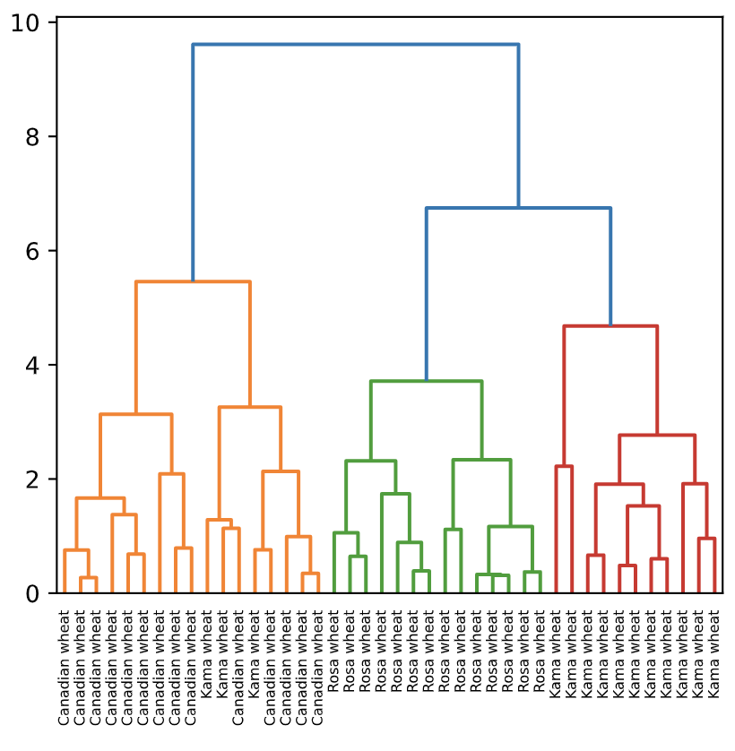
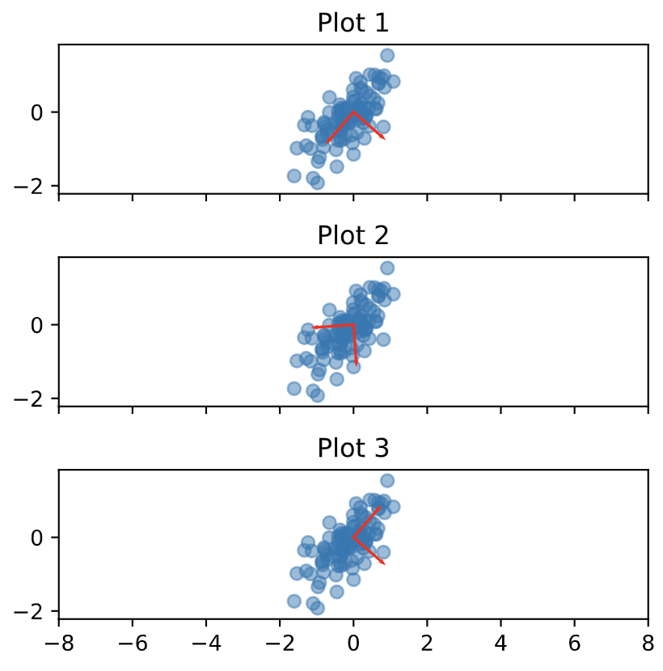

## Unsupervised Learning {.unnumbered}

<h3 class="course__description-title">Benjamin Wilson</h3>
<p class="course__instructor-description display-none-mobile-course-page-experiment">
    Ben is a machine learning specialist and the director of research at lateral.io.  He is passionate about learning and has worked as a data scientist in real-time bidding, e-commerce, and recommendation.   Ben holds a PhD in mathematics and a degree in computer science.
  </p>

**Course Description**

<p class="course__description">Say you have a collection of customers with a variety of characteristics such as age, location, and financial history, and you wish to discover patterns and sort them into clusters. Or perhaps you have a set of texts, such as Wikipedia pages, and you wish to segment them into categories based on their content. This is the world of unsupervised learning, called as such because you are not guiding, or supervising, the pattern discovery by some prediction task, but instead uncovering hidden structure from unlabeled data. Unsupervised learning encompasses a variety of techniques in machine learning, from clustering to dimension reduction to matrix factorization. In this course, you'll learn the fundamentals of unsupervised learning and implement the essential algorithms using scikit-learn and SciPy. You will learn how to cluster, transform, visualize, and extract insights from unlabeled datasets, and end the course by building a recommender system to recommend popular musical artists.</p>

### Clustering for exploration {.unnumbered}

<p class="chapter__description">
    Learn how to discover the underlying groups (or "clusters") in a dataset.  By the end of this chapter, you'll be clustering companies using their stock market prices, and distinguishing different species by clustering their measurements.
  </p>
  
#### Unsupervised Learning {.unnumbered}


##### How many clusters? {.unnumbered}


<div class>
<p>You are given an array <code>points</code> of size 300x2, where each row gives the (x, y) co-ordinates of a point on a map.  Make a scatter plot of these points, and use the scatter plot to guess how many clusters there are.</p>
<p><code>matplotlib.pyplot</code> has already been imported as <code>plt</code>.  In the IPython Shell:</p>

<li>Create an array called <code>xs</code> that contains the values of <code>points[:,0]</code> - that is, column <code>0</code> of <code>points</code>.</li>

<li>Create an array called <code>ys</code> that contains the values of <code>points[:,1]</code> - that is, column <code>1</code> of <code>points</code>.</li>

<li>Make a scatter plot by passing <code>xs</code> and <code>ys</code> to the <code>plt.scatter()</code> function.</li>

<li>Call the <code>plt.show()</code> function to show your plot.</li>


<p>How many clusters do you see?</p>
</div>

```{python}
# edited/added
import numpy as np
import pandas as pd
import matplotlib.pyplot as plt
points = np.array(pd.read_csv("archive/Unsupervised-Learning-in-Python/datasets/points.csv", header = None))
xs = points[:,0]
ys = points[:,1]
plt.scatter(xs, ys, alpha=0.5)
plt.show()
```


- [ ] 2
- [x] 3
- [ ] 300

<p class="">Correct! The scatter plot suggests that there are 3 distinct clusters.</p>
  
##### Clustering 2D points {.unnumbered}


<div class>
<p>From the scatter plot of the previous exercise, you saw that the points seem to separate into 3 clusters. You'll now create a KMeans model to find 3 clusters, and fit it to the data points from the previous exercise.  After the model has been fit, you'll obtain the cluster labels for some new points using the <code>.predict()</code> method.</p>
<p>You are given the array <code>points</code> from the previous exercise, and also an array <code>new_points</code>.</p>
</div>
<div class="exercise--instructions__content">


<li>Import <code>KMeans</code> from <code>sklearn.cluster</code>.</li>

<li>Using <code>KMeans()</code>, create a <code>KMeans</code> instance called <code>model</code> to find <code>3</code> clusters. To specify the number of clusters, use the <code>n_clusters</code> keyword argument.</li>

<li>Use the <code>.fit()</code> method of <code>model</code> to fit the model to the array of points <code>points</code>.</li>

<li>Use the <code>.predict()</code> method of <code>model</code> to predict the cluster labels of <code>new_points</code>, assigning the result to <code>labels</code>.</li>

<li>Hit submit to see the cluster labels of <code>new_points</code>.</li>
```{python}
# edited/added
import numpy as np
import pandas as pd
points = np.array(pd.read_csv("archive/Unsupervised-Learning-in-Python/datasets/points.csv", header = None))
new_points = np.array(pd.read_csv("archive/Unsupervised-Learning-in-Python/datasets/new_points.csv", header = None))

# Import KMeans
from sklearn.cluster import KMeans

# Create a KMeans instance with 3 clusters: model
model = KMeans(n_clusters=3)

# Fit model to points
model.fit(points)

# Determine the cluster labels of new_points: labels
labels = model.predict(new_points)

# Print cluster labels of new_points
print(labels)
```
</div>

<p class="">Great work! You've successfully performed k-Means clustering and predicted the labels of new points. But it is not easy to inspect the clustering by just looking at the printed labels. A visualization would be far more useful. In the next exercise, you'll inspect your clustering with a scatter plot!</p>

##### Inspect your clustering {.unnumbered}


<div class>
<p>Let's now inspect the clustering you performed in the previous exercise!</p>
<p>A solution to the previous exercise has already run, so <code>new_points</code> is an array of points and <code>labels</code> is the array of their cluster labels.</p>
</div>
<div class="exercise--instructions__content">


<li>Import <code>matplotlib.pyplot</code> as <code>plt</code>.</li>

<li>Assign column <code>0</code> of <code>new_points</code> to <code>xs</code>, and column <code>1</code> of <code>new_points</code> to <code>ys</code>.</li>

<li>Make a scatter plot of <code>xs</code> and <code>ys</code>, specifying the <code>c=labels</code> keyword arguments to color the points by their cluster label. Also specify <code>alpha=0.5</code>.</li>

<li>Compute the coordinates of the centroids using the <code>.cluster_centers_</code> attribute of <code>model</code>.</li>

<li>Assign column <code>0</code> of <code>centroids</code> to <code>centroids_x</code>, and column <code>1</code> of <code>centroids</code> to <code>centroids_y</code>.</li>

<li>Make a scatter plot of <code>centroids_x</code> and <code>centroids_y</code>, using <code>'D'</code> (a diamond) as a marker by specifying the <code>marker</code> parameter. Set the size of the markers to be <code>50</code> using <code>s=50</code>.</li>
```{python}
# Import pyplot
from matplotlib import pyplot as plt

# Assign the columns of new_points: xs and ys
xs = new_points[:,0]
ys = new_points[:,1]

# Make a scatter plot of xs and ys, using labels to define the colors
plt.scatter(xs, ys, c=labels, alpha=0.5)

# Assign the cluster centers: centroids
centroids = model.cluster_centers_

# Assign the columns of centroids: centroids_x, centroids_y
centroids_x = centroids[:,0]
centroids_y = centroids[:,1]

# Make a scatter plot of centroids_x and centroids_y
plt.scatter(centroids_x, centroids_y, marker='D', s=50)
plt.show()
```
</div>

<p class="">Fantastic! The clustering looks great! But how can you be sure that 3 clusters is the correct choice? In other words, how can you evaluate the quality of a clustering? Tune into the next video in which Ben will explain how to evaluate a clustering!</p>

#### Evaluating a clustering {.unnumbered}


##### How many clusters of grain? {.unnumbered}


<div class>
<p>In the video, you learned how to choose a good number of clusters for a dataset using the k-means inertia graph.  You are given an array <code>samples</code> containing the measurements (such as area, perimeter, length, and several others) of samples of grain.  What's a good number of clusters in this case?</p>
<p><code>KMeans</code> and PyPlot (<code>plt</code>) have already been imported for you.</p>
<p>This dataset was sourced from the <a href="https://archive.ics.uci.edu/ml/datasets/seeds">UCI Machine Learning Repository</a>.</p>
</div>
<div class="exercise--instructions__content">


<li>For each of the given values of <code>k</code>, perform the following steps:</li>

<li>Create a <code>KMeans</code> instance called <code>model</code> with <code>k</code> clusters.</li>

<li>Fit the model to the grain data <code>samples</code>.</li>

<li>Append the value of the <code>inertia_</code> attribute of <code>model</code> to the list <code>inertias</code>.</li>

<li>The code to plot <code>ks</code> vs <code>inertias</code> has been written for you, so hit submit to see the plot!</li>
```{python}
# edited/added
grains = pd.read_csv("archive/Unsupervised-Learning-in-Python/datasets/grains.csv")
samples = np.array(grains)[:,:7]
varieties = list(np.array(grains)[:,8])

ks = range(1, 6)
inertias = []

for k in ks:
    # Create a KMeans instance with k clusters: model
    model = KMeans(n_clusters=k)
    
    # Fit model to samples
    model.fit(samples)
    
    # Append the inertia to the list of inertias
    inertias.append(model.inertia_)
    
# Plot ks vs inertias
plt.plot(ks, inertias, '-o')
plt.xlabel('number of clusters, k')
plt.ylabel('inertia')
plt.xticks(ks)
plt.show()
```
</div>

<p class="">Excellent job! The inertia decreases very slowly from 3 clusters to 4, so it looks like 3 clusters would be a good choice for this data.</p>

##### Evaluating the grain clustering {.unnumbered}


<div class>
<p>In the previous exercise, you observed from the inertia plot that 3 is a good number of clusters for the grain data.  In fact, the grain samples come from a mix of 3 different grain varieties: "Kama", "Rosa" and "Canadian".  In this exercise, cluster the grain samples into three clusters, and compare the clusters to the grain varieties using a cross-tabulation.</p>
<p>You have the array <code>samples</code> of grain samples, and a list <code>varieties</code> giving the grain variety for each sample.  Pandas (<code>pd</code>) and <code>KMeans</code> have already been imported for you.</p>
</div>
<div class="exercise--instructions__content">


<li>Create a <code>KMeans</code> model called <code>model</code> with <code>3</code> clusters.</li>

<li>Use the <code>.fit_predict()</code> method of <code>model</code> to fit it to <code>samples</code> and derive the cluster labels. Using <code>.fit_predict()</code> is the same as using <code>.fit()</code> followed by <code>.predict()</code>.</li>

<li>Create a DataFrame <code>df</code> with two columns named <code>'labels'</code> and <code>'varieties'</code>, using <code>labels</code> and <code>varieties</code>, respectively, for the column values. This has been done for you.</li>

<li>Use the <code>pd.crosstab()</code> function on <code>df['labels']</code> and <code>df['varieties']</code> to count the number of times each grain variety coincides with each cluster label. Assign the result to <code>ct</code>.</li>

<li>Hit submit to see the cross-tabulation!</li>
```{python}
# Create a KMeans model with 3 clusters: model
model = KMeans(n_clusters=3)

# Use fit_predict to fit model and obtain cluster labels: labels
labels = model.fit_predict(samples)

# Create a DataFrame with clusters and varieties as columns: df
df = pd.DataFrame({'labels': labels, 'varieties': varieties})

# Create crosstab: ct
ct = pd.crosstab(df['labels'], df['varieties'])

# Display ct
print(ct)
```
</div>

<p class="">Great work! The cross-tabulation shows that the 3 varieties of grain separate really well into 3 clusters. But depending on the type of data you are working with, the clustering may not always be this good. Is there anything you can do in such situations to improve your clustering? You'll find out in the next video!</p>

#### Transforming features for better clusterings {.unnumbered}


##### Scaling fish data for clustering {.unnumbered}


<div class>
<p>You are given an array <code>samples</code> giving measurements of fish.  Each row represents an individual fish.  The measurements, such as weight in grams, length in centimeters, and the percentage ratio of height to length, have very different scales.  In order to cluster this data effectively, you'll need to standardize these features first.  In this exercise, you'll build a pipeline to standardize and cluster the data.</p>
<p>These fish measurement data were sourced from the <a href="http://ww2.amstat.org/publications/jse/jse_data_archive.htm">Journal of Statistics Education</a>.</p>
</div>
<div class="exercise--instructions__content">


<li>Import:
<li>
<code>make_pipeline</code> from <code>sklearn.pipeline</code>.</li>

<li>
<code>StandardScaler</code> from <code>sklearn.preprocessing</code>.</li>

<li>
<code>KMeans</code> from <code>sklearn.cluster</code>.</li>


</li>

<li>Create an instance of <code>StandardScaler</code> called <code>scaler</code>.</li>

<li>Create an instance of <code>KMeans</code> with <code>4</code> clusters called <code>kmeans</code>.</li>

<li>Create a pipeline called <code>pipeline</code> that chains <code>scaler</code> and <code>kmeans</code>. To do this, you just need to pass them in as arguments to <code>make_pipeline()</code>.</li>
```{python}
# edited/added
fish = np.array(pd.read_csv("archive/Unsupervised-Learning-in-Python/datasets/fish.csv", header = None))
samples = fish[:,1:]
species = fish[:,0]

# Perform the necessary imports
from sklearn.pipeline import make_pipeline
from sklearn.preprocessing import StandardScaler
from sklearn.cluster import KMeans

# Create scaler: scaler
scaler = StandardScaler()

# Create KMeans instance: kmeans
kmeans = KMeans(n_clusters=4)

# Create pipeline: pipeline
pipeline = make_pipeline(scaler, kmeans)
```
</div>

<p class="">Great work! Now that you've built the pipeline, you'll use it in the next exercise to cluster the fish by their measurements.</p>

##### Clustering the fish data {.unnumbered}


<div class>
<p>You'll now use your standardization and clustering pipeline from the previous exercise to cluster the fish by their measurements, and then create a cross-tabulation to compare the cluster labels with the fish species.</p>
<p>As before, <code>samples</code> is the 2D array of fish measurements.  Your pipeline is available as <code>pipeline</code>, and the species of every fish sample is given by the list <code>species</code>.</p>
</div>
<div class="exercise--instructions__content">


<li>Import <code>pandas</code> as <code>pd</code>.</li>

<li>Fit the pipeline to the fish measurements <code>samples</code>.</li>

<li>Obtain the cluster labels for <code>samples</code> by using the <code>.predict()</code> method of <code>pipeline</code>.</li>

<li>Using <code>pd.DataFrame()</code>, create a DataFrame <code>df</code> with two columns named <code>'labels'</code> and <code>'species'</code>, using <code>labels</code> and <code>species</code>, respectively, for the column values.</li>

<li>Using <code>pd.crosstab()</code>, create a cross-tabulation <code>ct</code> of <code>df['labels']</code> and <code>df['species']</code>.</li>
```{python}
# Import pandas
import pandas as pd

# Fit the pipeline to samples
pipeline.fit(samples)

# Calculate the cluster labels: labels
labels = pipeline.predict(samples)

# Create a DataFrame with labels and species as columns: df
df = pd.DataFrame({'labels': labels, 'species': species})

# Create crosstab: ct
ct = pd.crosstab(df['labels'], df['species'])

# Display ct
print(ct)
```
</div>

<p class="">Excellent! It looks like the fish data separates really well into 4 clusters!</p>

##### Clustering stocks using KMeans {.unnumbered}


<div class>
<p>In this exercise, you'll cluster companies using their daily stock price movements (i.e. the dollar difference between the closing and opening prices for each trading day).  You are given a NumPy array <code>movements</code> of daily price movements from 2010 to 2015 (obtained from Yahoo! Finance), where each row corresponds to a company, and each column corresponds to a trading day.</p>
<p>Some stocks are more expensive than others.  To account for this, include a <code>Normalizer</code> at the beginning of your pipeline.  The Normalizer will separately transform each company's stock price to a relative scale before the clustering begins. </p>
<p>Note that <code>Normalizer()</code> is different to <code>StandardScaler()</code>, which you used in the previous exercise. While <code>StandardScaler()</code> standardizes <strong>features</strong> (such as the features of the fish data from the previous exercise) by removing the mean and scaling to unit variance, <code>Normalizer()</code> rescales <strong>each sample</strong> - here, each company's stock price - independently of the other.  </p>
<p><code>KMeans</code> and <code>make_pipeline</code> have already been imported for you.</p>
</div>
<div class="exercise--instructions__content">


<li>Import <code>Normalizer</code> from <code>sklearn.preprocessing</code>.</li>

<li>Create an instance of <code>Normalizer</code> called <code>normalizer</code>.</li>

<li>Create an instance of <code>KMeans</code> called <code>kmeans</code> with <code>10</code> clusters.</li>

<li>Using <code>make_pipeline()</code>, create a pipeline called <code>pipeline</code> that chains <code>normalizer</code> and <code>kmeans</code>.</li>

<li>Fit the pipeline to the <code>movements</code> array.</li>
```{python}
# edited/added
stock = np.array(pd.read_csv("archive/Unsupervised-Learning-in-Python/datasets/company-stock-movements-2010-2015-incl.csv", header = None, skiprows=1))
movements = stock[:,1:]
companies = list(stock[:,0])

# Import Normalizer
from sklearn.preprocessing import Normalizer

# Create a normalizer: normalizer
normalizer = Normalizer()

# Create a KMeans model with 10 clusters: kmeans
kmeans = KMeans(n_clusters=10)

# Make a pipeline chaining normalizer and kmeans: pipeline
pipeline = make_pipeline(normalizer, kmeans)

# Fit pipeline to the daily price movements
pipeline.fit(movements)
```
</div>

<p class="">Great work - you're really getting the hang of this. Now that your pipeline has been set up, you can find out which stocks move together in the next exercise!</p>

##### Which stocks move together? {.unnumbered}


<div class>
<p>In the previous exercise, you clustered companies by their daily stock price movements.  So which company have stock prices that tend to change in the same way?  You'll now inspect the cluster labels from your clustering to find out.</p>
<p>Your solution to the previous exercise has already been run.  Recall that you constructed a Pipeline <code>pipeline</code> containing a <code>KMeans</code> model and fit it to the NumPy array <code>movements</code> of daily stock movements.  In addition, a list <code>companies</code> of the company names is available.</p>
</div>
<div class="exercise--instructions__content">


<li>Import <code>pandas</code> as <code>pd</code>.</li>

<li>Use the <code>.predict()</code> method of the pipeline to predict the labels for <code>movements</code>.</li>

<li>Align the cluster labels with the list of company names <code>companies</code> by creating a DataFrame <code>df</code> with <code>labels</code> and <code>companies</code> as columns. This has been done for you.</li>

<li>Use the <code>.sort_values()</code> method of <code>df</code> to sort the DataFrame by the <code>'labels'</code> column, and print the result.</li>

<li>Hit submit and take a moment to see which companies are together in each cluster!</li>
```{python}
# Import pandas
import pandas as pd

# Predict the cluster labels: labels
labels = pipeline.predict(movements)

# Create a DataFrame aligning labels and companies: df
df = pd.DataFrame({'labels': labels, 'companies': companies})

# Display df sorted by cluster label
print(df.sort_values('labels'))
```
</div>

<p class="">Fantastic job - you have completed Chapter 1! Take a look at the clusters. Are you surprised by any of the results? In the next chapter, you'll learn about how to communicate results such as this through visualizations.</p>

### Hierarchical clustering and t-SNE {.unnumbered}

<p class="chapter__description">
    In this chapter, you'll learn about two unsupervised learning techniques for data visualization, hierarchical clustering and t-SNE.  Hierarchical clustering merges the data samples into ever-coarser clusters, yielding a tree visualization of the resulting cluster hierarchy.  t-SNE maps the data samples into 2d space so that the proximity of the samples to one another can be visualized.
  </p>

#### Visualizing hierarchies {.unnumbered}


##### How many merges? {.unnumbered}

<div class=""><p>If there are 5 data samples, how many merge operations will occur in a hierarchical clustering? (To help answer this question, think back to the video, in which Ben walked through an example of hierarchical clustering using 6 countries.)</p></div>

- [x] 4 merges.
- [ ] 3 merges.
- [ ] This can't be known in advance.

<p class="dc-completion-pane__message dc-u-maxw-100pc">Well done! With 5 data samples, there would be 4 merge operations, and with 6 data samples, there would be 5 merges, and so on.</p>

##### Hierarchical clustering of the grain data {.unnumbered}


<div class><p>In the video, you learned that the SciPy <code>linkage()</code> function performs hierarchical clustering on an array of samples.  Use the <code>linkage()</code> function to obtain a hierarchical clustering of the grain samples, and use <code>dendrogram()</code> to visualize the result.  A sample of the grain measurements is provided in the array <code>samples</code>, while the variety of each grain sample is given by the list <code>varieties</code>.</p></div>
<div class="exercise--instructions__content">


<li>Import:
<li>
<code>linkage</code> and <code>dendrogram</code> from <code>scipy.cluster.hierarchy</code>.</li>

<li>
<code>matplotlib.pyplot</code> as <code>plt</code>.</li>


</li>

<li>Perform hierarchical clustering on <code>samples</code> using the <code>linkage()</code> function with the <code>method='complete'</code> keyword argument. Assign the result to <code>mergings</code>.</li>

<li>Plot a dendrogram using the <code>dendrogram()</code> function on <code>mergings</code>. Specify the keyword arguments <code>labels=varieties</code>, <code>leaf_rotation=90</code>, and <code>leaf_font_size=6</code>.</li>
```{python}
# edited/added
samples = np.array(grains.sample(42))[:,:7]
varieties = list(np.array(grains.sample(42))[:,8])

# Perform the necessary imports
from scipy.cluster.hierarchy import linkage, dendrogram
import matplotlib.pyplot as plt

# Calculate the linkage: mergings
mergings = linkage(samples, method='complete')

# Plot the dendrogram, using varieties as labels
dendrogram(mergings,
           labels=varieties,
           leaf_rotation=90,
           leaf_font_size=6,
)
plt.show()
```
</div>

<p class="">Superb! Dendrograms are a great way to illustrate the arrangement of the clusters produced by hierarchical clustering.</p>

##### Hierarchies of stocks {.unnumbered}


<div class>
<p>In chapter 1, you used k-means clustering to cluster companies according to their stock price movements. Now, you'll perform hierarchical clustering of the companies.  You are given a NumPy array of price movements <code>movements</code>, where the rows correspond to companies, and a list of the company names <code>companies</code>.  SciPy hierarchical clustering doesn't fit into a sklearn pipeline, so you'll need to use the <code>normalize()</code> function from <code>sklearn.preprocessing</code> instead of <code>Normalizer</code>.</p>
<p><code>linkage</code> and <code>dendrogram</code> have already been imported from <code>scipy.cluster.hierarchy</code>, and PyPlot has been imported as <code>plt</code>.</p>
</div>
<div class="exercise--instructions__content">


<li>Import <code>normalize</code> from <code>sklearn.preprocessing</code>.</li>

<li>Rescale the price movements for each stock by using the <code>normalize()</code> function on <code>movements</code>.</li>

<li>Apply the <code>linkage()</code> function to <code>normalized_movements</code>, using <code>'complete'</code> linkage, to calculate the hierarchical clustering. Assign the result to <code>mergings</code>.</li>

<li>Plot a dendrogram of the hierarchical clustering, using the list <code>companies</code> of company names as the <code>labels</code>. In addition, specify the <code>leaf_rotation=90</code>, and <code>leaf_font_size=6</code> keyword arguments as you did in the previous exercise.</li>
```{python}
# Import normalize
from sklearn.preprocessing import normalize

# Normalize the movements: normalized_movements
normalized_movements = normalize(movements)

# Calculate the linkage: mergings
mergings = linkage(normalized_movements, method='complete')

# Plot the dendrogram
dendrogram(
    mergings,
    labels=companies,
    leaf_rotation=90,
    leaf_font_size=6
)
plt.show()
```
</div>

<p class="">Great work! You can produce great visualizations such as this with hierarchical clustering, but it can be used for more than just visualizations. You'll find out more about this in the next video!</p>

#### Cluster labels in hierarchical clustering {.unnumbered}


##### Which clusters are closest? {.unnumbered}

<div class=""><p>In the video, you learned that the linkage method defines how the distance between clusters is measured.
In <em>complete</em> linkage, the distance between clusters is the distance between the <em>furthest</em> points of the clusters.
In <em>single</em> linkage, the distance between clusters is the distance between the <em>closest</em> points of the clusters.</p>
<p>Consider the three clusters in the diagram.  Which of the following statements are true?</p>
<p></p>
<p><strong>A.</strong> In single linkage, Cluster 3 is the closest cluster to Cluster 2.</p>
<p><strong>B.</strong> In complete linkage, Cluster 1 is the closest cluster to Cluster 2.</p></div>

- [ ] Neither A nor B.
- [ ] A only.
- [x] Both A and B.

<p class="dc-completion-pane__message dc-u-maxw-100pc">Well done!</p>

##### Different linkage, different hierarchical clustering! {.unnumbered}


<div class>
<p>In the video, you saw a hierarchical clustering of the voting countries at the Eurovision song contest using <code>'complete'</code> linkage. Now, perform a hierarchical clustering of the voting countries with <code>'single'</code> linkage, and compare the resulting dendrogram with the one in the video.  Different linkage, different hierarchical clustering!</p>
<p>You are given an array <code>samples</code>. Each row corresponds to a voting country, and each column corresponds to a performance that was voted for. The list <code>country_names</code> gives the name of each voting country. This dataset was obtained from  <a href="https://www.eurovision.tv/page/results">Eurovision</a>.</p>
</div>
<div class="exercise--instructions__content">


<li>Import <code>linkage</code> and <code>dendrogram</code> from <code>scipy.cluster.hierarchy</code>.</li>

<li>Perform hierarchical clustering on <code>samples</code> using the <code>linkage()</code> function with the <code>method='single'</code> keyword argument. Assign the result to <code>mergings</code>.</li>

<li>Plot a dendrogram of the hierarchical clustering, using the list <code>country_names</code> as the <code>labels</code>. In addition, specify the <code>leaf_rotation=90</code>, and <code>leaf_font_size=6</code> keyword arguments as you have done earlier.</li>
```{python}
# edited/added
eurovision = pd.read_csv("archive/Unsupervised-Learning-in-Python/datasets/eurovision-2016.csv").fillna(0)
scores = pd.crosstab(index=eurovision['From country'], columns=eurovision['To country'], values=eurovision['Televote Points'], aggfunc='first').fillna(12)
samples = scores.values
country_names = list(scores.index)

# Perform the necessary imports
import matplotlib.pyplot as plt
from scipy.cluster.hierarchy import linkage, dendrogram

# Calculate the linkage: mergings
mergings = linkage(samples, method='single')

# Plot the dendrogram
dendrogram(mergings,
           labels=country_names,
           leaf_rotation=90,
           leaf_font_size=6,
)
plt.show()
```
</div>

<p class="">Great work! As you can see, performing single linkage hierarchical clustering produces a different dendrogram!</p>

##### Intermediate clusterings {.unnumbered}


<div class><p>Displayed on the right is the dendrogram for the hierarchical clustering of the grain samples that you computed earlier. If the hierarchical clustering were stopped at height 6 on the dendrogram, how many clusters would there be?</p></div>



- [ ] 1.
- [x] 3.
- [ ] As many as there were at the beginning.

<p class="">Exactly - great work!</p>

##### Extracting the cluster labels {.unnumbered}


<div class>
<p>In the previous exercise, you saw that the intermediate clustering of the grain samples at height 6 has 3 clusters. Now, use the <code>fcluster()</code> function to extract the cluster labels for this intermediate clustering, and compare the labels with the grain varieties using a cross-tabulation.</p>
<p>The hierarchical clustering has already been performed and <code>mergings</code> is the result of the <code>linkage()</code> function. The list <code>varieties</code> gives the variety of each grain sample.</p>
</div>
<div class="exercise--instructions__content">


<li>Import:
<li>
<code>pandas</code> as <code>pd</code>.</li>

<li>
<code>fcluster</code> from <code>scipy.cluster.hierarchy</code>.</li>


</li>

<li>Perform a flat hierarchical clustering by using the <code>fcluster()</code> function on <code>mergings</code>. Specify a maximum height of <code>6</code> and the keyword argument <code>criterion='distance'</code>.</li>

<li>Create a DataFrame <code>df</code> with two columns named <code>'labels'</code> and <code>'varieties'</code>, using <code>labels</code> and <code>varieties</code>, respectively, for the column values.  This has been done for you.</li>

<li>Create a cross-tabulation <code>ct</code> between <code>df['labels']</code> and <code>df['varieties']</code> to count the number of times each grain variety coincides with each cluster label.</li>
```{python}
# edited/added
samples = np.array(grains.sample(42))[:,:7]
varieties = list(np.array(grains.sample(42))[:,8])
mergings = linkage(samples, method='complete')

# Perform the necessary imports
import pandas as pd
from scipy.cluster.hierarchy import fcluster

# Use fcluster to extract labels: labels
labels = fcluster(mergings, 6, criterion='distance')

# Create a DataFrame with labels and varieties as columns: df
df = pd.DataFrame({'labels': labels, 'varieties': varieties})

# Create crosstab: ct
ct = pd.crosstab(df['labels'], df['varieties'])

# Display ct
print(ct)
```
</div>

<p class="">Fantastic - you've now mastered the fundamentals of k-Means and agglomerative hierarchical clustering. Next, you'll learn about t-SNE, which is a powerful tool for visualizing high dimensional data.</p>

#### 2-dimensional maps {.unnumbered}


##### t-SNE visualization of grain dataset {.unnumbered}


<div class><p>In the video, you saw t-SNE applied to the iris dataset. In this exercise, you'll apply t-SNE to the grain samples data and inspect the resulting t-SNE features using a scatter plot. You are given an array <code>samples</code> of grain samples and a list <code>variety_numbers</code> giving the variety number of each grain sample.</p></div>
<div class="exercise--instructions__content">


<li>Import <code>TSNE</code> from <code>sklearn.manifold</code>.</li>

<li>Create a TSNE instance called <code>model</code> with <code>learning_rate=200</code>.</li>

<li>Apply the <code>.fit_transform()</code> method of <code>model</code> to <code>samples</code>. Assign the result to <code>tsne_features</code>.</li>

<li>Select the column <code>0</code> of <code>tsne_features</code>. Assign the result to <code>xs</code>.</li>

<li>Select the column <code>1</code> of <code>tsne_features</code>. Assign the result to <code>ys</code>.</li>

<li>Make a scatter plot of the t-SNE features <code>xs</code> and <code>ys</code>. To color the points by the grain variety, specify the additional keyword argument <code>c=variety_numbers</code>.</li>
```{python}
# edited/added
variety_numbers = list(np.array(grains.sample(42))[:,7])

# Import TSNE
from sklearn.manifold import TSNE

# Create a TSNE instance: model
model = TSNE(learning_rate=200)

# Apply fit_transform to samples: tsne_features
tsne_features = model.fit_transform(samples)

# Select the 0th feature: xs
xs = tsne_features[:,0]

# Select the 1st feature: ys
ys = tsne_features[:,1]

# Scatter plot, coloring by variety_numbers
plt.scatter(xs, ys, c=variety_numbers)
plt.show()
```
</div>

<p class="">Excellent! As you can see, the t-SNE visualization manages to separate the 3 varieties of grain samples. But how will it perform on the stock data? You'll find out in the next exercise!</p>

##### A t-SNE map of the stock market {.unnumbered}


<div class><p>t-SNE provides great visualizations when the individual samples can be labeled.  In this exercise, you'll apply t-SNE to the company stock price data. A scatter plot of the resulting t-SNE features, labeled by the company names, gives you a map of the stock market!  The stock price movements for each company are available as the array <code>normalized_movements</code> (these have already been normalized for you). The list <code>companies</code> gives the name of each company.  PyPlot (<code>plt</code>) has been imported for you.</p></div>
<div class="exercise--instructions__content">


<li>Import <code>TSNE</code> from <code>sklearn.manifold</code>.</li>

<li>Create a TSNE instance called <code>model</code> with <code>learning_rate=50</code>.</li>

<li>Apply the <code>.fit_transform()</code> method of <code>model</code> to <code>normalized_movements</code>. Assign the result to <code>tsne_features</code>.</li>

<li>Select column <code>0</code> and column <code>1</code> of <code>tsne_features</code>.</li>

<li>Make a scatter plot of the t-SNE features <code>xs</code> and <code>ys</code>. Specify the additional keyword argument <code>alpha=0.5</code>.</li>

<li>Code to label each point with its company name has been written for you using <code>plt.annotate()</code>, so just hit submit to see the visualization!</li>
```{python}
# edited/added
import numpy as np
import pandas as pd
import matplotlib.pyplot as plt
from sklearn.preprocessing import normalize
stock = np.array(pd.read_csv("archive/Unsupervised-Learning-in-Python/datasets/company-stock-movements-2010-2015-incl.csv", header = None, skiprows=1))
movements = stock[:,1:]
companies = list(stock[:,0])
normalized_movements = normalize(movements)

# Import TSNE
from sklearn.manifold import TSNE

# Create a TSNE instance: model
model = TSNE(learning_rate=50)

# Apply fit_transform to normalized_movements: tsne_features
tsne_features = model.fit_transform(normalized_movements)

# Select the 0th feature: xs
xs = tsne_features[:,0]

# Select the 1th feature: ys
ys = tsne_features[:,1]

# Scatter plot
plt.scatter(xs, ys, alpha=0.5)

# Annotate the points
for x, y, company in zip(xs, ys, companies):
    plt.annotate(company, (x, y), fontsize=5, alpha=0.75)
plt.show()
```
</div>

<p class="">Fantastic! It's visualizations such as this that make t-SNE such a powerful tool for extracting quick insights from high dimensional data.</p>

### Decorrelating your data and dimension reduction {.unnumbered}

<p class="chapter__description">
    Dimension reduction summarizes a dataset using its common occuring patterns.  In this chapter, you'll learn about the most fundamental of dimension reduction techniques, "Principal Component Analysis" ("PCA").  PCA is often used before supervised learning to improve model performance and generalization.  It can also be useful for unsupervised learning.  For example, you'll employ a variant of PCA will allow you to cluster Wikipedia articles by their content!
  </p>

#### The PCA transformation {.unnumbered}


##### Correlated data in nature {.unnumbered}


<div class><p>You are given an array <code>grains</code> giving the width and length of samples of grain. You suspect that width and length will be correlated. To confirm this, make a scatter plot of width vs length and measure their Pearson correlation.</p></div>
<div class="exercise--instructions__content">


<li>Import:
<li>
<code>matplotlib.pyplot</code> as <code>plt</code>.</li>

<li>
<code>pearsonr</code> from <code>scipy.stats</code>.</li>


</li>

<li>Assign column <code>0</code> of <code>grains</code> to <code>width</code> and column <code>1</code> of <code>grains</code> to <code>length</code>.</li>

<li>Make a scatter plot with <code>width</code> on the x-axis and <code>length</code> on the y-axis.</li>

<li>Use the <code>pearsonr()</code> function to calculate the Pearson correlation of <code>width</code> and <code>length</code>.</li>
```{python}
# edited/added
import pandas as pd
import numpy as np
grains = pd.read_csv("archive/Unsupervised-Learning-in-Python/datasets/grains.csv")
grains = np.array(grains)[:,[4,3]]

# Perform the necessary imports
import matplotlib.pyplot as plt
from scipy.stats import pearsonr

# Assign the 0th column of grains: width
width = grains[:,0]

# Assign the 1st column of grains: length
length = grains[:,1]

# Scatter plot width vs length
plt.scatter(width, length)
plt.axis('equal')
plt.show()

# Calculate the Pearson correlation
correlation, pvalue = pearsonr(width, length)

# Display the correlation
print(correlation)
```
</div>

<p class="">Great work! As you would expect, the width and length of the grain samples are highly correlated.</p>

##### Decorrelating the grain measurements with PCA {.unnumbered}


<div class><p>You observed in the previous exercise that the width and length measurements of the grain are correlated. Now, you'll use PCA to decorrelate these measurements, then plot the decorrelated points and measure their Pearson correlation.</p></div>
<div class="exercise--instructions__content">


<li>Import <code>PCA</code> from <code>sklearn.decomposition</code>.</li>

<li>Create an instance of <code>PCA</code> called <code>model</code>.</li>

<li>Use the <code>.fit_transform()</code> method of <code>model</code> to apply the PCA transformation to <code>grains</code>. Assign the result to <code>pca_features</code>.</li>

<li>The subsequent code to extract, plot, and compute the Pearson correlation of the first two columns <code>pca_features</code> has been written for you, so hit submit to see the result!</li>
```{python}
# Import PCA
from sklearn.decomposition import PCA

# Create PCA instance: model
model = PCA()

# Apply the fit_transform method of model to grains: pca_features
pca_features = model.fit_transform(grains)

# Assign 0th column of pca_features: xs
xs = pca_features[:,0]

# Assign 1st column of pca_features: ys
ys = pca_features[:,1]

# Scatter plot xs vs ys
plt.scatter(xs, ys)
plt.axis('equal')
plt.show()

# Calculate the Pearson correlation of xs and ys
correlation, pvalue = pearsonr(xs, ys)

# Display the correlation
print(correlation)
```
</div>

<p class="">Excellent! You've successfully decorrelated the grain measurements with PCA!</p>

##### Principal components {.unnumbered}


<div class>
<p>On the right are three scatter plots of the same point cloud. Each scatter plot shows a different set of axes (in red). In which of the plots could the axes represent the principal components of the point cloud?</p>
<p>Recall that the principal components are the directions along which the the data varies.</p>
</div>



- [ ] None of them.
- [x] Both plot 1 and plot 3.
- [ ] Plot 2.

<p class="">Well done! You've correctly inferred that the principal components have to align with the axes of the point cloud. This happens in both plot 1 and plot 3.</p>

#### Intrinsic dimension {.unnumbered}


##### The first principal component {.unnumbered}


<div class>
<p>The first principal component of the data is the direction in which the data varies the most. In this exercise, your job is to use PCA to find the first principal component of the length and width measurements of the grain samples, and represent it as an arrow on the scatter plot.</p>
<p>The array <code>grains</code> gives the length and width of the grain samples.  PyPlot (<code>plt</code>) and <code>PCA</code> have already been imported for you.</p>
</div>
<div class="exercise--instructions__content">


<li>Make a scatter plot of the grain measurements. This has been done for you.</li>
<li>Create a <code>PCA</code> instance called <code>model</code>.</li>
<li>Fit the model to the <code>grains</code> data.</li>
<li>Extract the coordinates of the mean of the data using the <code>.mean_</code> attribute of <code>model</code>.</li>
<li>Get the first principal component of <code>model</code> using the <code>.components_[0,:]</code> attribute.</li>
<li>Plot the first principal component as an arrow on the scatter plot, using the <code>plt.arrow()</code> function. You have to specify the first two arguments - <code>mean[0]</code> and <code>mean[1]</code>.</li>
```{python}
# Make a scatter plot of the untransformed points
plt.scatter(grains[:,0], grains[:,1])

# Create a PCA instance: model
model = PCA()

# Fit model to points
model.fit(grains)

# Get the mean of the grain samples: mean
mean = model.mean_

# Get the first principal component: first_pc
first_pc = model.components_[0,:]

# Plot first_pc as an arrow, starting at mean
plt.arrow(mean[0], mean[1], first_pc[0], first_pc[1], color='red', width=0.01)

# Keep axes on same scale
plt.axis('equal')
plt.show()
```
</div>

<p class="">Excellent job! This is the direction in which the grain data varies the most.</p>

##### Variance of the PCA features {.unnumbered}


<div class><p>The fish dataset is 6-dimensional.  But what is its <em>intrinsic</em> dimension? Make a plot of the variances of the PCA features to find out. As before, <code>samples</code> is a 2D array, where each row represents a fish. You'll need to standardize the features first.</p></div>
<div class="exercise--instructions__content">


<li>Create an instance of <code>StandardScaler</code> called <code>scaler</code>.</li>

<li>Create a <code>PCA</code> instance called <code>pca</code>.</li>

<li>Use the <code>make_pipeline()</code> function to create a pipeline chaining <code>scaler</code> and <code>pca</code>.</li>

<li>Use the <code>.fit()</code> method of <code>pipeline</code> to fit it to the fish samples <code>samples</code>.</li>

<li>Extract the number of components used using the <code>.n_components_</code> attribute of <code>pca</code>. Place this inside a <code>range()</code> function and store the result as <code>features</code>.</li>

<li>Use the <code>plt.bar()</code> function to plot the explained variances, with <code>features</code> on the x-axis and <code>pca.explained_variance_</code> on the y-axis.</li>
```{python}
# edited/added
fish = np.array(pd.read_csv("archive/Unsupervised-Learning-in-Python/datasets/fish.csv", header = None))
samples = fish[:,1:]
species = fish[:,0]

# Perform the necessary imports
from sklearn.decomposition import PCA
from sklearn.preprocessing import StandardScaler
from sklearn.pipeline import make_pipeline
import matplotlib.pyplot as plt

# Create scaler: scaler
scaler = StandardScaler()

# Create a PCA instance: pca
pca = PCA()

# Create pipeline: pipeline
pipeline = make_pipeline(scaler, pca)

# Fit the pipeline to 'samples'
pipeline.fit(samples)

# Plot the explained variances
features = range(pca.n_components_)

plt.bar(features, pca.explained_variance_)
plt.xlabel('PCA feature')
plt.ylabel('variance')
plt.xticks(features)
plt.show()
```
</div>

<p class="">Great work! It looks like PCA features 0 and 1 have significant variance.</p>

##### Intrinsic dimension of the fish data {.unnumbered}


<div class><p>In the previous exercise, you plotted the variance of the PCA features of the fish measurements. Looking again at your plot, what do you think would be a reasonable choice for the "intrinsic dimension" of the fish measurements? Recall that the intrinsic dimension is the number of PCA features with significant variance.</p></div>

- [ ] 1
- [x] 2
- [ ] 5

<p class="">Great job! Since PCA features 0 and 1 have significant variance, the intrinsic dimension of this dataset appears to be 2.</p>

#### Dimension reduction with PCA {.unnumbered}


##### Dimension reduction{.unnumbered}


<div class>
<p>In a previous exercise, you saw that <code>2</code> was a reasonable choice for the "intrinsic dimension" of the fish measurements.  Now use PCA for dimensionality reduction of the fish measurements, retaining only the 2 most important components.</p>
<p>The fish measurements have already been scaled for you, and are available as <code>scaled_samples</code>.</p>
</div>
<div class="exercise--instructions__content">


<li>Import <code>PCA</code> from <code>sklearn.decomposition</code>.</li>

<li>Create a PCA instance called <code>pca</code> with <code>n_components=2</code>.</li>

<li>Use the <code>.fit()</code> method of <code>pca</code> to fit it to the scaled fish measurements <code>scaled_samples</code>.</li>

<li>Use the <code>.transform()</code> method of <code>pca</code> to transform the <code>scaled_samples</code>. Assign the result to <code>pca_features</code>.</li>
```{python}
# edited/added
scaler = StandardScaler()
scaled_samples = scaler.fit_transform(samples)

# Import PCA
from sklearn.decomposition import PCA

# Create a PCA instance with 2 components: pca
pca = PCA(n_components=2)

# Fit the PCA instance to the scaled samples
pca.fit(scaled_samples)

# Transform the scaled samples: pca_features
pca_features = pca.transform(scaled_samples)

# Print the shape of pca_features
print(pca_features.shape)
```
</div>

<p class="">Superb! You've successfully reduced the dimensionality from 6 to 2.</p>

##### A tf-idf word-frequency array {.unnumbered}


<div class>
<p>In this exercise, you'll create a tf-idf word frequency array for a toy collection of documents.  For this, use the <code>TfidfVectorizer</code> from sklearn.  It transforms a list of documents into a word frequency array, which it outputs as a csr_matrix.  It has <code>fit()</code> and <code>transform()</code> methods like other sklearn objects.</p>
<p>You are given a list <code>documents</code> of toy documents about pets. Its contents have been printed in the IPython Shell.</p>
</div>
<div class="exercise--instructions__content">


<li>Import <code>TfidfVectorizer</code> from <code>sklearn.feature_extraction.text</code>.</li>

<li>Create a <code>TfidfVectorizer</code> instance called <code>tfidf</code>.</li>

<li>Apply <code>.fit_transform()</code> method of <code>tfidf</code> to <code>documents</code> and assign the result to <code>csr_mat</code>. This is a word-frequency array in csr_matrix format.</li>

<li>Inspect <code>csr_mat</code> by calling its <code>.toarray()</code> method and printing the result. This has been done for you.</li>

<li>The columns of the array correspond to words.  Get the list of words by calling the <code>.get_feature_names()</code> method of <code>tfidf</code>, and assign the result to <code>words</code>.</li>
```{python}
# edited/added
documents = ['cats say meow', 'dogs say woof', 'dogs chase cats']

# Import TfidfVectorizer
from sklearn.feature_extraction.text import TfidfVectorizer

# Create a TfidfVectorizer: tfidf
tfidf = TfidfVectorizer() 

# Apply fit_transform to document: csr_mat
csr_mat = tfidf.fit_transform(documents)

# Print result of toarray() method
print(csr_mat.toarray())

# Get the words: words
words = tfidf.get_feature_names()

# Print words
print(words)
```
</div>

<p class="">Great work! You'll now move to clustering Wikipedia articles!</p>

##### Clustering Wikipedia part I {.unnumbered}


<div class>
<p>You saw in the video that <code>TruncatedSVD</code> is able to perform PCA on sparse arrays in csr_matrix format, such as word-frequency arrays.  Combine your knowledge of TruncatedSVD and k-means to cluster some popular pages from Wikipedia.  In this exercise, build the pipeline.  In the next exercise, you'll apply it to the word-frequency array of some Wikipedia articles.</p>
<p>Create a Pipeline object consisting of a TruncatedSVD followed by KMeans.  (This time, we've precomputed the word-frequency matrix for you, so there's no need for a TfidfVectorizer).</p>
<p>The Wikipedia dataset you will be working with was obtained from <a href="https://blog.lateral.io/2015/06/the-unknown-perils-of-mining-wikipedia/">here</a>.</p>
</div>
<div class="exercise--instructions__content">


<li>Import:
<li>
<code>TruncatedSVD</code> from <code>sklearn.decomposition</code>.</li>

<li>
<code>KMeans</code> from <code>sklearn.cluster</code>.</li>

<li>
<code>make_pipeline</code> from <code>sklearn.pipeline</code>.</li>


</li>

<li>Create a <code>TruncatedSVD</code> instance called <code>svd</code> with <code>n_components=50</code>.</li>

<li>Create a <code>KMeans</code> instance called <code>kmeans</code> with <code>n_clusters=6</code>.</li>

<li>Create a pipeline called <code>pipeline</code> consisting of <code>svd</code> and <code>kmeans</code>.</li>
```{python}
# Perform the necessary imports
from sklearn.decomposition import TruncatedSVD
from sklearn.cluster import KMeans
from sklearn.pipeline import make_pipeline

# Create a TruncatedSVD instance: svd
svd = TruncatedSVD(n_components=50)

# Create a KMeans instance: kmeans
kmeans = KMeans(n_clusters=6)

# Create a pipeline: pipeline
pipeline = make_pipeline(svd, kmeans)
```
</div>

<p class="">Excellent! Now that you have set up your pipeline, you will use it in the next exercise to cluster the articles.</p>

##### Clustering Wikipedia part II {.unnumbered}


<div class>
<p>It is now time to put your pipeline from the previous exercise to work!  You are given an array <code>articles</code> of tf-idf word-frequencies of some popular Wikipedia articles, and a list <code>titles</code> of their titles.  Use your pipeline to cluster the Wikipedia articles.</p>
<p>A solution to the previous exercise has been pre-loaded for you, so a Pipeline <code>pipeline</code> chaining TruncatedSVD with KMeans is available.</p>
</div>
<div class="exercise--instructions__content">


<li>Import <code>pandas</code> as <code>pd</code>.</li>

<li>Fit the pipeline to the word-frequency array <code>articles</code>.</li>

<li>Predict the cluster labels. </li>

<li>Align the cluster labels with the list <code>titles</code> of article titles by creating a DataFrame <code>df</code> with <code>labels</code> and <code>titles</code> as columns. This has been done for you.</li>

<li>Use the <code>.sort_values()</code> method of <code>df</code> to sort the DataFrame by the <code>'label'</code> column, and print the result.</li>

<li>Hit submit and take a moment to investigate your amazing clustering of Wikipedia pages!</li>
```{python}
# edited/added
from scipy.sparse import csc_matrix
documents = pd.read_csv('archive/Unsupervised-Learning-in-Python/datasets/wikipedia-vectors.csv', index_col=0)
titles = documents.columns
articles = csc_matrix(documents.values).T

# Import pandas
import pandas as pd

# Fit the pipeline to articles
pipeline.fit(articles)

# Calculate the cluster labels: labels
labels = pipeline.predict(articles)

# Create a DataFrame aligning labels and titles: df
df = pd.DataFrame({'label': labels, 'article': titles})

# Display df sorted by cluster label
print(df.sort_values('label'))
```
</div>

<p class="">Fantastic! Take a look at the cluster labels and see if you can identify any patterns!</p>

### Interpretable features {.unnumbered}

<p class="chapter__description">
    In this chapter, you'll learn about a dimension reduction technique called "Non-negative matrix factorization" ("NMF") that expresses samples as combinations of interpretable parts.  For example, it expresses documents as combinations of topics, and images in terms of commonly occurring visual patterns.  You'll also learn to use NMF to build recommender systems that can find you similar articles to read, or musical artists that match your listening history!
  </p>

#### Non-negative matrix factorization (NMF) {.unnumbered}


##### Non-negative data {.unnumbered}

<div class=""><p>Which of the following 2-dimensional arrays are examples of non-negative data?</p>
<ol>
<li>A tf-idf word-frequency array.</li>
<li>An array daily stock market price movements (up and down), where each row represents a company.</li>
<li>An array where rows are customers, columns are products and entries are 0 or 1, indicating whether a customer has purchased a product.</li>
</ol></div>

- [ ] 1 only
- [ ] 2 and 3
- [x] 1 and 3

<p class="dc-completion-pane__message dc-u-maxw-100pc">Well done! Stock prices can go down as well as up, so an array of daily stock market price movements is not an example of non-negative data.</p>

##### NMF applied to Wikipedia articles {.unnumbered}


<div class><p>In the video, you saw NMF applied to transform a toy word-frequency array.  Now it's your turn to apply NMF, this time using the tf-idf word-frequency array of Wikipedia articles, given as a csr matrix <code>articles</code>.  Here, fit the model and transform the articles.  In the next exercise, you'll explore the result.</p></div>
<div class="exercise--instructions__content">


<li>Import <code>NMF</code> from <code>sklearn.decomposition</code>.</li>
```{python}


```
<li>Create an <code>NMF</code> instance called <code>model</code> with <code>6</code> components.</li>

<li>Fit the model to the word count data <code>articles</code>.</li>

<li>Use the <code>.transform()</code> method of <code>model</code> to transform <code>articles</code>, and assign the result to <code>nmf_features</code>.</li>

<li>Print <code>nmf_features</code> to get a first idea what it looks like (<code>.round(2)</code> rounds the entries to 2 decimal places.)</li>
```{python}
# Import NMF
from sklearn.decomposition import NMF

# Create an NMF instance: model
model = NMF(n_components=6)

# Fit the model to articles
model.fit(articles)

# Transform the articles: nmf_features
nmf_features = model.transform(articles)

# Print the NMF features
print(nmf_features.round(2))
```
</div>

<p class="">Fantastic - let's explore the meaning of these features in the next exercise!</p>

##### NMF features of the Wikipedia articles {.unnumbered}


<div class>
<p>Now you will explore the NMF features you created in the previous exercise. A solution to the previous exercise has been pre-loaded, so the array <code>nmf_features</code> is available.  Also available is a list <code>titles</code> giving the title of each Wikipedia article.</p>
<p>When investigating the features, notice that for both actors, the NMF feature 3 has by far the highest value.  This means that both articles are reconstructed using mainly the 3rd NMF component.  In the next video, you'll see why: NMF components represent topics (for instance, acting!).</p>
</div>
<div class="exercise--instructions__content">


<li>Import <code>pandas</code> as <code>pd</code>.</li>

<li>Create a DataFrame <code>df</code> from <code>nmf_features</code> using <code>pd.DataFrame()</code>. Set the index to <code>titles</code> using <code>index=titles</code>.</li>

<li>Use the <code>.loc[]</code> accessor of <code>df</code> to select the row with title <code>'Anne Hathaway'</code>, and print the result.  These are the NMF features for the article about the actress Anne Hathaway.</li>

<li>Repeat the last step for <code>'Denzel Washington'</code> (another actor).</li>
```{python}
# Import pandas
import pandas as pd

# Create a pandas DataFrame: df
df = pd.DataFrame(nmf_features, index=titles)

# Print the row for 'Anne Hathaway'
print(df.loc['Anne Hathaway'])

# Print the row for 'Denzel Washington'
print(df.loc['Denzel Washington'])
```
</div>

<p class="">Great work! Notice that for both actors, the NMF feature 3 has by far the highest value.  This means that both articles are reconstructed using mainly the 3rd NMF component.  In the next video, you'll see why: NMF components represent topics (for instance, acting!).</p>

##### NMF reconstructs samples {.unnumbered}


<div class><p>In this exercise, you'll check your understanding of how NMF reconstructs samples from its components using the NMF feature values.  On the right are the components of an NMF model.  If the NMF feature values of a sample are <code>[2, 1]</code>, then which of the following is <em>most likely</em> to represent the original sample? A pen and paper will help here! You have to apply the same technique Ben used in the video to reconstruct the sample <code>[0.1203 0.1764 0.3195 0.141]</code>.</p></div>

```{python}
# edited/added
sample_feature = np.array([2, 1])
components = np.array([[1. , 0.5, 0. ],
                       [0.2, 0.1, 2.1]])
np.matmul(sample_feature.T, components)
```

- [x] <code>[2.2, 1.1, 2.1]</code>
- [ ] <code>[0.5, 1.6, 3.1]</code>
- [ ] <code>[-4.0, 1.0, -2.0]</code>

<p class="">Well done, you've got it!</p>

#### NMF learns interpretable parts {.unnumbered}


##### NMF learns topics of documents {.unnumbered}


<div class>
<p>In the video, you learned when NMF is applied to documents, the components correspond to topics of documents, and the NMF features reconstruct the documents from the topics. Verify this for yourself for the NMF model that you built earlier using the Wikipedia articles.  Previously, you saw that the 3rd NMF feature value was high for the articles about actors Anne Hathaway and Denzel Washington. In this exercise, identify the topic of the corresponding NMF component.</p>
<p>The NMF model you built earlier is available as <code>model</code>, while <code>words</code> is a list of the words that label the columns of the word-frequency array.</p>
<p>After you are done, take a moment to recognize the topic that the articles about Anne Hathaway and Denzel Washington have in common!</p>
</div>
<div class="exercise--instructions__content">


<li>Import <code>pandas</code> as <code>pd</code>.</li>

<li>Create a DataFrame <code>components_df</code> from <code>model.components_</code>, setting <code>columns=words</code> so that columns are labeled by the words.</li>

<li>Print <code>components_df.shape</code> to check the dimensions of the DataFrame.</li>

<li>Use the <code>.iloc[]</code> accessor on the DataFrame <code>components_df</code> to select row <code>3</code>. Assign the result to <code>component</code>.</li>

<li>Call the <code>.nlargest()</code> method of <code>component</code>, and print the result.  This gives the five words with the highest values for that component.</li>
```{python}
# edited/added
words = []
with open('archive/Unsupervised-Learning-in-Python/datasets/wikipedia-vocabulary-utf8.txt') as f:
    words = f.read().splitlines()
    
# Import pandas
import pandas as pd

# Create a DataFrame: components_df
components_df = pd.DataFrame(model.components_, columns=words)

# Print the shape of the DataFrame
print(components_df.shape)

# Select row 3: component
component = components_df.iloc[3]

# Print result of nlargest
print(component.nlargest())
```
</div>

<p class="">Great work! Take a moment to recognise the topics that the articles about Anne Hathaway and Denzel Washington have in common!</p>

##### Explore the LED digits dataset {.unnumbered}


<div class><p>In the following exercises, you'll use NMF to decompose grayscale images into their commonly occurring patterns.  Firstly, explore the image dataset and see how it is encoded as an array.  You are given 100 images as a 2D array <code>samples</code>, where each row represents a single 13x8 image. The images in your dataset are pictures of a LED digital display.</p></div>
<div class="exercise--instructions__content">


<li>Import <code>matplotlib.pyplot</code> as <code>plt</code>.</li>

<li>Select row <code>0</code> of <code>samples</code> and assign the result to <code>digit</code>. For example, to select column <code>2</code> of an array <code>a</code>, you could use <code>a[:,2]</code>. Remember that since <code>samples</code> is a NumPy array, you can't use the <code>.loc[]</code> or <code>iloc[]</code> accessors to select specific rows or columns.</li>

<li>Print <code>digit</code>. This has been done for you. Notice that it is a 1D array of 0s and 1s.</li>

<li>Use the <code>.reshape()</code> method of <code>digit</code> to get a 2D array with shape <code>(13, 8)</code>. Assign the result to <code>bitmap</code>.</li>

<li>Print <code>bitmap</code>, and notice that the 1s show the digit 7!</li>

<li>Use the <code>plt.imshow()</code> function to display <code>bitmap</code> as an image.</li>
```{python}
# edited/added
df = pd.read_csv('archive/Unsupervised-Learning-in-Python/datasets/lcd-digits.csv', header=None)
samples = df.values
digit = samples[0]

# Import pyplot
from matplotlib import pyplot as plt

# Select the 0th row: digit
digit = samples[0,:]

# Print digit
print(digit)

# Reshape digit to a 13x8 array: bitmap
bitmap = digit.reshape((13, 8))

# Print bitmap
print(bitmap)

# Use plt.imshow to display bitmap
plt.imshow(bitmap, cmap='gray', interpolation='nearest')
plt.colorbar()
plt.show()
```
</div>

<p class="">Excellent job! You'll explore this dataset further in the next exercise and see for yourself how NMF can learn the parts of images.</p>

##### NMF learns the parts of images {.unnumbered}


<div class>
<p>Now use what you've learned about NMF to decompose the digits dataset. You are again given the digit images as a 2D array <code>samples</code>. This time, you are also provided with a function <code>show_as_image()</code> that displays the image encoded by any 1D array:</p>
<pre><code>def show_as_image(sample):
    bitmap = sample.reshape((13, 8))
    plt.figure()
    plt.imshow(bitmap, cmap='gray', interpolation='nearest')
    plt.colorbar()
    plt.show()
</code></pre>
<p>After you are done, take a moment to look through the plots and notice how NMF has expressed the digit as a sum of the components!</p>
</div>
<div class="exercise--instructions__content">


<li>Import <code>NMF</code> from <code>sklearn.decomposition</code>.</li>

<li>Create an <code>NMF</code> instance called <code>model</code> with <code>7</code> components. (7 is the number of cells in an LED display).</li>

<li>Apply the <code>.fit_transform()</code> method of <code>model</code> to <code>samples</code>. Assign the result to <code>features</code>.</li>

<li>To each component of the model (accessed via <code>model.components_</code>), apply the <code>show_as_image()</code> function to that component inside the loop.</li>

<li>Assign the row <code>0</code> of <code>features</code> to <code>digit_features</code>.</li>

<li>Print <code>digit_features</code>.</li>
```{python}
# edited/added
def show_as_image(sample):
    bitmap = sample.reshape((13, 8))
    plt.figure()
    plt.imshow(bitmap, cmap='gray', interpolation='nearest')
    plt.colorbar()
    
# Import NMF
from sklearn.decomposition import NMF

# Create an NMF model: model
model = NMF(n_components=7)

# Apply fit_transform to samples: features
features = model.fit_transform(samples)

# Call show_as_image on each component
for component in model.components_:
    show_as_image(component)
    
# Select the 0th row of features: digit_features
digit_features = features[0,:]

# Print digit_features
print(digit_features)
```
</div>

<p class="">Great work! Take a moment to look through the plots and notice how NMF has expressed the digit as a sum of the components!</p>

##### PCA doesn't learn parts {.unnumbered}


<div class>
<p>Unlike NMF, PCA <em>doesn't</em> learn the parts of things.  Its components do not correspond to topics (in the case of documents) or to parts of images, when trained on images.  Verify this for yourself by inspecting the components of a PCA model fit to the dataset of LED digit images from the previous exercise.  The images are available as a 2D array <code>samples</code>.  Also available is a modified version of the <code>show_as_image()</code> function which colors a pixel red if the value is negative.</p>
<p>After submitting the answer, notice that the components of PCA do not represent meaningful parts of images of LED digits!</p>
</div>
<div class="exercise--instructions__content">


<li>Import <code>PCA</code> from <code>sklearn.decomposition</code>.</li>

<li>Create a <code>PCA</code> instance called <code>model</code> with <code>7</code> components. </li>

<li>Apply the <code>.fit_transform()</code> method of <code>model</code> to <code>samples</code>. Assign the result to <code>features</code>.</li>

<li>To each component of the model (accessed via <code>model.components_</code>), apply the <code>show_as_image()</code> function to that component inside the loop.</li>
```{python}
# Import PCA
from sklearn.decomposition import PCA

# Create a PCA instance: model
model = PCA(n_components=7)

# Apply fit_transform to samples: features
features = model.fit_transform(samples)

# Call show_as_image on each component
for component in model.components_:
    show_as_image(component)
```
</div>

<p class="">Great work! Notice that the components of PCA do not represent meaningful parts of images of LED digits!</p>

#### Recommender systems {.unnumbered}


##### Which articles are similar to 'Cristiano Ronaldo'? {.unnumbered}


<div class><p>In the video, you learned how to use NMF features and the cosine similarity to find similar articles.
Apply this to your NMF model for popular Wikipedia articles, by finding the articles most similar to the article about the footballer Cristiano Ronaldo.  The NMF features you obtained earlier are available as <code>nmf_features</code>, while <code>titles</code> is a list of the article titles.</p></div>
<div class="exercise--instructions__content">


<li>Import <code>normalize</code> from <code>sklearn.preprocessing</code>.</li>

<li>Apply the <code>normalize()</code> function to <code>nmf_features</code>. Store the result as <code>norm_features</code>.</li>

<li>Create a DataFrame <code>df</code> from <code>norm_features</code>, using <code>titles</code> as an index.</li>

<li>Use the <code>.loc[]</code> accessor of <code>df</code> to select the row of <code>'Cristiano Ronaldo'</code>. Assign the result to <code>article</code>. </li>

<li>Apply the <code>.dot()</code> method of <code>df</code> to <code>article</code> to calculate the cosine similarity of every row with <code>article</code>.</li>

<li>Print the result of the <code>.nlargest()</code> method of <code>similarities</code> to display the most similar articles. This has been done for you, so hit 'Submit Answer' to see the result!</li>
```{python}
# Perform the necessary imports
import pandas as pd
from sklearn.preprocessing import normalize

# Normalize the NMF features: norm_features
norm_features = normalize(nmf_features)

# Create a DataFrame: df
df = pd.DataFrame(norm_features, index=titles)

# Select the row corresponding to 'Cristiano Ronaldo': article
article = df.loc['Cristiano Ronaldo']

# Compute the dot products: similarities
similarities = df.dot(article)

# Display those with the largest cosine similarity
print(similarities.nlargest())
```
</div>

<p class="">Great work - although you may need to know a little about football (or soccer, depending on where you're from!) to be able to evaluate for yourself the quality of the computed similarities!</p>

##### Recommend musical artists part I {.unnumbered}


<div class>
<p>In this exercise and the next, you'll use what you've learned about NMF to recommend popular music artists! You are given a sparse array <code>artists</code> whose rows correspond to artists and whose columns correspond to users.  The entries give the number of times each artist was listened to by each user.</p>
<p>In this exercise, build a pipeline and transform the array into normalized NMF features.  The first step in the pipeline, <code>MaxAbsScaler</code>, transforms the data so that all users have the same influence on the model, regardless of how many different artists they've listened to.  In the next exercise, you'll use the resulting normalized NMF features for recommendation!</p>
</div>
<div class="exercise--instructions__content">


<li>Import:
<li>
<code>NMF</code> from <code>sklearn.decomposition</code>.</li>

<li>
<code>Normalizer</code> and <code>MaxAbsScaler</code> from <code>sklearn.preprocessing</code>.</li>

<li>
<code>make_pipeline</code> from <code>sklearn.pipeline</code>.</li>


</li>

<li>Create an instance of <code>MaxAbsScaler</code> called <code>scaler</code>.</li>

<li>Create an <code>NMF</code> instance with <code>20</code> components called <code>nmf</code>.</li>

<li>Create an instance of <code>Normalizer</code> called <code>normalizer</code>.</li>

<li>Create a pipeline called <code>pipeline</code> that chains together <code>scaler</code>, <code>nmf</code>, and <code>normalizer</code>.</li>

<li>Apply the <code>.fit_transform()</code> method of <code>pipeline</code> to <code>artists</code>. Assign the result to <code>norm_features</code>.</li>
```{python}
# edited/added
from scipy.sparse import coo_matrix
df = pd.read_csv('archive/Unsupervised-Learning-in-Python/datasets/scrobbler-small-sample.csv')
artists1 = df.sort_values(['artist_offset', 'user_offset'], ascending=[True, True])
row_ind = np.array(artists1['artist_offset'])
col_ind = np.array(artists1['user_offset'])
data1 = np.array(artists1['playcount'])
artists = coo_matrix((data1, (row_ind, col_ind)))

# Perform the necessary imports
from sklearn.decomposition import NMF
from sklearn.preprocessing import Normalizer, MaxAbsScaler
from sklearn.pipeline import make_pipeline

# Create a MaxAbsScaler: scaler
scaler = MaxAbsScaler()

# Create an NMF model: nmf
nmf = NMF(n_components=20)

# Create a Normalizer: normalizer
normalizer = Normalizer()

# Create a pipeline: pipeline
pipeline = make_pipeline(scaler, nmf, normalizer)

# Apply fit_transform to artists: norm_features
norm_features = pipeline.fit_transform(artists)
```
</div>

<p class="">Excellent work - now that you've computed the normalized NMF features, you'll use them in the next exercise to recommend musical artists!</p>

##### Recommend musical artists part II {.unnumbered}


<div class><p>Suppose you were a big fan of Bruce Springsteen - which other musical artists might you like?  Use your NMF features from the previous exercise and the cosine similarity to find similar musical artists.  A solution to the previous exercise has been run, so <code>norm_features</code> is an array containing the normalized NMF features as rows. The names of the musical artists are available as the list <code>artist_names</code>.</p></div>
<div class="exercise--instructions__content">


<li>Import <code>pandas</code> as <code>pd</code>.</li>

<li>Create a DataFrame <code>df</code> from <code>norm_features</code>, using <code>artist_names</code> as an index.</li>

<li>Use the <code>.loc[]</code> accessor of <code>df</code> to select the row of <code>'Bruce Springsteen'</code>. Assign the result to <code>artist</code>. </li>

<li>Apply the <code>.dot()</code> method of <code>df</code> to <code>artist</code> to calculate the dot product of every row with <code>artist</code>. Save the result as <code>similarities</code>.</li>

<li>Print the result of the <code>.nlargest()</code> method of <code>similarities</code> to display the artists most similar to <code>'Bruce Springsteen'</code>.</li>
```{python}
# edited/added
df = pd.read_csv('archive/Unsupervised-Learning-in-Python/datasets/artists.csv', header=None)
artist_names = df.values.reshape(111).tolist()

# Import pandas
import pandas as pd

# Create a DataFrame: df
df = pd.DataFrame(norm_features, index=artist_names)

# Select row of 'Bruce Springsteen': artist
artist = df.loc['Bruce Springsteen']

# Compute cosine similarities: similarities
similarities = df.dot(artist)

# Display those with highest cosine similarity
print(similarities.nlargest())
```
</div>

<p class="">Well done, and congratulations on reaching the end of the course!</p>

#### Final thoughts {.unnumbered}

##### Final thoughts {.unnumbered}

Congratulations, you sure have come a long way! You've learned all about Unsupervised Learning, and applied the techniques to real-world datasets, and built your knowledge of Python along the way. In particular, you've become a whiz at using scikit-learn and scipy for unsupervised learning challenges. You have harnessed both clustering and dimension reduction techniques to tackle serious problems with real-world datasets, such as clustering Wikipedia documents by the words they contain, and recommending musical artists to consumers.

##### Congratulations! {.unnumbered}

You are now equipped to face a whole range of new challenges. Congratulations, once again, and keep coding!